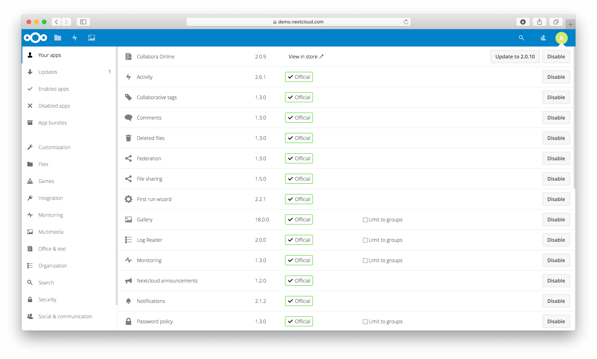
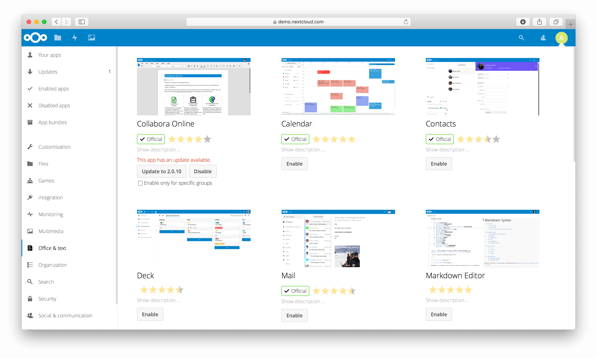

===============
Apps management
===============

Nextcloud apps can enhance, customize, or restrict the features and experience
available to you and your users on the Nextcloud server. In addition to built-in
apps such as Files, Activity, and Photos, other apps such as Calendar, Contacts,
and Talk can further expand its functionality.

After installing the Nextcloud server, you might want to consider enabling, disabling,
or restricting some apps for specific groups, depending on your needs and those of
your users.

Apps
----

During the Nextcloud server installation, some apps are enabled by default.
To see which apps are enabled go to your Apps page.

Those apps are supported and developed by Nextcloud GmbH directly and
have a **Featured** tag.

.. note::
   Your Nextcloud server needs to be able to communicate with ``https://apps.nextcloud.com``,
   ``https://ltd[1-3].nextcloud.com``, ``https://garm[1-5].nextcloud.com`` to list and download
   apps. Please make sure to allow these hosts in your firewall or proxy if necessary.

.. note::
   To get access to work-arounds, long-term-support, priority bug fixing and custom consulting
   for supported apps, contact `Nextcloud GmbH <https://nextcloud.com/enterprise/>`_.

.. note::
   If you would like to develop your own Nextcloud app, you can find out more information in
   our `developer manual <https://docs.nextcloud.com/server/latest/go.php?to=developer-manual>`_.

All apps must be licensed under AGPLv3+ or any compatible license.

Managing apps
-------------

You will see which apps are enabled, disabled and available. You'll also
see additional app bundles and filters, such as Customization, Security and
Monitoring for finding more apps quickly.

On the Apps page, you can enable or disable applications. Some apps have
configurable options on the Apps page, such as **Enable only for specific
groups**, but mainly they are enabled or disabled here, and are configured in
your Nextcloud settings (admin and/or user-settings) or in the ``config.php``.

Select an app to view its description and available configuration options. Clicking
the **Enable** button will enable the app. If the app is not part of the Nextcloud
installation, it will be downloaded from the app store, installed and enabled.

App updates will also be offered to you on this page. Simply click on the **Update**
button to update a specific app or use the **Update all** button on top of the page to
update all apps.

.. note:: 
   **Beta releases**: You can also install beta releases of apps directly from here by
   switching your Nextcloud to the beta channel in the admin overview.

Update notifications
^^^^^^^^^^^^^^^^^^^^

The default ``updatenotification`` app sends administrators notifications about available
app and Nextcloud updates. Moreover, since Nextcloud 29, this app also allows to notify
users about updated apps and the changes that are included in the update. This notification
is enabled by default if the app provides a changelog.

To disable user notifications use:

.. code-block:: console

   occ config:app:set --type boolean --value="false" updatenotification app_updated.enabled

By default. when using the ``guests`` app, guest users are not notified. To enable notifications for them use:

.. code-block:: console

   occ config:app:set --type boolean --value="true" updatenotification app_updated.notify_guests

Managing apps with ``occ``
^^^^^^^^^^^^^^^^^^^^^^^^^^

In addition to managing apps via the web interface, administrators can enable or disable apps with the ``occ`` command.

To enable an app, use the following command:

.. code-block:: console

   occ app:enable <app-id>

For example, to enable the "files" app, run:

.. code-block:: console

   occ app:enable files

To enable the app for specific groups, use the ``--groups`` option:

.. code-block:: console

   occ app:enable files --groups=admin

This command enables the "files" app only for the "admin" group.

To disable an app, use:

.. code-block:: console

   occ app:disable <app-id>

Using private API
^^^^^^^^^^^^^^^^^

If a third-party app uses private APIs instead of public APIs, installation
fails when ``'appcodechecker' => true,`` is set in ``config.php``.

Using custom app directories
^^^^^^^^^^^^^^^^^^^^^^^^^^^^

Use the **apps_paths** array in ``config.php`` to set any custom apps directory
locations. The key **path** defines the absolute file system path to the app
folder. The key **url** defines the HTTP web path to that folder, starting at
the Nextcloud web root. The key **writable** indicates if a user can install apps
in that folder.

Example: To ensure that the default ``/apps/`` folder only contains apps shipped
with Nextcloud, follow this example to set up an ``/extra-apps/`` folder which
will be used to store any additional apps you install:

.. code-block:: php

    "apps_paths" => [
        [
                "path"     => OC::$SERVERROOT . "/apps",
                "url"      => "/apps",
                "writable" => false,
        ],
        [
                "path"     => OC::$SERVERROOT . "/extra-apps",
                "url"      => "/extra-apps",
                "writable" => true,
        ],
    ],

.. danger:: Make sure that the values you choose for ``path`` and ``url`` for any custom
   apps directories do not conflict with directories which already exist in your Nextcloud
   Server root (installation directory).

.. tip:: Apps paths can be located outside the server root.  However, for any
   **path** outside the server root, you need to create a symbolic link in the server
   root that points **url** to **path**. For instance, if **path** is
   ``/var/local/lib/nextcloud/extra-apps``, and **url** is ``/extra-apps``, then
   you would use the command ``ln`` to create the symbolic link like this:
   ``ln -sf /var/local/lib/nextcloud/extra-apps ./extra-apps``

Configuring the app store timeout
^^^^^^^^^^^^^^^^^^^^^^^^^^^^^^^^^

The timeout for requests to fetch app store metadata can be configured with the
``appstore-timeout`` app setting. The value is specified in seconds. This setting is
configured with ``occ`` and is not a ``config.php`` parameter.

For example, to set the timeout to 180 seconds:

.. code-block:: console

   occ config:app:set settings appstore-timeout --value=180

The default timeout is 120 seconds. To restore the default, remove the
custom setting:

.. code-block:: console

   occ config:app:delete settings appstore-timeout

.. versionchanged:: 33.0.0
   The default app store request timeout was increased from 60 to 120 seconds
   and can be configured with ``occ``.

Using a self-hosted app store
^^^^^^^^^^^^^^^^^^^^^^^^^^^^^

This section explains how to enable installation of apps from a self-hosted app store.
At least one of the configured apps directories must be writable.

To enable a self-hosted app store:

1. Set the ``appstoreenabled`` parameter to ``true``.

   This parameter is used to enable the app store in Nextcloud.

2. Set the ``appstoreurl`` to the URL of your Nextcloud app store.

   This parameter is used to set the HTTP path to your self-hosted Nextcloud app store.

.. code-block:: php

   "appstoreenabled" => true,
   "appstoreurl" => "https://my.appstore.instance/v1",

By default the app store is enabled and configured to use ``https://apps.nextcloud.com/api/v1``
as the app store URL. Nextcloud will fetch ``apps.json`` and ``categories.json`` from there. To
use the defaults again, remove the ``appstoreenabled`` and ``appstoreurl`` parameters from the
configuration.

Example: If ``categories.json`` is available at ``https://apps.nextcloud.com/api/v1/categories.json``
the app store URL is ``https://apps.nextcloud.com/api/v1``.
