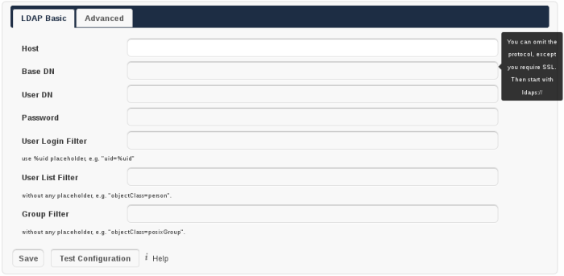
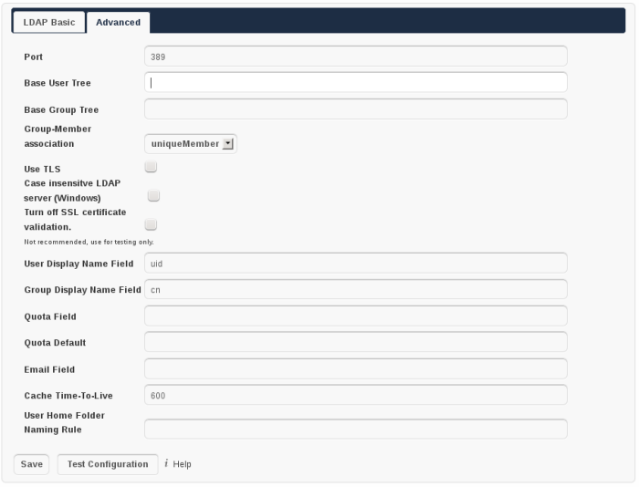

User Authentication with LDAP
=============================

ownCloud ships an LDAP backend, which allows full use of ownCloud for user
logging in with LDAP credentials including:

* LDAP group support
* File sharing with users and groups
* Access via WebDAV and of course ownCloud Desktop Client
* Versioning, external Storages and all other ownCloud Goodies

To connect to an LDAP server the configuration needs to be set up properly.
Once the LDAP backend is activated (Settings→Apps, choose ``LDAP user and group
backend``, click on ``Enable``) the configuration can be found on
Settings→Admin. Read on for a detailed description of the configuration fields.

Basic Settings
--------------

The basic settings are all you need. However, if you have a larger directory or
custom requirements you want to have a look on the advanced settings
afterwards. The basic part allows you to set up a working connection to your
LDAP server and use it with ownCloud.

   LDAP Basic Settings

Note that a hint will be shown on the right hand side, when hovering with the
mouse over an input field. This gives you more context information while
filling out the settings.

Settings Details
~~~~~~~~~~~~~~~~

Host:
  The host name of the LDAP server. It can also be a ``ldaps://`` URI, for
  instance. 

  * *Example: directory.my-company.com*

Base DN:
  The base DN of LDAP, from where all users and groups can be reached.
  Separated Base DNs for users and groups can be set in the Advanced
  tab. Nevertheless, this field is mandatory.

  * *Example: dc=my-company,dc=com*

User DN:
  The name as DN of a user who is able to do searches in the LDAP
  directory. Let it empty for anonymous access. It is recommended to have a
  special system user for ownCloud.

  * *Example: uid=owncloudsystemuser,cn=sysusers,dc=my-company,dc=com*
  * formerly ``Name`` in oC 4.0

Password:
  The password for the user given above. Empty for anonymous access.

User Login Filter:
  The filter to use when a users tries to login. Use ``%uid`` as placeholder
  for the user name. Note, that login applies this filter only, but not User
  List Filter. This may change in future. 

  * Example (allows login with user name and email address): ``(|(uid=%uid)(email=$uid))``

User List Filter:
  The filter to use when a search for users will be executed.

  * Example: ``objectClass=posixAccount``

Group Filter:
  The filter to use when a search for groups will be executed. In
  case you do not want to use LDAP groups in ownCloud, leave it empty.

  * Example: ``objectClass=posixGroup``

Advanced Settings
-----------------

In the LDAP Advanced settings section you can define options, that are less
common to set. They are not needed for a working connection, unless you use a
non-standard Port, e.g. It can also have a positive effect on the performance
to specify distinguished bases for user and group searches.

   LDAP Advanced Settings

Settings Details
~~~~~~~~~~~~~~~~

Port:
  The port LDAP server Example: 389 Base User Tree: The base DN of LDAP,
  from where all users can be reached. It needs to be given completely despite
  to the Base DN from the Basic settings.

  * Example: ``cn=users,dc=my-company,dc=com``

Base Group Tree:
  The base DN of LDAP, from where all groups can be reached.
  It needs to be given completely despite to the Base DN from the Basic
  settings.

  * Example: ``cn=groups,dc=my-company,dc=com``

Group Member association:
  The attribute that is used to indicate group memberships, i.e. the attribute
  used by LDAP groups to refer to their users.

  * Example: uniquemember

Use TLS:
  Wether to use TLS encrypted connection to the LDAP server.  In case you use
  SSL connections (via the ldaps scheme) do not check it, it will fail.

  * Example: [ ]

Case insensitive LDAP server (Windows): 
  Wether the LDAP server is running on a Windows Host

  * Example: [ ]

Turn off SSL certificate validation:
  Turns of check of valid SSL certificates. Use it – if needed –
  for testing, only!

  * Example: [ ]

User Display Name Field: 
  The attribute that should be used as ownCloud user name. ownCloud allows
  a limited set of characters ``(a-zA-Z0-9.-_@)``, every other character 
  will be replaced in ownCloud. Once a user name is assigned, it will not be
  changed, i.e. changing this value will only have effect to new LDAP users.
  The default, uid, does not exist in AD, switch to ``cn``, for example,
  otherwise you will not see any users.

  *  Example: displayName

Group Display Name Field: 
  The attribute that should be used as ownCloud group name. ownCloud allows a
  limited set of characters (a-zA-Z0-9.-_@), every other character will be
  replaced in ownCloud. Once a group name is assigned, it will not be changed,
  i.e. changing this value will only have effect to new LDAP groups.

  * Example: ``cn`` 

Quota Attribute: 
  ownCloud can read an LDAP attribute and set the user quota
  there from. Specify the attribute here, otherwise keep it empty.

  * Example: ownCloudQuota
  * formerly Quota Field in ownCloud 4.0

Quota Default: 
  Override ownCloud default quota for LDAP users who do not 
  have a quota set in the attribute given above.  

  * Example: 15 GB

Email Attribute:
  ownCloud can read an LDAP attribute and set the user email
  there from. Specify the attribute here, otherwise keep it empty.

  * Example: email

Cache Time-To-Live:
  We introduced a cache to avoid unnecessary LDAP traffic,
  for example lookups check whether the users exists on every page request or
  WebDAV interaction. It is also supposed to speed up the Admin → User page or
  list of users to share with, once it is populated. Changing this setting
  empties the Cache. The time is given in seconds. 

  * Example (10 min): 600

User Home Folder Naming Rule:
  By default, the ownCloud creates the user
  directory, where all files and meta data are kept, according to the ownCloud
  user name. You may want to override this setting and name it after an
  attribute’s value. Once set for a user, the user name folder will not change,
  i.e. changing this value will only have effect to new LDAP users. Leave it
  empty to default behaviour

  * Example: cn 

Microsoft Active Directory
--------------------------

In case you want to connect to a Windows AD, you must change some values in the Advanced tab.

* The default in User Display Name Field will not work with Active Directory.
* The Group Member association must be set to “member (AD)” Check Case insensitive
* LDAP server (Windows)

Testing the configuration
-------------------------

In this version we introduced the ``Test Configuration`` button on the bottom
of the LDAP settings section. It will always check the values as currently
given in the input fields. You do not need to save before testing. By clicking
on the button, ownCloud will try to bind to the ownCloud server with the
settings currently given in the input fields. The response will look like this:

.. figure:: images/ldap-settings-invalid-oc45.png

   Failure

In case the configuration fails, you can see details in ownCloud's log, which
is in the data directory and called ``owncloud.log`` or on the bottom the
``Settings →  Admin page``. Unfortunately it requires a reload – sorry for the
inconvenience.

.. figure:: images/ldap-settings-valid-oc45.png

   Success 

In this case, Save the settings. You can check if the users and groups are
fetched correctly on the Settings → Users page.

ownCloud LDAP Internals
-----------------------

Some parts of how the LDAP backend works are described here. May it be helpful.

User and Group Mapping
----------------------

In ownCloud, the user name is automatically the user ID, same applies for
groups. That’s why we map the DN and UUID of the LDAP object to an ownCloud
name. Those mappings are done in the database table ldap_user_mapping and
ldap_group_mapping. The user name is also used for the user’s folder, which
contains files and meta data. Most ownCloud applications, like Sharing, use the
user name to refer to a user. Renaming a user (or a group) is not supported.
That means that your LDAP configuration should be good and ready before putting
it into production. The mapping tables are filled early, but as long as you are
testing, you empty the tables any time. Do not do this in production. If you
want to rename a user or a group, be very careful.

Caching
-------

For performance reasons a cache has been introduced to ownCloud. He we store
all users and groups, group memberships or internal userExists-requests. Since
ownCloud is written in PHP and each and every page request (also done by Ajax)
loads ownCloud and would execute one or more LDAP queries again, you do want to
have some of those queries cached and save those requests and traffic. It is
highly recommended to have the cache filled for a small amount of time, which
comes also very handy when using the sync client, as it is yet another request
for PHP.
