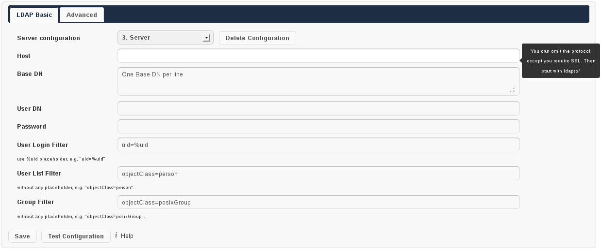
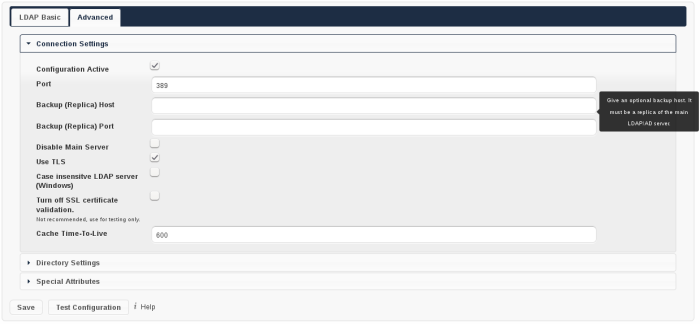
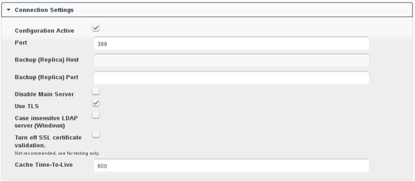
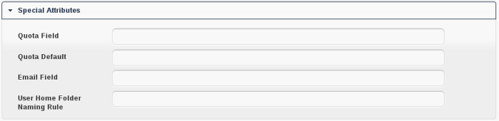
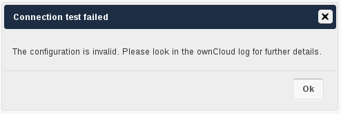
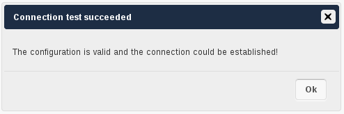

User Authentication with LDAP
=============================

ownCloud ships an LDAP backend, which allows full use of ownCloud for user
logging in with LDAP credentials including:

* LDAP group support
* File sharing with users and groups
* Access via WebDAV and of course ownCloud Desktop Client
* Versioning, external Storages and all other ownCloud Goodies

To connect to an LDAP server the configuration needs to be set up properly.
Once the LDAP backend is activated (Settings→Apps, choose **LDAP user and group
backend**, click on **Enable**) the configuration can be found on
Settings→Admin. Read on for a detailed description of the configuration fields.

Basic Settings
--------------

The basic settings are all you need. However, if you have a larger directory,
custom requirements or need to connect to Active Directory (AD) you want to have
a look on the advanced settings afterwards. The basic part allows you to set up
a working connection to your LDAP server and use it with ownCloud.

   LDAP Basic Settings

Note that a hint will be shown on the right hand side, when hovering with the
mouse over an input field. This gives you more context information while
filling out the settings.

Settings Details
~~~~~~~~~~~~~~~~

Server configuration:
  ownCloud can be configured to connect to multiple LDAP servers. Using this
  control you can pick a configuration you want to edit or add a new one. The
  button **Delete Configuration** deletes the current configuration.

  * *Example: 1. Server*

Host:
  The host name of the LDAP server. It can also be a **ldaps://** URI, for
  instance.

  * Example: *directory.my-company.com*

Base DN:
  The base DN of LDAP, from where all users and groups can be reached.
  Separated Base DNs for users and groups can be set in the Advanced
  tab. Nevertheless, this field is mandatory.

  * Example: *dc=my-company,dc=com*

User DN:
  The name as DN of a user who is able to do searches in the LDAP
  directory. Let it empty for anonymous access. It is recommended to have a
  special system user for ownCloud.

  * Example: *uid=owncloudsystemuser,cn=sysusers,dc=my-company,dc=com*

Password:
  The password for the user given above. Empty for anonymous access.

User Login Filter:
  The filter to use when a users tries to login. Use **%uid** as placeholder
  for the user name. Note, that login applies this filter only, but not User
  List Filter. This may change in future.

  * Example (allows login with user name and email address): *(|(uid=%uid)(email=$uid))*

User List Filter:
  The filter to use when a search for users will be executed.

  * Example: *objectClass=posixAccount*

Group Filter:
  The filter to use when a search for groups will be executed. In
  case you do not want to use LDAP groups in ownCloud, leave it empty.

  * Example: *objectClass=posixGroup*

Advanced Settings
-----------------

In the LDAP Advanced settings section you can define options, that are less
common to set. They are not needed for a working connection, unless you use a
non-standard Port, e.g. It can also have a positive effect on the performance
to specify distinguished bases for user and group searches.

The Advanced Settings are structured into three parts:
* Connection Settings
* Directory Settings
* Special Attributes

   LDAP Advanced Settings

Connection Settings
~~~~~~~~~~~~~~~~~~~

   LDAP Advanced Settings, section Connection Settings

Configuration Active:
  Enables or Disables the current configuration. Disabled configuration will not
  connect to the LDAP server.

  * Example: *[X]*

Port:
  The port on which to connect to the LDAP server.

  * Example: *389*

Backup (Replica) Host:
  A backup server can be defined here. ownCloud tries to connect to the backup
  server automatically, when the main host (as specified in basic settings)
  cannot be reached. It is import that the backup server is a replica of the
  main server, because the object UUIDs must match.

  * Example: *directory2.my-company.com*

Backup (Replica) Port:
  The port on which to connect to the backup LDAP server. If no port is given,
  but a host, then the main port (as specified above) will be used.

  * Example: *389*

Disable Main Server:
  You can manually override the main server and make ownCloud only connect to
  the backup server. It may be handy for planned downtimes.

  * Example: *[ ]*

Use TLS:
  Whether to use TLS encrypted connection to the LDAP server.  This will be
  ignored when "ldaps://" protocol is specified in the host entries.

  * Example: *[ ]*

Case insensitive LDAP server (Windows):
  Whether the LDAP server is running on a Windows Host

  * Example: *[ ]*

Turn off SSL certificate validation:
  Turns of check of valid SSL certificates. Use it – if needed –
  for testing, only!

  * Example: *[ ]*

Cache Time-To-Live:
  A cache is introduced to avoid unnecessary LDAP traffic,
  for example lookups check whether the users exists on every page request or
  WebDAV interaction. It is also supposed to speed up the Admin → User page or
  list of users to share with, once it is populated. Saving the configuration
  empties the cache (changes are not necessary). The time is given in seconds.

  Note that almost every PHP request would require to build up a new connection
  to the LDAP server. If you require a most up-to-dateness it is recommended not
  to totally switch off the cache, but define a minimum life time of 15s.

  * Example (10 min): *600*

Directory Settings
~~~~~~~~~~~~~~~~~~~

   LDAP Advanced Settings, section Directory Settings

User Display Name Field:
  The attribute that should be used as display name in ownCloud. Prior to
  ownCloud 5 it was used as internal user name. This is not the case anymore.
  It also means that display names are not permanent in ownCloud, i.e. if the
  attribute's value changes in LDAP, it changes in ownCloud too. Display names
  to not need to be unique, but you rather want to specify a more or less unique
  attribute here to avoid confusion.

  *  Example: *displayName*

Base User Tree:
  The base DN of LDAP, from where all users can be reached. It needs to be given
  completely despite to the Base DN from the Basic settings. You can specifiy
  multiple base trees, one in each line.

  * Example:

    | *cn=programmers,dc=my-company,dc=com*
    | *cn=designers,dc=my-company,dc=com*

User Search Attributes:
  These attributes are used when a search for users with a search string is
  done. This happens, for instance, in the share dialogue. By default the user
  display name attribute as specified above is being used. Multiple attributes
  can be given, one in each line.

  * Example:

    | *displayName*
    | *mail*

Group Display Name Field:
  The attribute that should be used as ownCloud group name. ownCloud allows a
  limited set of characters (a-zA-Z0-9.-_@), every other character will be
  replaced in ownCloud. Once a group name is assigned, it will not be changed,
  i.e. changing this value will only have effect to new LDAP groups.

  * Example: *cn*

Base Group Tree:
  The base DN of LDAP, from where all groups can be reached.
  It needs to be given completely despite to the Base DN from the Basic
  settings. You can specifiy multiple base trees, one in each line.

  * Example:

    | *cn=barcelona,dc=my-company,dc=com*
    | *cn=madrid,dc=my-company,dc=com*

Group Search Attributes:
  These attributes are used when a search for groups with a search string is
  done. This happens, for instance, in the share dialogue. By default the group
  display name attribute as specified above is being used. Multiple attributes
  can be given, one in each line.

  * Example:

    | *cn*
    | *description*

Group Member association:
  The attribute that is used to indicate group memberships, i.e. the attribute
  used by LDAP groups to refer to their users.

  * Example: *uniquemember*

Special Attributes
~~~~~~~~~~~~~~~~~~

   LDAP Advanced Settings, section Special Attributes

Quota Field:
  ownCloud can read an LDAP attribute and set the user quota according to its
  value. Specify the attribute here, otherwise keep it empty. The attribute
  shall return human readable values, e.g. "2 GB".

  * Example: *ownCloudQuota*

Quota Default:
  Override ownCloud default quota for LDAP users who do not
  have a quota set in the attribute given above.

  * Example: *15 GB*

Email Field:
  ownCloud can read an LDAP attribute and set the user email
  there from. Specify the attribute here, otherwise keep it empty.

  * Example: *mail*

User Home Folder Naming Rule:
  By default, the ownCloud creates the user
  directory, where all files and meta data are kept, according to the ownCloud
  user name. You may want to override this setting and name it after an
  attribute's value. The attribute given can also return an absolute path, e.g.
  ``/mnt/storage43/alice``. Leave it empty for default behavior.

  * Example: *cn*

Testing the configuration
-------------------------

In this version we introduced the **Test Configuration** button on the bottom
of the LDAP settings section. It will always check the values as currently
given in the input fields. You do not need to save before testing. By clicking
on the button, ownCloud will try to bind to the ownCloud server with the
settings currently given in the input fields. The response will look like this:

   Failure

In case the configuration fails, you can see details in ownCloud's log, which
is in the data directory and called **owncloud.log** or on the bottom the
**Settings →  Admin page**. Unfortunately it requires a reload – sorry for the
inconvenience.

   Success

In this case, Save the settings. You can check if the users and groups are
fetched correctly on the Settings → Users page.

Troubleshooting, Tips and Tricks
--------------------------------

SSL Certificate Verification (LDAPS, TLS)
-----------------------------------------

A common mistake with SSL certificates is that they may not be known to PHP.
If you have trouble with certificate validation make sure that

* you have the certificate of the server installed on the ownCloud server
* the certificate is announced in the system's LDAP configuration file (usually
  */etc/ldap/ldap.conf* on Linux, *C:\\openldap\\sysconf\\ldap.conf* or
  *C:\\ldap.conf* on Windows) using a **TLS_CACERT /path/to/cert** line.
* Using LDAPS, also make sure that the port is correctly configured (by default
  686)

Microsoft Active Directory
--------------------------

In case you want to connect to a Windows AD, you must change some values in the Advanced tab.

* The default in User Display Name Field will not work with Active Directory.
* The Group Member association must be set to “member (AD)”
* Check Case insensitive LDAP server (Windows)

Duplicating Server Configurations
---------------------------------

In case you have a working configuration and want to create a similar one or
"snapshot" configurations before modifying them you can do the following:

#. Go to the **LDAP Basic** tab
#. On **Server Configuration** choose *Add Server Configuration*
#. Answer the question *Take over settings from recent server configuration?*
   with *yes*.
#. (optional) Switch to **Advanced** tab and uncheck **Configuration Active**
   in the *Connection Settings*, so the new configuration is not used on Save
#. Click on **Save**

Now you can modify the configuration and enable it if you wish.

ownCloud LDAP Internals
-----------------------

Some parts of how the LDAP backend works are described here. May it be helpful.

User and Group Mapping
----------------------

In ownCloud the user or group name is used to have all relevant information in
the database assigned. To work reliably a permanent internal user name and
group name is created and mapped to the LDAP DN and UUID. If the DN changes in
LDAP it will be detected, there will be no conflicts.

Those mappings are done in the database table ldap_user_mapping and
ldap_group_mapping. The user name is also used for the user's folder (except
something else is specified in *User Home Folder Naming Rule*), which
contains files and meta data.

As of ownCloud 5 internal user name and a visible display name are separated.
This is not the case for group names, yet, i.e. group cannot be altered.

That means that your LDAP configuration should be good and ready before putting
it into production. The mapping tables are filled early, but as long as you are
testing, you can empty the tables any time. Do not do this in production. If you
want to rename a group, be very careful. Do not rename the user's internal name.

Caching
-------

For performance reasons a cache has been introduced to ownCloud. He we store
all users and groups, group memberships or internal userExists-requests. Since
ownCloud is written in PHP and each and every page request (also done by Ajax)
loads ownCloud and would execute one or more LDAP queries again, you do want to
have some of those queries cached and save those requests and traffic. It is
highly recommended to have the cache filled for a small amount of time, which
comes also very handy when using the sync client, as it is yet another request
for PHP.

Handling with Backup Server
---------------------------

When ownCloud is not able to contact the main server, he will be treated as
offline and no connection attempts will be done for the time specified in
**Cache Time-To-Live**. If a backup server is configured, it will be connected
instead. If you plan a maintained downtime, check **Disable Main Server** for
the time being to avoid unnecessary connection attempts every now and then.