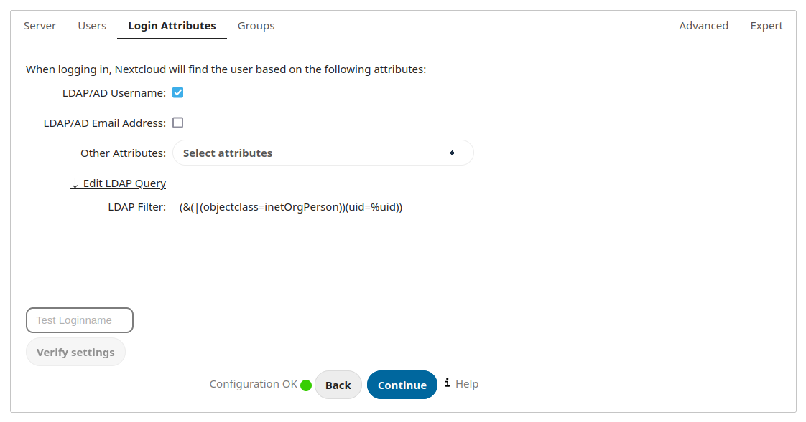
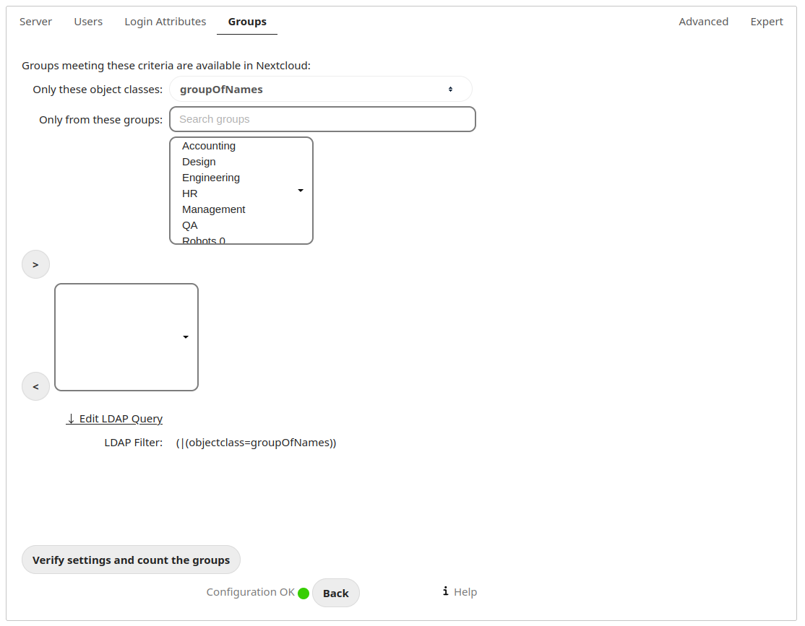
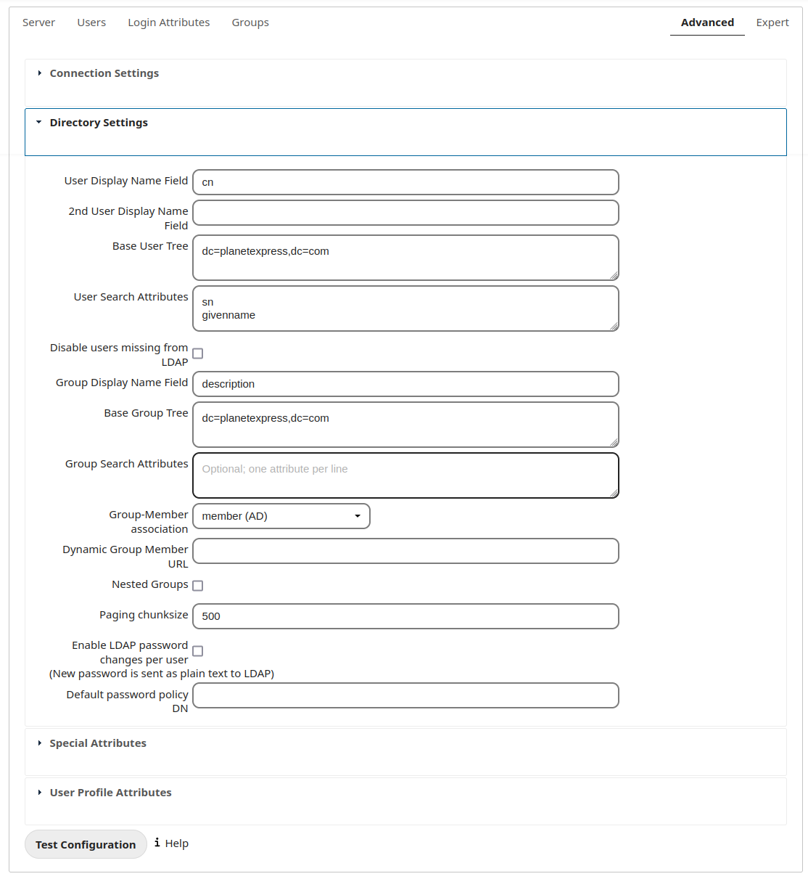

User Authentication with LDAP
=============================

ownCloud ships an LDAP backend, which allows full use of ownCloud for user
logging in with LDAP credentials including:

* LDAP group support
* File sharing with users and groups
* Access via WebDAV and of course ownCloud Desktop Client
* Versioning, external Storages and all other ownCloud goodies

To connect to an LDAP server the configuration needs to be set up properly.
Once the LDAP backend is activated (Apps Sidebar→Apps, choose **LDAP user and
group backend**, click on **Enable**) the configuration can be found on
Settings→Admin. Read on for a detailed description of the configuration fields.

Configuration
-------------

The LDAP backend follows a wizard-like approach, splitted into four tabs. A
correctly completed first tab ("Server") is mandatory to access the other tabs.
Also, the other tabs need to be reviewed by the admin, however the necessary
settings are detected automatically. An indicator will show whether the
configuration is incomplete, incorrect or OK.

The settings are changed automatically, as soon as a input element looses the
focus, i.e. the cursor is taken away by clicking somewhere else or pressing the
tabulator key.

The other tabs can be navigated by clicking the tabs or by using the *Continue*
and *Back* buttons. They are located on the lower right, next to the status
indicator.

Server
~~~~~~

The server tab contains the basic information on the LDAP server. They make sure
that ownCloud will be able to connect to LDAP and be able to read data from
there. The admin at least needs to provide a hostname. If anonymous access is
not possible he will need to provide an account DN and a password, too. ownCloud
attempts to auto-detect the port and the base DN.

.. figure:: ../images/ldap-wizard-1-server.png

Server configuration:
  ownCloud can be configured to connect to multiple LDAP servers. Using this
  control you can pick a configuration you want to edit or add a new one. The
  button **Delete Configuration** deletes the current configuration.

Host:
  The host name of the LDAP server. It can also be a **ldaps://** URI, for
  instance.

  It is also possible to pass a port number, which speeds up port detection. It
  is especially useful, if a custom port is used. ownCloud will move the value
  to the port field subsequently.

  Examples:

  * *directory.my-company.com*
  * *ldaps://directory.my-company.com*
  * *directory.my-company.com:9876*

Port:
  The port on which to connect to the LDAP server. The field is disabled in the
  beginning of a new configuration. The port will be detected automatically,
  if the LDAP server is running on a standard port. After ownCloud attempted to
  determine the port, the field will be enabled for user input. A successfully
  found port will be inserted by ownCloud, of course.

  Example:

  * *389*

User DN:
  The name as DN of a user who is able to do searches in the LDAP
  directory. Leave it empty for anonymous access. It is recommended to have a
  special system user for ownCloud.

  Example:

  * *uid=owncloudsystemuser,cn=sysusers,dc=my-company,dc=com*

Password:
  The password for the user given above. Empty for anonymous access.

Base DN:
  The base DN of LDAP, from where all users and groups can be reached. Separated
  Base DNs for users and groups can be set in the Advanced tab. Nevertheless,
  this field is mandatory. ownCloud attempts to determine the Base DN according
  to the provided User DN or the provided Host.

  Example:

  * *dc=my-company,dc=com*

User Filter
~~~~~~~~~~~

The settings in the user filter tab determine which LDAP users will appear and
are allowed to log in into ownCloud. It is also possible to enter a raw LDAP
filter.

.. figure:: ../images/ldap-wizard-2-user.png

only those object classes:
  ownCloud will determine the object classes that are typically availalble for
  (ideally only) user objects in your LDAP. ownCloud will automatically select
  the object class that returns the highest amount of users. You can select
  multiple object classes.

only from those groups:
  If your LDAP server supports the member-of-overlay in LDAP filters, you can
  define that only users from one or more certain groups are allowed to
  appear and log in into ownCloud. By default, no value will be selected. You
  can select multiple groups.

  If your LDAP server does not support the member-of-overlay in LDAP filters,
  the input field is disabled. Please contact your LDAP administrator.

Edit raw filter instead:
  Clicking on this text will toggle the filter mode. Instead of the assisted
  approach, you can enter the raw LDAP filter directly in the appearing field.

  Example:

  * *objectClass=inetOrgPerson*

x users found:
  This is an indicator that tells you approximately how many users will be
  allowed to access ownCloud. The number will update after any change you do.

Login Filter
~~~~~~~~~~~~

The settings in the login filter tab determine which user detail will be
compared to the login value entered by the user. It is possible to allow
multiple user details. It is also possible to enter a raw LDAP filter.

The user limitation as set up in the previous tab is in effect, unless you
manually configure the filter in raw mode.

LDAP Username:
  If this value is checked, the login value will be compared to the username in
  the LDAP directory. The corresponding attribute, usually *uid* or
  *samaccountname* will be detected automatically by ownCloud.

LDAP Email Address:
  If this value is checked, the login value will be compared to an email address
  in the LDAP directory. The email address will be looked for in the
  *mailPrimaryAddress* and *mail* attributes.

Other Attributes:
  This multiselect box allows you to select other attributes for the comparison.
  The list is generated automatically based on the attributes that a user object
  contains in your LDAP server.

Edit raw filter instead:
  Clicking on this text will toggle the filter mode. Instead of the assisted
  approach, you can enter the raw LDAP filter directly in the appearing field.

  The **%uid** placeholder will be replaced with the login name entered by the user
  upon login. When you enter the filter manually.

  Examples:

  * only username: *uid=%uid*
  * username or email address: *(|(uid=%uid)(mail=$uid))*

Group Filter
~~~~~~~~~~~~

The settings in the group filter tab determine which groups will be availalble
in ownCloud. It does not have any restrictions on logins, this has been dealed
with in the prior tabs.  It is also possible to enter a raw LDAP
filter.

By default, no groups will be availalble in ownCloud. You actively need to
enable groups.

only those object classes:
  ownCloud will determine the object classes that are typically availalble for
  (ideally only) group objects in your LDAP. ownCloud will only list object
  classes that return at least one group object. You can select multiple
  object classes. A typical object class is "group", or "posixGroup".

only from those groups:
  This setting lets you pick certain groups that shall be availalble in
  ownCloud. This field follows a whitelist approach. ownCloud will generate a
  list of available groups found in your LDAP server. You can select multiple
  groups.

Edit raw filter instead:
  Clicking on this text will toggle the filter mode. Instead of the assisted
  approach, you can enter the raw LDAP filter directly in the appearing field.

  Example:

  * *objectClass=group*
  * *objectClass=posixGroup*

y groups found:
  This is an indicator that tells you approximately how many groups will be
  available in  ownCloud. The number will update after any change you do.

Advanced Settings
-----------------

In the LDAP Advanced settings section you can define options, that are less
common to set. They are not needed for a working connection. It can also have a
positive effect on the performance to specify distinguished bases for user and
group searches.

The Advanced Settings are structured into three parts:

* Connection Settings
* Directory Settings
* Special Attributes

Connection Settings
~~~~~~~~~~~~~~~~~~~

.. figure:: ../images/ldap-advanced-1-connection.png

   LDAP Advanced Settings, section Connection Settings

Configuration Active:
  Enables or Disables the current configuration. Disabled configuration will not
  connect to the LDAP server.

  By default, it is turned off. It will be automatically turned on, when using
  the wizard and the configuration is OK and a test connection successful.

Backup (Replica) Host:
  A backup server can be defined here. ownCloud tries to connect to the backup
  server automatically, when the main host (as specified in basic settings)
  cannot be reached. It is import that the backup server is a replica of the
  main server, because the object UUIDs must match.

  Example:

  * *directory2.my-company.com*

Backup (Replica) Port:
  The port on which to connect to the backup LDAP server. If no port is given,
  but a host, then the main port (as specified above) will be used.

  Example:

  * *389*

Disable Main Server:
  You can manually override the main server and make ownCloud only connect to
  the backup server. It may be handy for planned downtimes.

Case insensitive LDAP server (Windows):
  Whether the LDAP server is running on a Windows Host. Usually, it is not
  necessary to check it, however.

Turn off SSL certificate validation:
  Turns of check of valid SSL certificates. Use it – if needed –
  for testing, only!

Cache Time-To-Live:
  A cache is introduced to avoid unnecessary LDAP traffic,
  for example lookups check whether the users exists on every page request or
  WebDAV interaction. It is also supposed to speed up the Admin → User page or
  list of users to share with, once it is populated. Saving the configuration
  empties the cache (changes are not necessary). The time is given in seconds.

  Note that almost every PHP request would require to build up a new connection
  to the LDAP server. If you require a most up-to-dateness it is recommended not
  to totally switch off the cache, but define a minimum life time of 15s.

  Examples:

  * ten minutes: *600*
  * one hour: *3600*

Directory Settings
~~~~~~~~~~~~~~~~~~~

   LDAP Advanced Settings, section Directory Settings

User Display Name Field:
  The attribute that should be used as display name in ownCloud.

  *  Example: *displayName*

Base User Tree:
  The base DN of LDAP, from where all users can be reached. It needs to be given
  completely despite to the Base DN from the Basic settings. You can specify
  multiple base trees, one in each line.

  * Example:

    | *cn=programmers,dc=my-company,dc=com*
    | *cn=designers,dc=my-company,dc=com*

User Search Attributes:
  These attributes are used when a search for users is done. This happens, for
  instance, in the share dialogue. By default the user display name attribute as
  specified above is being used. Multiple attributes can be given, one in each
  line.

  Beware that if an attribute is not available on a user object, the user will
  neither be listed (e.g. in the share dialogue) nor be able to login. This also
  affects the display name attribute as specified above. If you override the
  default, the display name attribute will not be taken into account, unless you
  specify it as well.

  * Example:

    | *displayName*
    | *mail*

Group Display Name Field:
  The attribute that should be used as ownCloud group name. ownCloud allows a
  limited set of characters (a-zA-Z0-9.-_@), every other character will be
  replaced in ownCloud. Once a group name is assigned, it will not be changed,
  i.e. changing this value will only have effect to new LDAP groups.

  * Example: *cn*

Base Group Tree:
  The base DN of LDAP, from where all groups can be reached.
  It needs to be given completely despite to the Base DN from the Basic
  settings. You can specify multiple base trees, one in each line.

  * Example:

    | *cn=barcelona,dc=my-company,dc=com*
    | *cn=madrid,dc=my-company,dc=com*

Group Search Attributes:
  These attributes are used when a search for groups is done. This happens, for
  instance, in the share dialogue. By default the group display name attribute
  as specified above is being used. Multiple attributes can be given, one in
  each line.

  If you override the default, the group display name attribute will not be
  taken into account, unless you specify it as well.

  * Example:

    | *cn*
    | *description*

Group Member association:
  The attribute that is used to indicate group memberships, i.e. the attribute
  used by LDAP groups to refer to their users.

  ownCloud detects the value automatically, you should only change it, if you
  have a very valid reason and know what you are doing.

  * Example: *uniquemember*

Special Attributes
~~~~~~~~~~~~~~~~~~

.. figure:: ../images/ldap-advanced-3-attributes.png

   LDAP Advanced Settings, section Special Attributes

Quota Field:
  ownCloud can read an LDAP attribute and set the user quota according to its
  value. Specify the attribute here, otherwise keep it empty. The attribute
  shall return human readable values, e.g. "2 GB".

  * Example: *ownCloudQuota*

Quota Default:
  Override ownCloud default quota for LDAP users who do not
  have a quota set in the attribute given above.

  * Example: *15 GB*

Email Field:
  ownCloud can read an LDAP attribute and set the user email
  there from. Specify the attribute here, otherwise keep it empty.

  Although the wizard offers you to check login by email, the correct email
  attribute is not detected and you need to specify it manually.

  * Example: *mail*

User Home Folder Naming Rule:
  By default, the ownCloud creates the user
  directory, where all files and meta data are kept, according to the ownCloud
  user name. You may want to override this setting and name it after an
  attribute value. The attribute given can also return an absolute path, e.g.
  ``/mnt/storage43/alice``. Leave it empty for default behavior.

  * Example: *cn*

Expert Settings
---------------

.. figure:: ../images/ldap-expert.png

In the Expert Settings fundamental behavior can be adjusted to your needs. The
configuration should be done before starting production use or when testing the
installation.

Internal Username:
  The internal username is the identifier in ownCloud for LDAP users. By default
  it will be created from the UUID attribute. By using the UUID attribute it is
  made sure that the username is unique and characters do not need to be
  converted. The internal username has the restriction that only these
  characters are allowed: [\a-\zA-\Z0-\9_.@-]. Other characters are replaced with
  their ASCII correspondence or are simply omitted.

  The LDAP backend ensures that there are no duplicate internal usernames in
  ownCloud, i.e. that it is checking all other activated user backends
  (including local ownCloud users). On collisions a random number (between 1000
  and 9999) will be attached to the retrieved value. For example, if "alice"
  exists, the next username may be "alice_1337".

  The internal username is also the default name for the user home folder in
  ownCloud. It is also a part of remote URLs, for instance for all \*DAV services.
  With this setting the default behaviour can be overridden.

  Leave it empty for default behaviour. Changes will have effect only on newly
  mapped (added) LDAP users.

  * Example: *uid*

Override UUID detection
  By default, ownCloud auto-detects the UUID attribute. The UUID attribute is
  used to doubtlessly identify LDAP users and groups. Also, the internal
  username will be created based on the UUID, if not specified otherwise above.

  You can override the setting and pass an attribute of your choice. You must
  make sure that the attribute of your choice can be fetched for both users and
  groups and it is unique. Leave it empty for default behaviour. Changes will
  have effect only on newly mapped (added) LDAP users and groups. It also will
  have effect when a user's or group's DN changes and an old UUID was cached: It
  will result in a new user. Because of this, the setting should be applied
  before putting ownCloud in production use and cleaning the bindings
  (see below).

  * Example: *cn*

Username-LDAP User Mapping
  ownCloud uses the usernames as key to store and assign data. In order to
  precisely identify and recognize users, each LDAP user will have a internal
  username in ownCloud. This requires a mapping from ownCloud username to LDAP
  user. The created username is mapped to the UUID of the LDAP user.
  Additionally the DN is cached as well to reduce LDAP interaction, but it is
  not used for identification. If the DN changes, the change will be detected by
  ownCloud by checking the UUID value.

  The same is valid for groups.

  The internal ownCloud name is used all over in ownCloud. Clearing the Mappings
  will have leftovers everywhere. Do never clear the mappings
  in a production environment. Only clear mappings in a testing or experimental
  stage.

  **Clearing the Mappings is not configuration sensitive, it affects all LDAP
  configurations!**

Testing the configuration
-------------------------

In this version we introduced the **Test Configuration** button on the bottom
of the LDAP settings section. It will always check the values as currently
given in the input fields. You do not need to save before testing. By clicking
on the button, ownCloud will try to bind to the ownCloud server with the
settings currently given in the input fields. The response will look like this:

.. figure:: ../images/ldap-settings-invalid-oc45.png

   Failure

In case the configuration fails, you can see details in ownCloud's log, which
is in the data directory and called **owncloud.log** or on the bottom the
**Settings →  Admin page**. Unfortunately it requires a reload – sorry for the
inconvenience.

.. figure:: ../images/ldap-settings-valid-oc45.png

   Success

In this case, Save the settings. You can check if the users and groups are
fetched correctly on the Settings → Users page.

ownCloud Avatar integration
---------------------------

ownCloud 6 incorporates a user profile picture feature, called Avatar. If a user
has a photo stored in the *jpegPhoto* or, since 6.0.2, *thumbnailPhoto*
attribute, it will be used as Avatar. The user then is not able to change his
avatar in the personal settings. It must be done within LDAP. *jpegPhoto* is
preferred over *thumbnailPhoto*.

.. figure:: ../images/ldap-fetched-avatar.png

   Profile picture fetched from LDAP, Personal Settings

If the *jpegPhoto* or *thumbnailPhoto* attribute is not set or empty, the
default ownCloud behaviour is active, i.e. the user will be able to set and
change his profile picture in the personal settings. If the user sets a profile
picture within ownCloud it will _not_ be stored in LDAP.

The *jpegPhoto* or *thumbnailPhoto* attribute will be fetched once a day to make
sure the current photo from LDAP is used in ownCloud. If a picture is added
later, a possibly set profile picture will be overridden with the LDAP one. If a
photo stored in the *jpegPhoto* and/or *thumbnailPhoto* attribute is deleted
later, the last profile picture in ownCloud will still be used.

The photo taken from LDAP will be adjusted to the requirements of the ownCloud
avatar automatically. I.e. it will be transformed into a square. If the photo
needs to be cut, it will be done equally from both affected sides. The original
photo stored in LDAP will stay the same, of course.

Troubleshooting, Tips and Tricks
--------------------------------

SSL Certificate Verification (LDAPS, TLS)
-----------------------------------------

A common mistake with SSL certificates is that they may not be known to PHP.
If you have trouble with certificate validation make sure that

* you have the certificate of the server installed on the ownCloud server
* the certificate is announced in the system's LDAP configuration file (usually
  */etc/ldap/ldap.conf* on Linux, *C:\\openldap\\sysconf\\ldap.conf* or
  *C:\\ldap.conf* on Windows) using a **TLS_CACERT /path/to/cert** line.
* Using LDAPS, also make sure that the port is correctly configured (by default
  686)

Microsoft Active Directory
--------------------------

Compared to earlier ownCloud versions, no further tweaks need to be done to
make ownCloud work with Active Directory. ownCloud will automatically find the
correct configuration in the wizard-like set up process.

Duplicating Server Configurations
---------------------------------

In case you have a working configuration and want to create a similar one or
"snapshot" configurations before modifying them you can do the following:

#. Go to the **Server** tab
#. On **Server Configuration** choose *Add Server Configuration*
#. Answer the question *Take over settings from recent server configuration?*
   with *yes*.
#. (optional) Switch to **Advanced** tab and uncheck **Configuration Active**
   in the *Connection Settings*, so the new configuration is not used on Save
#. Click on **Save**

Now you can modify the configuration and enable it if you wish.

ownCloud LDAP Internals
-----------------------

Some parts of how the LDAP backend works are described here. May it be helpful.

Groups
------

At the moment, only secondary groups are read. That means that only the groups
are retrieved, which are returned by the attribute auto-detected (or manually
chosen) in Group-Member association. Primary groups are not being taken into
account.

User and Group Mapping
----------------------

In ownCloud the user or group name is used to have all relevant information in
the database assigned. To work reliably a permanent internal user name and
group name is created and mapped to the LDAP DN and UUID. If the DN changes in
LDAP it will be detected, there will be no conflicts.

Those mappings are done in the database table ldap_user_mapping and
ldap_group_mapping. The user name is also used for the user's folder (except
something else is specified in *User Home Folder Naming Rule*), which
contains files and meta data.

As of ownCloud 5 internal user name and a visible display name are separated.
This is not the case for group names, yet, i.e. group cannot be altered.

That means that your LDAP configuration should be good and ready before putting
it into production. The mapping tables are filled early, but as long as you are
testing, you can empty the tables any time. Do not do this in production. If you
want to rename a group, be very careful. Do not rename the user's internal name.

Caching
-------

For performance reasons a cache has been introduced to ownCloud. He we store
all users and groups, group memberships or internal userExists-requests. Since
ownCloud is written in PHP and each and every page request (also done by Ajax)
loads ownCloud and would execute one or more LDAP queries again, you do want to
have some of those queries cached and save those requests and traffic. It is
highly recommended to have the cache filled for a small amount of time, which
comes also very handy when using the sync client, as it is yet another request
for PHP.

Handling with Backup Server
---------------------------

When ownCloud is not able to contact the main server, he will be treated as
offline and no connection attempts will be done for the time specified in
**Cache Time-To-Live**. If a backup server is configured, it will be connected
instead. If you plan a maintained downtime, check **Disable Main Server** for
the time being to avoid unnecessary connection attempts every now and then.
