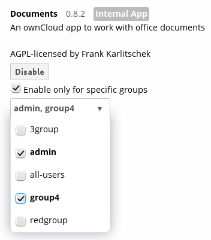
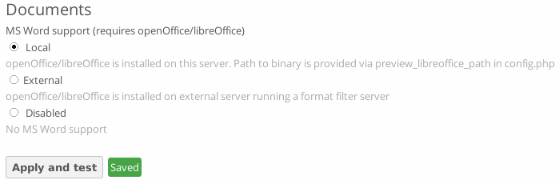

Configuring the Collaborative Documents App
===========================================

The Documents application supports editing documents within ownCloud, without the 
need to launch an external application. The Documents app supports these 
features:

* Cooperative edit, with multiple users editing files simultaneously. 
* Document creation within ownCloud.
* Document upload.
* Share and edit files in the browser, and then share them inside ownCloud or 
  through a public link.

Supported file formats are `.odt`, `.doc`, and `.docx`. `.odt` is supported 
natively in ownCloud, and you must have LibreOffice or OpenOffice installed on 
the ownCloud server to convert `.doc`, and `.docx` documents.
  
Enabling the Documents App
--------------------------

Go to your Apps page and click the ``Enable`` button. You also have the option 
to grant access to the Documents apps to selected user groups. By default it is 
available to all groups.

See "Collaborative Document Editing" in the User manual to learn how to create 
and share documents in the Documents application.

Enabling and testing MS Word support
------------------------------------

Go to your admin settings menu. After choosing ``Local`` or ``External`` click
on the ``Apply and test`` button. If you have a working LibreOffice or OpenOffice
installation a green ``Saved`` icon should appear.

Troubleshooting
~~~~~~~~~~~~~~~

If the mentioned test fails please make sure that:

* you're not running Windows (it is currently not supported)
* the PHP functions ``escapeshellarg`` and ``shell_exec`` are not disabled in your
  PHP configuration
* the libreoffice/openoffice binary is within your PATH and is executeable for the
  HTTP user
* your SELinux configuration is not blocking the execution of the binary
* the PHP ``open_basedir`` is correctly configured to allow the access to the binary

More hints why the test is failing can be found in your ``data/owncloud.log``.
