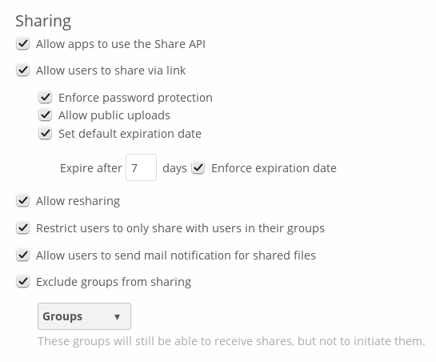
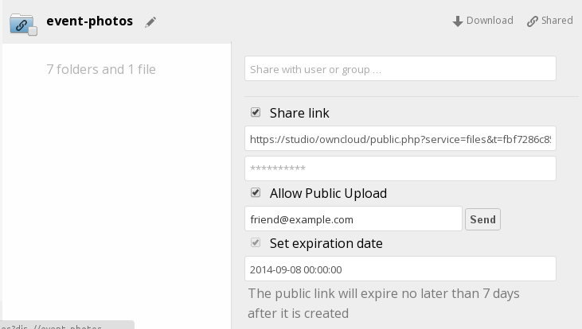
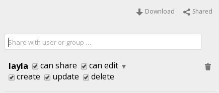

File Sharing
=======

ownCloud users can share files with their ownCloud groups and other users on 
the same ownCloud server, and create public shares for people who are not 
ownCloud users. You have control of a number of user permissions on file shares:

* Allowing users to share files
* Allowing users to create public shares
* Requiring a password on public shares
* Allowing public uploads to public shares
* Requiring an expiration date on public share links
* Allowing resharing
* Restricting sharing to group members only
* Allowing email notifications of new public shares
* Excluding groups from creating shares

You may also allow users to create server-to-server shares (see "Configuring 
Server-to-Server Sharing" in the Admin manual).

.. note:: The Shared folder has been removed from ownCloud 7. If you are 
   upgrading from older ownCloud versions you will still have your old Shared 
   folder, but new shares will appear in the top-level of your Files page, and 
   the Shared folder is no longer required. You can now create your own folders 
   for storing shared files, and organize, rename, and move them around like any 
   other files.

Configure your sharing policy on your Admin page in the Sharing section.

* Check ``Allow apps to use the Share API`` to enable users to share files. If 
  this is not checked, no users can create file shares
* Check ``Allow users to share via link`` to enable creating public shares for  
  people who are not ownCloud users. This creates a hyperlink, just like a 
  Web page, so your ownCloud server needs to be accessible to whoever you are 
  sharing with
* Check ``Enforce password protection`` to force users to set a password on all 
  public share links. This does not affect local user and group shares
* Check ``Allow public uploads`` to allow outside users to upload files to 
  public shares
* Checking ``Set default expiration date`` sets a default expiration date on 
  public shares, and checking ``Enforce expiration date`` makes it a requirement
* Check ``Allow resharing`` to enable users to re-share files shared with them
* Check ``Restrict users to only share with users in their groups`` to confine 
  sharing within group memberships
* Check ``Allow users to send mail notification for shared files`` so that 
  users can send email notifications when they create new public shares
* Check ``Exclude groups from sharing`` to prevent members of specific groups 
  from creating any file shares in those groups. When you check this, you'll 
  get a dropdown list of all your groups to choose from. Members of excluded 
  groups can still receive shares, but not create any

This is how it looks when a user creates a public share with passwords and 
expiration dates required:

This what a local share looks like. The user creating the share controls 
re-sharing, editing, updating, and deletion privileges:

Creating Persistent File Shares
-----------------------

When a user is deleted, their files are also deleted. As you can imagine, this 
is a problem if they created file shares that need to be preserved, because 
these disappear as well. In ownCloud files are tied to their owners, so 
whatever happens to the file owner also happens to the files.

One solution is to create persistent shares for your users. You can retain 
ownership of them, or you could create a special user for the purpose of 
establishing permanent file shares. Simply create a shared folder in the usual 
way, and share it with the users or groups who need to use it. Set the 
appropriate permissions on it-- at a minumum ``share`` and ``create``-- and then 
no matter which users come and go, the file shares will remain. Because all 
files added to the share, or edited in it, automatically become owned by the 
creator of the share regardless of who adds or edits them.
