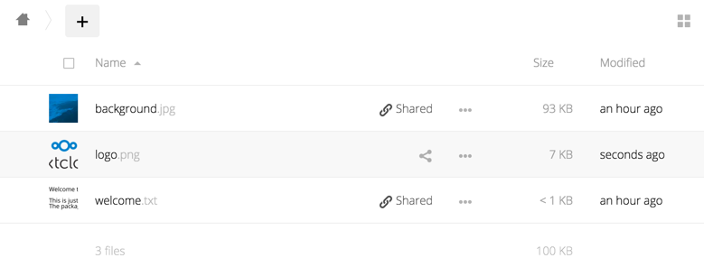

Preview Configuration
=====================
ownCloud 6 introduced a new thumbnail system. It is used to generate
thumbnails from various file types. Which are then shown as thumbnail 
in the files application of the web interface or as larger preview for
public shared links.

In the following image can be seen a file (A) where the ownCloud server
could generate a preview image and another file (B) where no preview 
could be generated. In this case a generic icon depending on the filetype 
is displayed.

By default, ownCloud can generate previews for the following filetypes:

* Images files
* Cover of MP3 files
* Text documents

.. note:: Older versions of ownCloud also supported the preview generation
          of other file types such as PDF, SVG or various office documents.
          Due to security concerns those providers have been disabled by
          default and are considered unsupported.
          While those providers are still available, it is  discouraged to 
          enable one of those providers. Therfore these providers are also
          not documented.

Parameters
----------
Please notice that the ownCloud preview system comes already with sensible 
defaults and therefore it is usually unecessary to adjust those configuration 
values. 

Disabling previews:
~~~~~~~~~~~~~~~~~~~
Under certain circumstances, for example if the server has only very limited 
resources, you might want to consider disabling the generation of previews. 
This can be done by  setting the configuration option 'enable_previews' in 
config.php to false:

.. code-block:: php

  <?php
    'enable_previews' => false,

Maximum preview size:
~~~~~~~~~~~~~~~~~~~~~

There are two config options to set the maximum size of a preview.

.. code-block:: php

  <?php
    'preview_max_x' => null,
    'preview_max_y' => null,

By default, both config options are set to null. 'Null' is equal to no limit.
Numeric values represent the size in pixel. The following code limits previews
to a maximum size of 100×100px:

.. code-block:: php

  <?php
    'preview_max_x' => 100,
    'preview_max_y' => 100,

'preview_max_x' represents the x-axis and 'preview_max_y' represents the y-axis.

Maximum scale factor:
~~~~~~~~~~~~~~~~~~~~~
If a lot of small pictures are stored on the ownCloud instance and the preview 
system generates blurry previews, you might want to consider setting a maximum 
scale factor. By default, pictures are upscaled to 10 times the original size:

.. code-block:: php

  <?php
    'preview_max_scale_factor' => 10,

If you want to disable scaling at all, you can set the config value to '1':

.. code-block:: php

  <?php
    'preview_max_scale_factor' => 1,

If you want to disable the maximum scaling factor, you can set the config value to 'null':

.. code-block:: php

  <?php
    'preview_max_scale_factor' => null,
