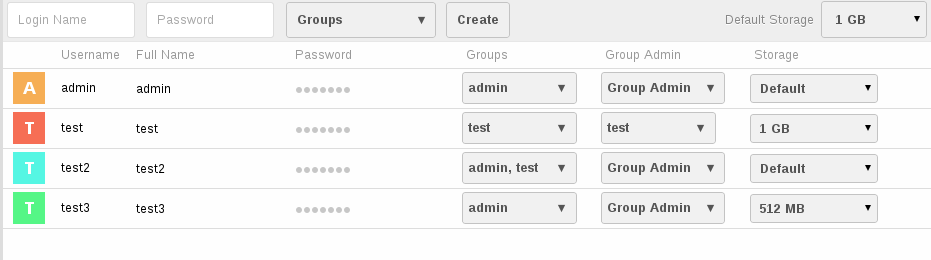

User Management
===============

ownCloud administrators can easily manage users via the web interface. To go into
user management page, click your username on the web interface and select *Users*.
A page similar to the image below will be shown:

  Users management page

A fictive use case will help you understand the concept of users, user groups
and group admins.

Think of a small, 25-member staff company, named "Cloud Lovers", that is lead
by its founder Richard. In this company Bob acts as IT operator and recently
set up ownCloud. Being the installing user, Bob is member of the so called
"admin" user group of ownCloud. His colleague Tom, who provides support if Bob
is on holiday, is member of the "admin" user group as well. All employees,
including Bob and Tom, are members of the user group "Internal", that is used
to share data across the company. Mostly for operational data, that should not
be accessible to all employees, Bob created the "Administration" user group
having two members: Richard and his assistant Susan. Richard is group admin of
this user group, so he can manage the members of the "Administration" user
group on his own.

Users
-----

A user represents an account of the ownCloud installation. In this section the
core properties are listed.

*Login name (Username)*
  This is the unique ID of a ownCloud user (e.g. test, jon.doe).

*Full Name*
  This is the name that is used all over the user interface to identify the
  user i.e. when sharing data or sending mails. If no display name is set, it
  defaults to the login name.

*Password*
  This is the password the user uses to login to ownCloud.

*Groups*
  This is a list of security groups the user is assigned to. By default the
  user is not member of any user group.

*Group Admin*
  This is a list of security groups the user has administration privileges for.
  By default the user is not registered as group admin for any user group.

*Storage*
  This is the maximum disk space that may be used by the user. If the user
  reaches this limit he/she is not able to upload or sync further data. The
  storage quota is specified in the format *Number Unit* (e.g. 100 B (byte),
  50 KB (kilobyte), 20 MB (megabyte), 5 GB (gigabyte)). If no unit is given,
  the number is interpreted as bytes.

Each user is able to change its display name and password.

Create a user
~~~~~~~~~~~~~

Before users can sign in and share data, they need ownCloud user accounts.

To create a user account:

#. Enter the new user's **Login Name** and its initial **Password** in the
   appropriate fields.
#. (Optional) Select the **Groups** to which you want to assign the new user.
#. Click **Create**.
#. (Optional) Edit additional user settings.

   To set other user settings, such as setting a display name or limiting the
   user's storage, see instructions as follows.

Created users will have the storage specified on *Default Storage* setting
on the same page.

Login names may contain letters (a-z, A-Z), numbers (0-9), dashes (-),
underscores (_), periods (.) and at signs (@).

Reset a user's password
~~~~~~~~~~~~~~~~~~~~~~~

To reset a user's password:

#. Hover the line of the user.
#. Click on the **pencil icon** next to the password field.
#. Enter the user's new password in the password field and then hit the
   **Enter** key of your keyboard.

Remember to provide the user with the new login information after you have
reset the password.

Rename a user
~~~~~~~~~~~~~

Each ownCloud user has two names: an unique *login name* used for
authentication, and a *display name* (e.g. the user's first name and last name)
used in the user interface. You can edit the display name of a user, but you
cannot change the login name of any user.

To set a user's display name:

#. Hover the line of the user.
#. Click on the **pencil icon** next to the display name field.
#. Enter the user's new display name in the corresponding field and then hit
   the **Enter** key of your keyboard.

Grant administrator privileges to a user
~~~~~~~~~~~~~~~~~~~~~~~~~~~~~~~~~~~~~~~~

If a user has administrator privileges, the user has the right to manage other
users. Within ownCloud there are two types of administrators: *Super
Administrators* and *Group Administrators*.

Group administrators have the management rights to:

* Create new users and assign them to the group of the group administrator
* Edit and delete users that are assigned to the group of the group
  administrator

Group administrators cannot access system settings or modify installation-wide
configuration like the default storage.

To assign the *super administrator* role to a user:

#. Use the drop-down list in *Groups* column of the user
#. Assign the user to the "admin" user group

To assign the *group administrator* role to a user:

Find the user and select the user groups from the **Group Admin** drop-down
list you want the user become group administrator for.

Assign a user to a user group
~~~~~~~~~~~~~~~~~~~~~~~~~~~~~

To assign a user to a user group:

Find the user and select the user groups from the **Groups** drop-down list
you want to assign the user to. You can use *add group* link to create a new
group to assign the user to. You can assign the user more than one group by checking
multiple groups.

.. note:: If a file/folder is shared with a group, newly created users will immediately
          have access to the share.

.. note:: If you assign a user to the *admin* user group, the user will become a
          *Super Administrator* with unlimited privileges.

Limit a user's storage
~~~~~~~~~~~~~~~~~~~~~~

To limit a user's storage quota:

Find the user and select an item from the **Storage** drop-down list.

   * If you select *Default*, the default storage limit, specified in the
     action bar at the top, is applied.
   * If you select *Unlimited*, the user is not limited until the total disk
     space is consumed.
   * If you want to enter a custom limit, select *Other...*, enter the storage
     quota of your choice and hit the **Enter** key of your keyboard.

If you edit the value of the **Default Storage** field in the action bar, all
users with storage *Default* are affected by this change, i.e. changing the
default storage from *Unlimited* to *1 GB* will cause all users with *Default*
storage being limited to 1 GB storage each.

Delete User
~~~~~~~~~~~

**Important considerations before deleting a user:**

* The user will no longer be able to sign in to your ownCloud installation.
* You cannot revert the deletion or restore a deleted account.

.. note:: If this user had a share with a group or user, the share also will
          be deleted permanently.

To delete a user account:

#. Hover the line of the user you want to delete.
#. Click the **cross icon** at the end of the line.

.. note:: If you accidentally delete a user, you can use undo button shown on
          notification bar at the top of the page.

User Groups
-----------

Create Group
~~~~~~~~~~~~

To create a user group:

#. Open the **Groups** drop-down list in the action bar.
#. Click **add group**.
#. Enter the name of the new group and then hit the **Enter** key of your
   keyboard.

You can *assign users* to the newly created user groups anytime by using users'
group drop-down list.

Edit/Delete Group
~~~~~~~~~~~~~~~~~

Currently, groups cannot be edited (e.g. renamed) or removed. This feature
will be available in a future version of ownCloud.

.. note:: If you have direct access to the database, you can manually delete the group
          from database tables oc_groups and oc_group_user.
