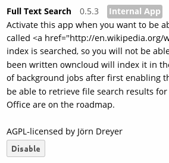
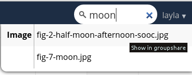

Enabling Full-Text Search
=========================
The Full-Text Search app indexes plain text, ``.docx``, ``.xlsx``, ``.pptx``, 
``.odt``, ``.ods`` and ``.pdf`` files stored in ownCloud. It is based on Zend 
Search Lucene, which is a good general purpose text 
search engine written in PHP 5. The Zend Lucene index is stored on the 
filesystem (in ``owncloud/data/$user/lucene_index``) and does not require a database server. 

Using the Full-Text Search app is literally set-it-and-forget-it: all you do is 
enable it on your Apps page, and then it automatically indexes all documents on 
your ownCloud server. It does not index files on remote storage services or 
devices.

When you want to find a document, enter your search term in the search field at 
the upper right of your ownCloud Web interface. You can run a search from any 
ownCloud page. Hover your cursor over any of your search results to see what 
folder it is in, or click on the filename and it takes you to the folder.

**Known limitations**

It does not work with the Encryption app, because the background indexing 
process does not have access to the key needed to decrypt files when the user is 
not logged in.

Not all PDF versions can be indexed because its text extraction may be
incompatible with newer PDF versions.

