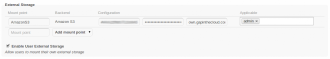
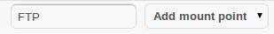
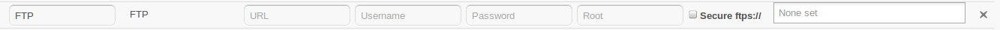
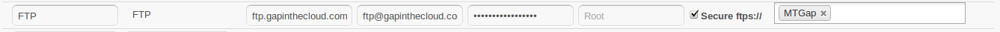

Custom Mount Configuration Web-GUI
==================================

Since ownCloud 5.0 it is possible to mount external storage providers into
ownCloud's virtual file system. To add an external storage backend to your
ownCloud head to *Settings* -> *Admin* or *Personal*. As administrator you
can mount external storage for any group or user. Users are also allowed
to mount external storage for themselves if this setting has been enabled
by the administrator.

At first the mount point has to be entered, this is the directory in ownCloud's
virtual file system, that the storage will be mounted to. Then the storage
backend has to be selected from the list of supported backends. As of writing
ownCloud currently supports the following storage backends:

-  Local file system (mount local storage that is outside ownCloud's data
   directory)
-  FTP (or FTPS)
-  SFTP
-  SMB
-  WebDAV
-  `Amazon S3`_
-  `Dropbox`_
-  `Google Drive`_
-  `OpenStack Swift`_

Please keep in mind, that users are not allowed to mount local file storage for
security purposes.

Once a backend has been selected, more configuration fields will appear. The
displayed configuration fields may vary depending on the selected storage backend.
For example, the FTP storage backend needs the following configuration details
to be entered:

-  **host**: the hostname of the ftp server
-  **user**: the username used to login to the ftp server
-  **password**: the password to login to the ftp server
-  **secure**: whether to use ftps:// (FTP over TLS) to connect to the ftp
   server instead of ftp:// (optional, defaults to false)
-  **root**: the name of the folder inside the ftp server to mount (optional,
   defaults to ‘/’)

.. _Amazon S3: http://aws.amazon.com/de/s3/
.. _Dropbox: https://www.dropbox.com/
.. _Google Drive: https://drive.google.com/start
.. _OpenStack Swift: http://openstack.org/projects/storage/

Dropbox
~~~~~~~
Mounting a Dropbox account requires that you create an app with Dropbox and then provide the app key and secret to the
external storage configuration user interface. Go to My apps at Dropbox and create an app. Select *Full Dropbox* access
level. Copy the app key and app secret and paste them into the corresponding fields for the Dropbox storage.

Click the *Grant access* button and you will be redirected to a Dropbox website to give ownCloud permission to access your account.

Google Drive
~~~~~~~~~~~~
For a detailed step-by-step guide read `User Manual <../../user_manual/external_storage/google_drive.html>`_
