Custom Mount Configuration (GUI)
================================

ownCloud provides the ability to mount an external storage device.
The external storage devices serves as a secondary storage device within ownCloud.

The ownCloud Admin has the ability to create such a mount.
In addition, the ownCloud Admin may decide to provide the end user the ability to create the mount.
The mounts may be created on a per-user, per group, or all user basis.

.. note:: Using ``$user`` in any option gets replaced by the current user. This can be used e.g to
	  specify users' own paths easily by just writing ``/home/$user/``.

Supported mounts
----------------

The following lists the supported storage types.

*   Local
*   Amazon S3
*   Dropbox
*   FTP
*   Google Drive
*   OpenStack Object Storage
*   SMB/CIFS
*   ownCloud/WebDAV
*   SFTP
*   iRODS

Configuration
-------------

Enable the app
--------------

From the ``APPs`` Page within ownCloud, select ``External Storage Support`` and enable.

|10000000000001980000009271BE0D26_png|

Configure mounts
----------------

As stated previously, the Admin has the ability to configure these mounts, as
well as decide whether an end user can configure mounts for themselves.  For
the Admin, the configuration is performed in the ``Admin`` page.  For end
users, the configuration is performed in the ``Personal`` Page.  This document
will discuss how the Admin configures the mounts, however, the configuration is
the same for the end user.

On the ``Admin`` page, scroll to External Storage:

|1000000000000631000000E19D116AA0_png|

Enable users to mount their own devices
~~~~~~~~~~~~~~~~~~~~~~~~~~~~~~~~~~~~~~~

In order to allow end users to mount their own devices, select the radio button next to
Enable User External Storage.

Local Storage
~~~~~~~~~~~~~

This is used to mount storage that is outside ownCloud’s data directory

|10000000000006060000006A0106CA0C_png|

*   Location – The directory to mount
*   Applicable – A list users of who can see this mount

|10000000000003DF00000071A41D8A1F_png|

Note: When configured correctly, a *Green Light* will appear next to the Folder Name.
If misconfigured, a *Red Light* will appear.

|10000000000004770000008AAF3CFFDB_png|

Amazon S3
~~~~~~~~~

This is used to mount to an S3 server

|100000000000061D0000007047877972_png|

*   Access Key – The access key provided by the S3 storage provider
*   Secret Key – The secret key provided by the S3 storage provider
*   Bucket – The bucket created within the S3 storage server
*   Hostname (optional) – The host of the s3 storage server
*   Port (optional) – The port to communicate to the host on
*   Region (optional) – The region where the storage exists
*   Applicable – A list of users who can see this mount

|10000000000005BB0000007C1DF71FA7_png|

.. note:: When configured correctly, a Green Light will appear next to the Folder Name.
          If misconfigured, a Red Light will appear.

|100000000000063F00000090AAE1FA4A_png|

Dropbox
~~~~~~~

Mounts a dropbox in the Dropbox cloud into the virtual file system.

Configure DropBox
^^^^^^^^^^^^^^^^^

Log onto the `Dropbox Developers page`_:

.. _`Dropbox Developers page`: http://www.dropbox.com/developers

Select App Console:

|10000000000000A800000073F49785A6_png|

This will ask you to accept terms and conditions.

Select Dropbox API and configure down the page as follows:

|1000000000000372000002AF943ADDA0_png|

The name can be any unique name desired.

Select Create App

|10000000000000950000004412998BE7_png|

Enter the OAuth redirect URI as follows::

  http://<ownCloud instance>/index.php/settings/personal
  http://<ownCloud instance>/index.php/settings/admin

|10000000000003A6000002A9C7A660BE_png|

Take note of the App Key and App Secret and enter into ownCloud.

ownCloud Configuration
^^^^^^^^^^^^^^^^^^^^^^

|100000000000060300000065DF96536B_png|

*   App key – The app key to login to your Dropbox
*   App secret – The app secret to login to your Dropbox
*   Applicable – A list users of who can see this mount

|10000000000005EC00000073E678DFEC_png|

Select “Grant Access” and the following appears

|10000000000002950000021E245F6883_png|

Note if you are not logged into Dropbox, you will first be prompted to login.
Select Allow.

|10000000000005E6000000676902E040_png|

.. note:: When configured correctly, a Green Light will appear next to the Folder Name.
          If misconfigured, a Red Light will appear.

|100000000000061A0000006FC014C3A4_png|

FTP
~~~

Mounts a folder on a remote FTP or FTPS server

|100000000000061E0000006BCF9ECC0B_png|

*   URL – The hostname of the FTP/FTPS server
*   Username – The username to login to the FTP/FTPS server
*   Password – The password to login to the FTP/FTPS esrver
*   Root – The folder inside the FTP/FTPS server to mount (optional – defaults to ‘/’)
*   Secure ``ftps://`` -- Whether to use ftps:// to connect to the FTP server instead of ``ftp://``
*   Applicable – A list users of who can see this mount

|10000000000005AF00000074604B1A67_png|

.. note:: When configured correctly, a Green Light will appear next to the
          Folder Name.  If misconfigured, a Red Light will appear.

|10000000000005D50000009458C5EE48_png|

GoogleDrive
~~~~~~~~~~~

Mounts a share in the Google cloud.

Configure GoogleDrive
^^^^^^^^^^^^^^^^^^^^^

All applications that access a Google API must be registered through the “Google Cloud Console”.
This can be accessed at the following URL:

`https://cloud.google.com <https://cloud.google.com>`_

Once logged into Google, create a project by selecting
Create Project

|1000000000000247000000A77440E4D3_png|

Enter a Project name and either keep or enter a new Project ID

|100000000000027B0000011D10F70F88_png|

Select the project and choose the APIs & auth menu entry

|10000000000000B600000120706C3C75_png|

Enable ``Drive API`` and ``Drive SDK`` and then select the

|100000000000003800000018D49F1CE7_png|

next to either ``Drive API`` or ``Drive SDK``

|10000000000004100000005657010336_png|

Select ``API Access`` on the menu

|10000000000000CD000000ECA8DE7780_png|

Select ``REGISTER APP``

|10000000000001FD000000DF8D2D7546_png|

Enter a name and select ``Web Application``

|10000000000002840000016729388B7F_png|

Expand ``OAuth 2.0 Client ID``
Enter the following in the ``REDIRECT URI`` field::

  http://<ownCloud instance>/index.php/settings/personal
  http://<ownCloud instance>/index.php/settings/admin

.. note:: The ``<ownCloud instance>`` must be a Fully Qualified Domain Name.  It cannot be an IP address!

Select ``Generate``

|10000000000003B30000021B5EE5D338_png|

Verify that the required email addresses are in the Permissions tab

|10000000000003A60000011E274A1A28_png|

Configure ownCloud
^^^^^^^^^^^^^^^^^^

Prior to configuring the mount, an E-mail address needs to be configured in the ``Personal`` tab

|10000000000001880000007EA4444400_png|

|10000000000006000000005EDA7B96BE_png|

*   Client ID – The client id to login to the Google Drive from ``OAuth 2.0 Client ID`` above
*   Client secret – The client secret to login to the Google Drive from ``OAuth 2.0 Client ID`` above
*   Applicable – A list users of who can see this mount

Once the required fields are filled in, a ``Grant access`` button appears.  Select this button.

|10000000000005F70000007E43DB8026_png|

The following screen appears. Select ``Accept``

|10000000000001D30000014DC251C948_png|

|10000000000004C0000000795BB2C146_png|

|1000000000000552000000BF22E90239_png|

.. note:: When configured correctly, a Green Light will appear next to the
          Folder Name.  If misconfigured, a Red Light will appear.

OpenStack Object Storage
~~~~~~~~~~~~~~~~~~~~~~~~

Mounts a container on an OpenStack Object Storage server.

|100000000000053A00000067708C8F53_png|

|10000000000002170000004A27056037_png|

*   Username
*   Bucket
*   Region
*   API Key
*   Tenantname
*   Password
*   Service Name
*   URL of identity Endpoint
*   Timeout of HTTP request
*   Applicable – A list users of who can see this mount

.. note:: When configured correctly, a Green Light will appear next to the
          Folder Name.  If misconfigured, a Red Light will appear.

SMB/CIFS
~~~~~~~~

Mounts a folder on a remote Samba server, NAS appliance, or Windows machine.

|10000000000005FA0000005CE8491B77_png|

*   URL – The host name of the Samba server.
*   Username – The user name used to login to the Samba server.
*   Password – The password to login to the Samba server.
*   Share – The share on the Samba server to mount.
*   Root – The folder inside the Samba share to mount (optional, defaults to ‘/’)
*   Applicable – A list users of who can see this mount

|10000000000005C30000006CAFFAAD61_png|

.. note:: When configured correctly, a Green Light will appear next to the
          Folder Name.  If misconfigured, a Red Light will appear.

.. note:: The SMB backend requires ``smbclient`` to be installed on the server.

|10000000000005D00000003B29340A7A_png|

ownCloud/WebDAV
~~~~~~~~~~~~~~~

Mounts a folder on a WebDAV server (or another ownCloud instance via WebDAV).

|10000000000005F70000005F0912E904_png|

*   URL – The hostname of the WebDAV server.
*   Username – The username used to login to the WebDAV server.
*   Password – The password used to login to the WebDAV server.
*   Root – The folder inside the WebDav server to mount (optional, defaults to ‘/’)
*   Secure ``https://`` - Whether to use ``https://`` to connect to the WebDav server instead of ``http://``
*   Applicable – A list users of who can see this mount

|10000000000005B90000007866D92D14_png|

.. note:: When configured correctly, a Green Light will appear next to the
          Folder Name.  If misconfigured, a Red Light will appear.

|10000000000005E20000009B1BA5A8CF_png|

SFTP
~~~~

Mounts a folder on a remote SSH server.

|10000000000005FF0000005F35710398_png|

*   URL – The hostname of the SSH server.
*   Username – The username used to login to the SSH server.
*   Password – The password used to login to the SSH server.
*   Root – The folder inside the SSH server to mount (optional, defaults to ‘/’)
*   Applicable – A list users of who can see this mount

|10000000000005970000006AE23997C9_png|

.. note:: When configured correctly, a Green Light will appear next to the
          Folder Name.  If misconfigured, a Red Light will appear.

|10000000000005EB000000A68BA73E2D_png|

iRODS
~~~~~

Mounts a folder on a iRODS server.

|100000000000062A0000005F61A18950_png|

*   Host
*   Port
*   Use ownCloud login
*   Username
*   Password
*   Authentication Mode
*   Zone
*   Applicable – A list users of who can see this mount

.. note:: When configured correctly, a Green Light will appear next to the
          Folder Name.  If misconfigured, a Red Light will appear.

Configuration File
------------------

The configuration of mounts created within the External Storage App are stored in the
``data/mount.json`` file.
This file contains all settings in JSON (JavaScript Object Notation) format.
Two different types of entries exist:

*   Group mounts -
    Each entry configures a mount for each user in group
*   User mount – Each entry configures a mount for a single user or all users.

For each type, there is a JSON array with the user/group name as key and an array of configuration values as the value.
Each entry consist of the class name of the storage backend and an array of backend specific options (described above) and will be replaced by the user login.

Although configuration may be done by making modifications to the mount.json file, it is recommended to use the Web-GUI in the administrator panel (as described in the above section) to add, remove, or modify mount options in order to prevent any problems.

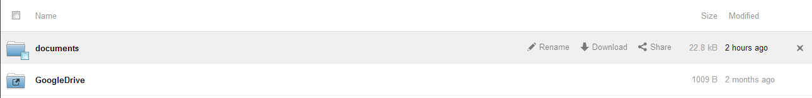

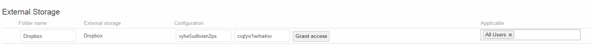

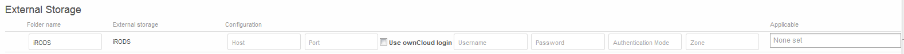

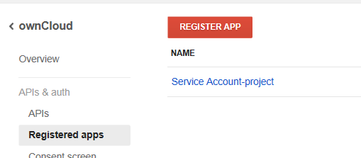

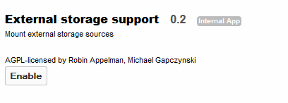

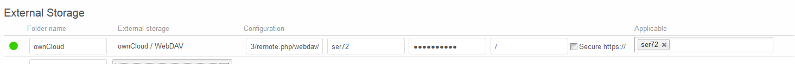

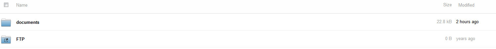

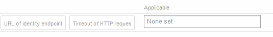

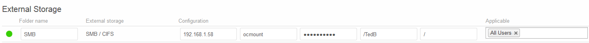

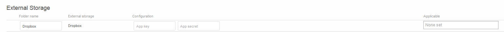

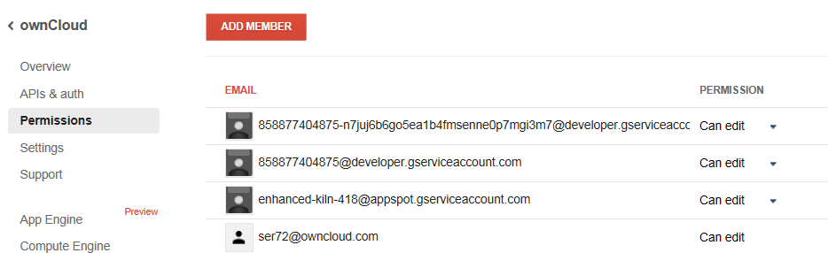

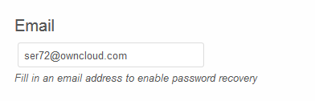

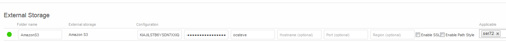

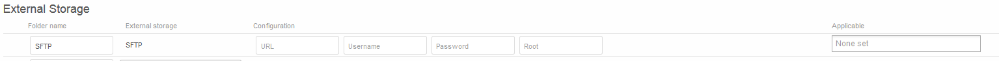

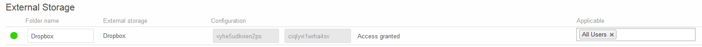

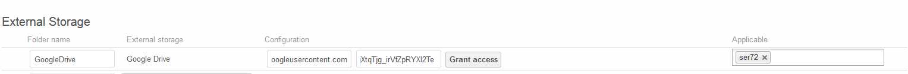

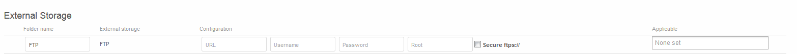

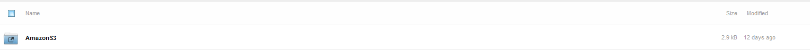

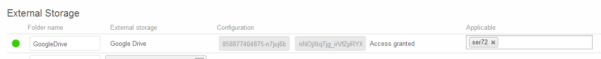

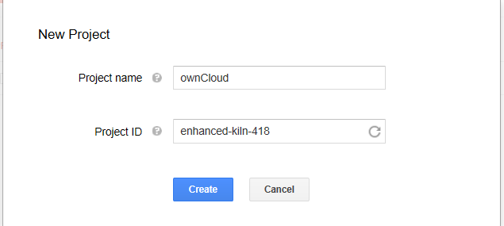

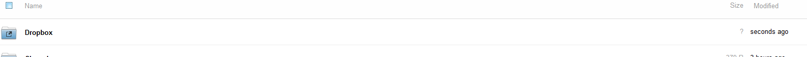

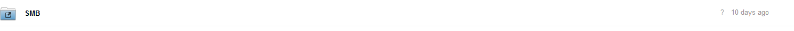

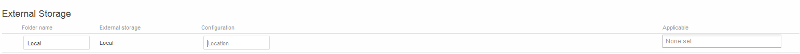

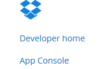

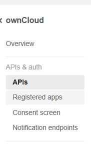

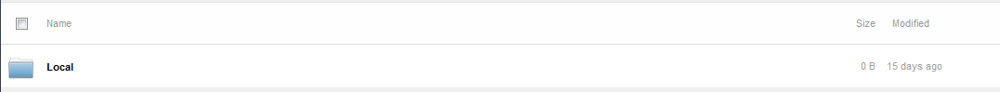

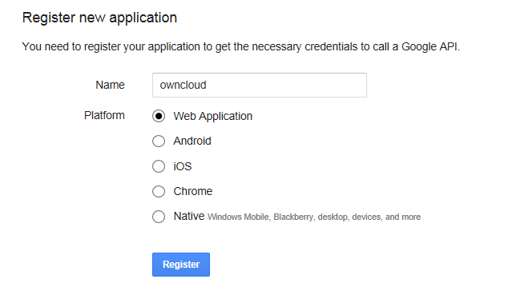

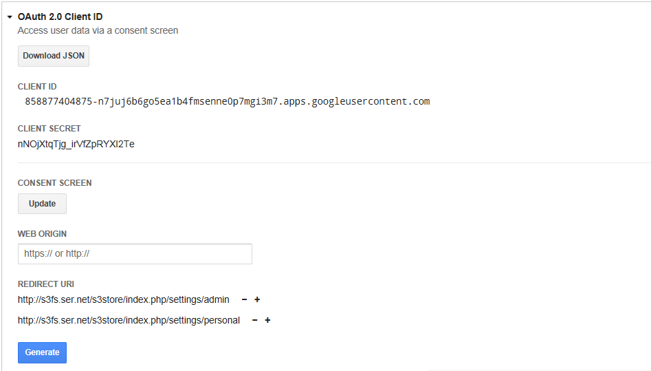

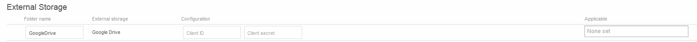

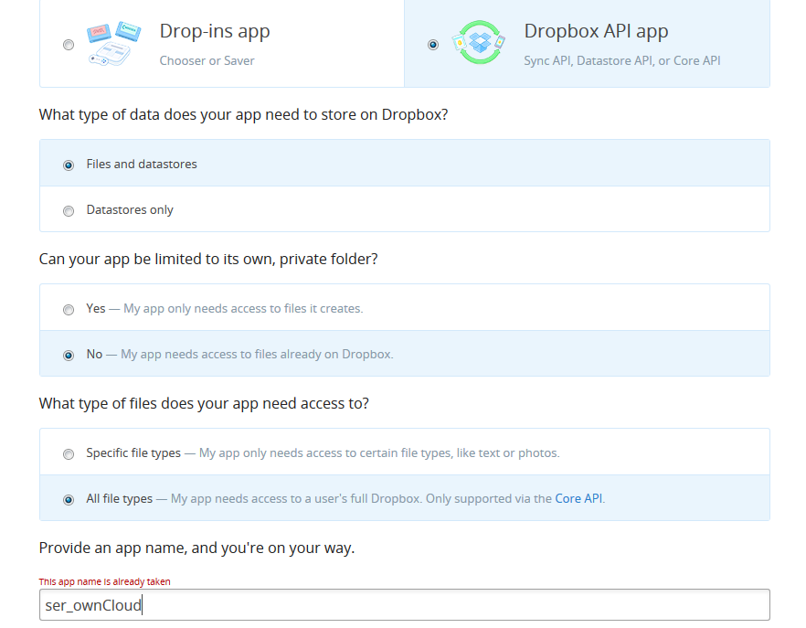

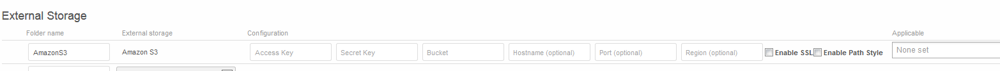

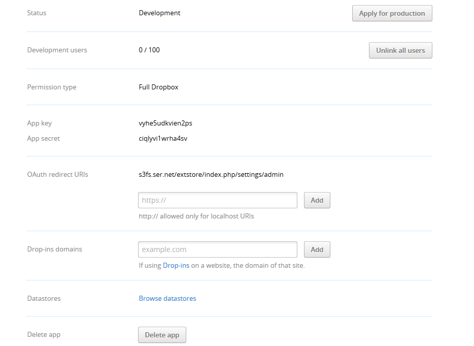

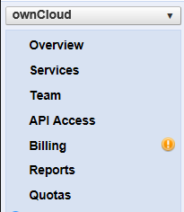

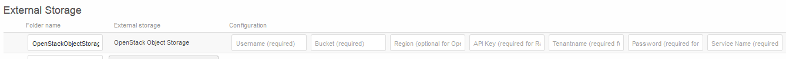

.. |10000000000005970000006AE23997C9_png| image:: ../images/10000000000005970000006AE23997C9.png
    :width: 6.5in
    :height: 0.4811in

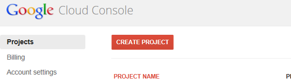

.. |10000000000003DF00000071A41D8A1F_png| image:: ../images/10000000000003DF00000071A41D8A1F.png
    :width: 6.5in
    :height: 0.7409in

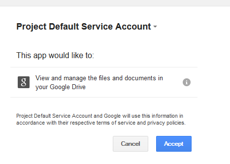

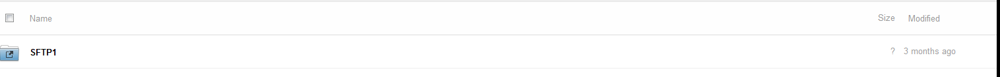

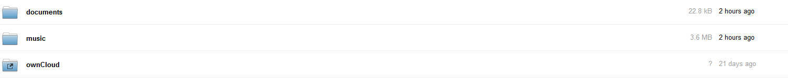

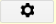

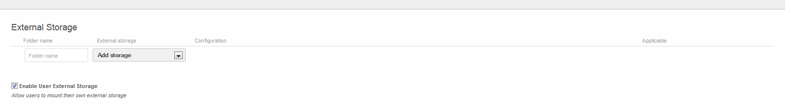

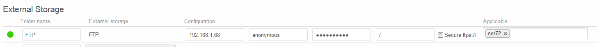

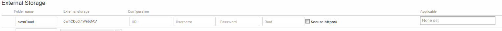

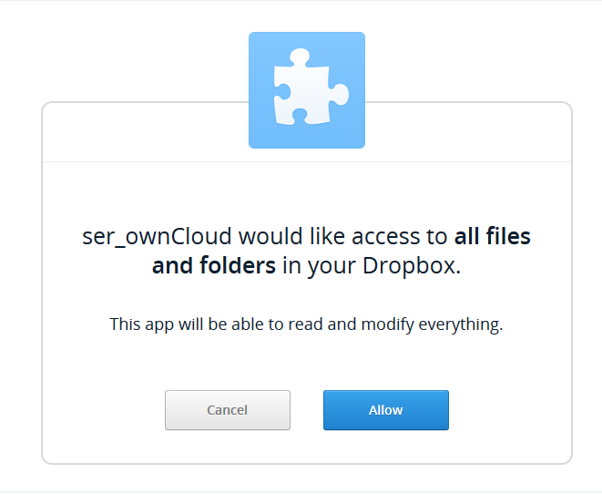

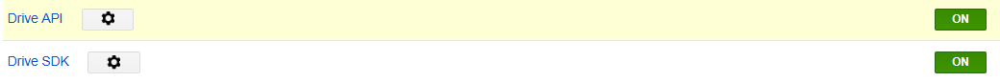

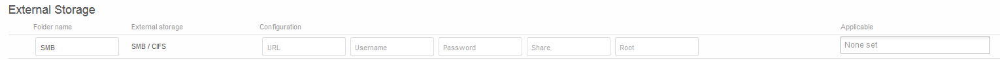

