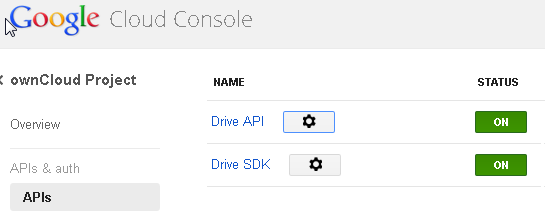
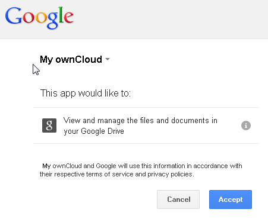

Custom Mount Configuration Web-GUI - Mounting a Google Drive
============================================================

Follow these steps to mount a Google Drive.

1. All applications that access a Google API must be registered through the "Google Cloud Console" which
     can be accessed using the following URL: https://cloud.google.com/console
2. Enter your Google login credentials and press the `Sign in`-button.
.. figure:: ../images/custom_mount_config_gui_add_google_drive-1.png

3. Enter your verification code which has been sett to you by SMS and press the `Verify`-button.
.. figure:: ../images/custom_mount_config_gui_add_google_drive-2.png

4. Create a project, e.g. "ownCloud-Project" 
.. figure:: ../images/custom_mount_config_gui_add_google_drive-3.png

5. Select the project and choose the *APIs & auth* menu entry.
6. Make sure that the "Drive API" / "Drive SDK" status is set to "ON" in the APIs menu.

7. Click on the `gear-wheel`-button behind "Drive API" or "Drive SDK" and choose the "API access" menu entry.
8. Click on the `Create another client ID...`-button and fill in the branding information.
9. Click on the `Next`-button and create a new client ID by selecting "Web application" as application type.
10. Next to your site or hostname click on the `Edit settings ...`-button.
11. Enter the following URLs to the "Authorized Redirect URIs" list and press the `Update`-button.
      http://your-internet-domain/owncloud/index.php/settings/personal
      http://your-internet-domain/owncloud/index.php/settings/admin

      **Attention:** Make sure that the URLs contain a valid Internet domain name and that this domain name is also used to access ownCloud, otherwise these URLs will not be accepted. This does not mean that ownCloud need to be accessible from the Internet, but that the domain name is send to Google to verify if the redirect URIs are valid.

12. Login into ownCloud using the previously entered Internet domain.
12. Click on the `Add storage`-button in the ownCloud Admin settings dialog to add a Google Drive
13. Enter the *folder name* which should be used to access the share, e.g. "GDrive", enter the Google OAuth 2.0 *client id* and *client secret* and choose the *user or group* who should be allowed to access the Google Drive (Applicable).
.. figure:: ../images/custom_mount_config_gui_add_google_drive-5.png

14. Now press the `Grant Access`-button and you will finally be redirected to a Google website.
15. Click on the `Accept`-button to confirm that you accept the Google data usage and data security policy.

 
