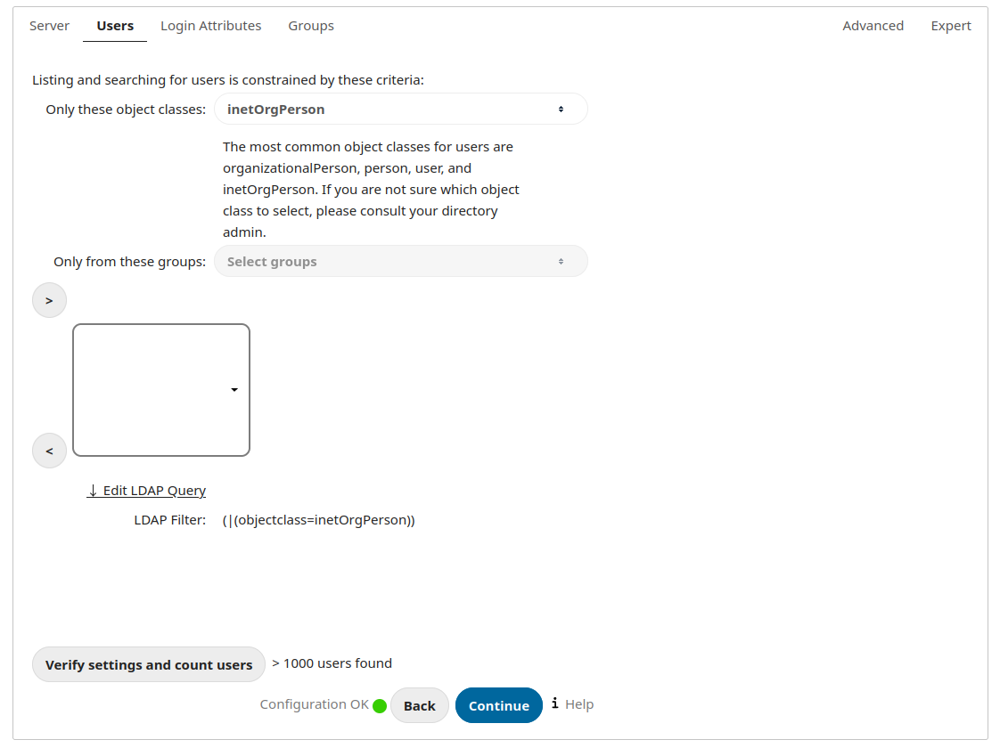
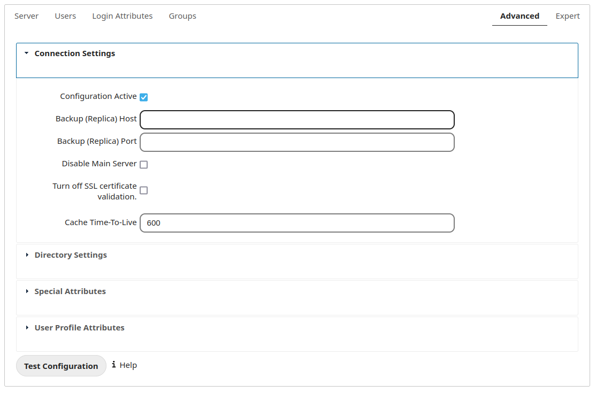
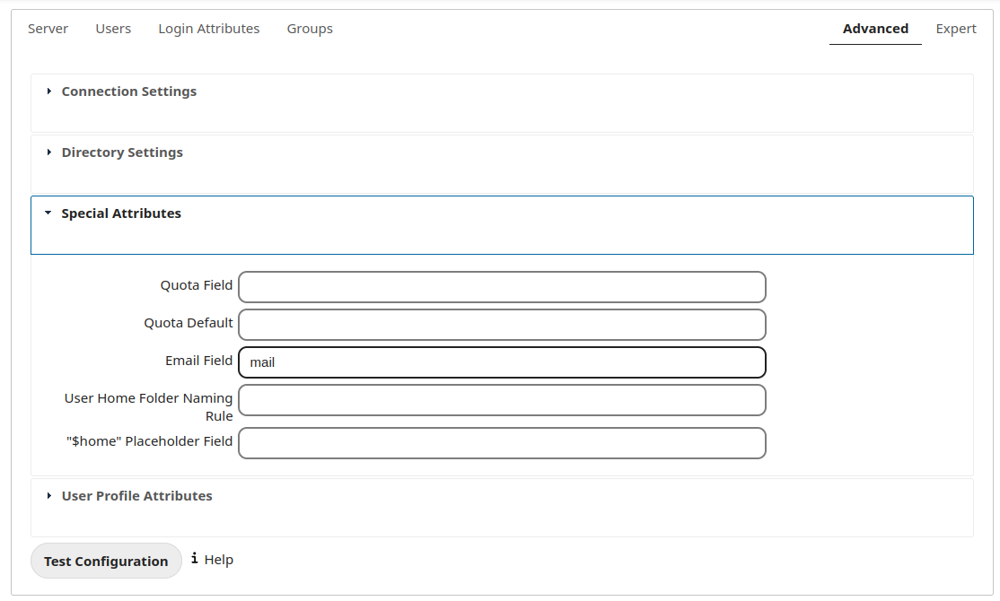
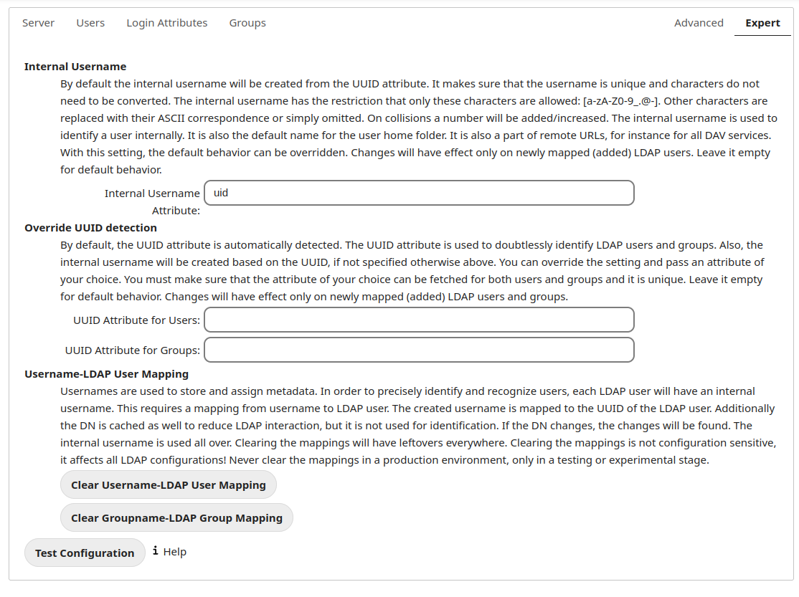

User Authentication with LDAP
=============================

ownCloud ships with an LDAP application so that your existing LDAP users may 
have access to your ownCloud server without creating separate ownCloud user 
accounts.

.. Note:: For performance reasons, we recommend using PHP 5.4 or greater to use 
   the LDAP application with more than 500 users. The PHP LDAP module is 
   required; this is supplied by ``php5-ldap`` on Debian/Ubuntu, and 
   ``php-ldap`` on CentOS/Red Hat/Fedora.

The LDAP application supports:

* LDAP group support
* File sharing with ownCloud users and groups
* Access via WebDAV and ownCloud Desktop Client
* Versioning, external Storage and all other ownCloud features
* Seamless connectivity to Active Directory, with no extra configuration 
  required
* Support for primary groups in Active Directory
* Auto-detection of LDAP attributes such as base DN, email, and the LDAP server 
  port number

.. Note:: The LDAP app is not compatible with the ``WebDAV user backend`` app. 
   You cannot use both of them at the same time. 

Configuration
-------------

First enable the ``LDAP user and group backend`` app on the Apps page in 
ownCloud. Then go to your Admin page to configure it.

The LDAP configuration panel has four tabs. A correctly completed first tab 
("Server") is mandatory to access the other tabs. A green indicator lights when 
the configuration is correct. Hover your cursor over the fields to see some 
pop-up tooltips. 

Server Tab
~~~~~~~~~~

Start with the Server tab. You may configure multiple servers if you have them. 
At a minimum you must supply the LDAP server's hostname. If your server requires 
authentication, enter your credentials on this tab. ownCloud will then attempt 
to auto-detect the server's port and base DN. The base DN and port are 
mandatory, so if ownCloud cannot detect them you must enter them manually.

.. figure:: ../images/ldap-wizard-1-server.png

Server configuration:
  Configure one or more LDAP servers. Click the **Delete Configuration** 
  button to remove the active configuration.

Host:
  The host name or IP address of the LDAP server. It can also be a **ldaps://** 
  URI. If you enter the port number, it speeds up server detection.
  
  Examples:

  * *directory.my-company.com*
  * *ldaps://directory.my-company.com*
  * *directory.my-company.com:9876*

Port:
  The port on which to connect to the LDAP server. The field is disabled in the
  beginning of a new configuration. If the LDAP server is running on a standard 
  port, the port will be detected automatically. If you are using a 
  non-standard port, ownCloud will attempt to detect it. If this fails you must 
  enter the port number manually.

  Example:

  * *389*

User DN:
  The name as DN of a user who has permissions to do searches in the LDAP 
  directory. Leave it empty for anonymous access. We recommend that you have a 
  special LDAP system user for this.

  Example:

  * *uid=owncloudsystemuser,cn=sysusers,dc=my-company,dc=com*

Password:
  The password for the user given above. Empty for anonymous access.

Base DN:
  The base DN of LDAP, from where all users and groups can be reached. You may 
  enter multiple base DNs, one per line. (Base DNs for users and groups can be 
  set in the Advanced tab.) This field is mandatory. ownCloud attempts to 
  determine the Base DN according to the provided User DN or the provided 
  Host, and you must enter it manually if ownCloud does not detect it.

  Example:

  * *dc=my-company,dc=com*

User Filter
~~~~~~~~~~~

Use this to control which LDAP users have access to your ownCloud server. You 
may bypass the form fields and enter a raw LDAP filter if you prefer.

only those object classes:
  ownCloud will determine the object classes that are typically available for
  user objects in your LDAP. ownCloud will automatically select the object 
  class that returns the highest amount of users. You may select multiple 
  object classes.

only from those groups:
  If your LDAP server supports the ``member-of-overlay`` in LDAP filters, you 
  can define that only users from one or more certain groups are allowed to
  appear and log in into ownCloud. By default, no value will be selected. You
  may select multiple groups.

  If your LDAP server does not support the member-of-overlay in LDAP filters,
  the input field is disabled. Please contact your LDAP administrator.

Edit raw filter instead:
  Clicking on this text toggles the filter mode and you can enter the raw LDAP 
  filter directly.
  
  Example:

  * *objectClass=inetOrgPerson*

x users found:
  This is an indicator that tells you approximately how many users will be
  allowed to access ownCloud. The number updates automatically after any 
  changes.

Login Filter
~~~~~~~~~~~~

The settings in the Login Filter tab determine what the user's login will be, 
for example an LDAP username, or an email address. You may select multiple user 
details. (You may bypass the form fields and enter a raw LDAP filter if you 
prefer.)

You may override your User Filter settings on the User Filter tab by using a raw 
LDAP filter.

.. figure:: ../images/ldap-wizard-3-login.png

LDAP Username:
  If this value is checked, the login value will be compared to the username in
  the LDAP directory. The corresponding attribute, usually *uid* or
  *samaccountname* will be detected automatically by ownCloud.

LDAP Email Address:
  If this value is checked, the login value will be compared to an email address
  in the LDAP directory; specifically, the *mailPrimaryAddress* and *mail* 
  attributes.

Other Attributes:
  This multi-select box allows you to select other attributes for the 
  comparison. The list is generated automatically from the user object 
  attributes in your LDAP server.

Edit raw filter instead:
  Clicking on this text toggles the filter mode and you can enter the raw LDAP 
  filter directly.

  The **%uid** placeholder is replaced with the login name entered by the 
  user upon login.

  Examples:

  * only username: *uid=%uid*
  * username or email address: *(|(uid=%uid)(mail=$uid))*

Group Filter
~~~~~~~~~~~~

By default, no LDAP groups will be available in ownCloud. The settings in the 
group filter tab determine which groups will be available in ownCloud. You may 
also elect to enter a raw LDAP filter instead.

.. figure:: ../images/ldap-wizard-4-group.png

only those object classes:
  ownCloud will determine the object classes that are typically available for
  group objects in your LDAP server. ownCloud will only list object
  classes that return at least one group object. You can select multiple
  object classes. A typical object class is "group", or "posixGroup".

only from those groups:
  ownCloud will generate a list of available groups found in your LDAP server. 
  and then you select the group or groups that get access to your ownCloud 
  server.

Edit raw filter instead:
  Clicking on this text toggles the filter mode and you can enter the raw LDAP 
  filter directly.

  Example:

  * *objectClass=group*
  * *objectClass=posixGroup*

y groups found:
  This tells you approximately how many groups will be available in ownCloud. 
  The number updates automatically after any change.

Advanced Settings
-----------------

The LDAP Advanced Setting section contains options that are not needed for a 
working connection. This provides controls to disable the current configuration, 
configure replica hosts, and various performance-enhancing options.

The Advanced Settings are structured into three parts:

* Connection Settings
* Directory Settings
* Special Attributes

Connection Settings
~~~~~~~~~~~~~~~~~~~

   LDAP Advanced Settings, section Connection Settings

Configuration Active:
  Enables or Disables the current configuration. By default, it is turned off. 
  When ownCloud makes a successful test connection it is automatically turned 
  on.

Backup (Replica) Host:
  If you have a backup LDAP server, enter the connection settings here. 
  ownCloud will then automatically connect to the backup when the main server 
  cannot be reached. The backup server must be a replica of the main server so 
  that the object UUIDs match.

  Example:

  * *directory2.my-company.com*

Backup (Replica) Port:
  The connection port of the backup LDAP server. If no port is given,
  but only a host, then the main port (as specified above) will be used.

  Example:

  * *389*

Disable Main Server:
  You can manually override the main server and make ownCloud only connect to
  the backup server. This is useful for planned downtimes.

Case insensitive LDAP server (Windows):
  When the LDAP server is running on a Windows Host.

Turn off SSL certificate validation:
  Turns off SSL certificate checking. Use it for testing only!

Cache Time-To-Live:
  A cache is introduced to avoid unnecessary LDAP traffic, for example caching 
  usernames so they don't have to be looked up for every page, and speeding up 
  loading of the Users page. Saving the configuration empties the cache. The 
  time is given in seconds.

  Note that almost every PHP request requires a new connection to the LDAP 
  server. If you require fresh PHP requests we recommend defining a minimum 
  lifetime of 15s or so, rather than completely eliminating the cache.

  Examples:

  * ten minutes: *600*
  * one hour: *3600*
  
See the Caching section below for detailed information on how the cache 
operates.

Directory Settings
~~~~~~~~~~~~~~~~~~~

.. figure:: ../images/ldap-advanced-2-directory.png

   LDAP Advanced Settings, section Directory Settings

User Display Name Field:
  The attribute that should be used as display name in ownCloud.

  *  Example: *displayName*

Base User Tree:
  The base DN of LDAP, from where all users can be reached. This must be a 
  complete DN, regardless of what you have entered for your Base DN in the 
  Basic setting. You can specify multiple base trees, one on each line.

  * Example:

    | *cn=programmers,dc=my-company,dc=com*
    | *cn=designers,dc=my-company,dc=com*

User Search Attributes:
  These attributes are used when searches for users are performed, for example 
  in the in the share dialogue. The user display name attribute is the 
  default. You may list multiple attributes, one per line.

  If an attribute is not available on a user object, the user will not be 
  listed, and will be unable to login. This also affects the display name 
  attribute. If you override the default you must specify the display name 
  attribute here.

  * Example:

    | *displayName*
    | *mail*

Group Display Name Field:
  The attribute that should be used as ownCloud group name. ownCloud allows a
  limited set of characters (a-zA-Z0-9.-_@). Once a group name is assigned it 
  cannot be changed.

  * Example: *cn*

Base Group Tree:
  The base DN of LDAP, from where all groups can be reached. This must be a 
  complete DN, regardless of what you have entered for your Base DN in the 
  Basic setting. You can specify multiple base trees, one in each line.

  * Example:

    | *cn=barcelona,dc=my-company,dc=com*
    | *cn=madrid,dc=my-company,dc=com*

Group Search Attributes:
  These attributes are used when a search for groups is done, for example in 
  the share dialogue. By default the group display name attribute as specified 
  above is being used. Multiple attributes can be given, one in each line.

  If you override the default, the group display name attribute will not be
  taken into account, unless you specify it as well.

  * Example:

    | *cn*
    | *description*

Group Member association:
  The attribute that is used to indicate group memberships, i.e. the attribute
  used by LDAP groups to refer to their users.

  ownCloud detects the value automatically. You should only change it if you
  have a very valid reason and know what you are doing.

  * Example: *uniquemember*

Special Attributes
~~~~~~~~~~~~~~~~~~

   LDAP Advanced Settings, section Special Attributes

Quota Field:
  ownCloud can read an LDAP attribute and set the user quota according to its
  value. Specify the attribute here, and it will return human-readable values, 
  e.g. "2 GB".

  * Example: *ownCloudQuota*

Quota Default:
  Override ownCloud default quota for LDAP users who do not have a quota set in 
  the Quota Field.

  * Example: *15 GB*

Email Field:
  Set the user's email from their LDAP attribute. Leave it empty for default 
  behavior.

  * Example: *mail*

User Home Folder Naming Rule:
  By default, the ownCloud server creates the user directory in your ownCloud 
  data directory. You may want to override this setting and name it after an 
  attribute value. The attribute given can also return an absolute path, e.g. 
  ``/mnt/storage43/alice``. Leave it empty for default behavior.

  * Example: *cn*

Expert Settings
---------------

In the Expert Settings fundamental behavior can be adjusted to your needs. The
configuration should be well-tested before starting production use.

Internal Username:
  The internal username is the identifier in ownCloud for LDAP users. By default
  it will be created from the UUID attribute. The UUID attribute ensures that 
  the username is unique, and that characters do not need to be converted. Only 
  these characters are allowed: [\a-\zA-\Z0-\9_.@-]. Other characters are 
  replaced with their ASCII equivalents, or are simply omitted.

  The LDAP backend ensures that there are no duplicate internal usernames in
  ownCloud, i.e. that it is checking all other activated user backends
  (including local ownCloud users). On collisions a random number (between 1000
  and 9999) will be attached to the retrieved value. For example, if "alice"
  exists, the next username may be "alice_1337".

  The internal username is the default name for the user home folder in 
  ownCloud. It is also a part of remote URLs, for instance for all \*DAV 
  services.

  You can override all of this with the Internal Username setting. Leave it 
  empty for default behaviour. Changes will affect only newly mapped LDAP users.

  * Example: *uid*

Override UUID detection
  By default, ownCloud auto-detects the UUID attribute. The UUID attribute is
  used to uniquely identify LDAP users and groups. The internal username will 
  be created based on the UUID, if not specified otherwise.

  You can override the setting and pass an attribute of your choice. You must
  make sure that the attribute of your choice can be fetched for both users and
  groups and it is unique. Leave it empty for default behaviour. Changes will
  have effect only on newly mapped LDAP users and groups. It also will
  have effect when a user's or group's DN changes and an old UUID was cached, 
  which will result in a new user. Because of this, the setting should be 
  applied before putting ownCloud in production use and clearing the bindings
  (see the ``User and Group Mapping`` section below).

  * Example: *cn*

Username-LDAP User Mapping
  ownCloud uses usernames as keys to store and assign data. In order to
  precisely identify and recognize users, each LDAP user will have a internal
  username in ownCloud. This requires a mapping from ownCloud username to LDAP
  user. The created username is mapped to the UUID of the LDAP user.
  Additionally the DN is cached as well to reduce LDAP interaction, but it is
  not used for identification. If the DN changes, the change will be detected by
  ownCloud by checking the UUID value.

  The same is valid for groups.

  The internal ownCloud name is used all over in ownCloud. Clearing the Mappings
  will have leftovers everywhere. Never clear the mappings in a production 
  environment, but only in a testing or experimental server.

  **Clearing the Mappings is not configuration sensitive, it affects all LDAP
  configurations!**

Testing the configuration
-------------------------

The **Test Configuration** button checks the values as currently given in the 
input fields. You do not need to save before testing. By clicking on the 
button, ownCloud will try to bind to the ownCloud server using the
settings currently given in the input fields. The response will look like this:

.. figure:: ../images/ldap-settings-invalid-oc45.png

   Failure

In case the configuration fails, you can see details in ownCloud's log, which
is in the data directory and called **owncloud.log** or on the bottom the
**Settings -- Admin page**. You must refresh the Admin page to see the new log 
entries.

.. figure:: ../images/ldap-settings-valid-oc45.png

   Success

In this case, Save the settings. You can check if the users and groups are
fetched correctly on the Users page.

ownCloud Avatar integration
---------------------------

ownCloud support user profile pictures, which are also called avatars. If a user 
has a photo stored in the *jpegPhoto* or *thumbnailPhoto* attribute on your LDAP 
server, it will be used as their avatar. In this case the user cannot alter their 
avatar (on their Personal page) as it must be changed in LDAP. *jpegPhoto* is 
preferred over *thumbnailPhoto*.

.. figure:: ../images/ldap-fetched-avatar.png

   Profile picture fetched from LDAP

If the *jpegPhoto* or *thumbnailPhoto* attribute is not set or empty, then 
users can upload and manage their avatars on their ownCloud Personal pages. 
Avatars managed in ownCloud are not stored in LDAP.

The *jpegPhoto* or *thumbnailPhoto* attribute is fetched once a day to make
sure the current photo from LDAP is used in ownCloud. LDAP avatars override 
ownCloud avatars, and when an LDAP avatar is deleted it the most recent 
ownCloud avatar replaces it.

Photos served from LDAP are automatically cropped and resized in ownCloud. This 
affects only the presentation, and the original image is not changed.

Troubleshooting, Tips and Tricks
--------------------------------

SSL Certificate Verification (LDAPS, TLS)
-----------------------------------------

A common mistake with SSL certificates is that they may not be known to PHP.
If you have trouble with certificate validation make sure that

* You have the certificate of the server installed on the ownCloud server
* The certificate is announced in the system's LDAP configuration file (usually
  */etc/ldap/ldap.conf* on Linux, *C:\\openldap\\sysconf\\ldap.conf* or
  *C:\\ldap.conf* on Windows) using a **TLS_CACERT /path/to/cert** line.
* Using LDAPS, also make sure that the port is correctly configured (by default
  636)

Microsoft Active Directory
--------------------------

Compared to earlier ownCloud versions, no further tweaks need to be done to
make ownCloud work with Active Directory. ownCloud will automatically find the
correct configuration in the set-up process.

Duplicating Server Configurations
---------------------------------

In case you have a working configuration and want to create a similar one or
"snapshot" configurations before modifying them you can do the following:

#. Go to the **Server** tab
#. On **Server Configuration** choose *Add Server Configuration*
#. Answer the question *Take over settings from recent server configuration?*
   with *yes*.
#. (optional) Switch to **Advanced** tab and uncheck **Configuration Active**
   in the *Connection Settings*, so the new configuration is not used on Save
#. Click on **Save**

Now you can modify and enable the configuration.

ownCloud LDAP Internals
-----------------------

Some parts of how the LDAP backend works are described here.

User and Group Mapping
----------------------

In ownCloud the user or group name is used to have all relevant information in
the database assigned. To work reliably a permanent internal user name and
group name is created and mapped to the LDAP DN and UUID. If the DN changes in
LDAP it will be detected, and there will be no conflicts.

Those mappings are done in the database table ``ldap_user_mapping`` and
``ldap_group_mapping``. The user name is also used for the user's folder (except
something else is specified in *User Home Folder Naming Rule*), which
contains files and meta data.

As of ownCloud 5 internal user name and a visible display name are separated.
This is not the case for group names, yet, i.e. a group name cannot be altered.

That means that your LDAP configuration should be good and ready before putting
it into production. The mapping tables are filled early, but as long as you are
testing, you can empty the tables any time. Do not do this in production.

Caching
-------

The ownCloud  **Cache** helps to speed up user interactions and sharing. It is 
populated on demand, and remains populated until the **Cache Time-To-Live** for 
each unique request expires. User logins are not cached, so if you need to
improve login times set up a slave LDAP server to share the load.

Another significant performance enhancement is to install the Alternative PHP 
Cache (APC). APC is an OPcache, which is several times faster than a file 
cache. APC improves PHP performance by storing precompiled script bytecode in 
shared memory, which reduces the overhead of loading and parsing scripts on 
each request. (See http://php.net/manual/en/book.apc.php for more information.)

You can adjust the **Cache Time-To-Live** value to balance performance and 
freshness of LDAP data. All LDAP requests will be cached for 10 minutes by 
default, and you can alter this with the **Cache Time-To-Live** setting. The 
cache answers each request that is identical to a previous request, within the 
time-to-live of the original request, rather than hitting the LDAP server.

The **Cache Time-To-Live** is related to each single request. After a cache 
entry expires there is no automatic trigger for re-populating the information, 
as the cache is populated only by new requests, for example by opening the 
User administration page, or searching in a sharing dialog.

There is one trigger which is automatically triggered by a certain background 
job which keeps the ``user-group-mappings`` up-to-date, and always in cache.

Under normal circumstances, all users are never loaded at the same time. 
Typically the loading of users happens while page results are generated, in 
steps of 30 until the limit is reached or no results are left. For this to 
work on an oC-Server and LDAP-Server, **Paged Results** must be supported, 
which presumes PHP >= 5.4.

ownCloud remembers which user belongs to which LDAP-configuration. That means 
each request will always be directed to the right server unless a user is 
defunct, for example due to a server migration or unreachable server. In this 
case the other servers will also receive the request.

Handling with Backup Server
---------------------------

When ownCloud is not able to contact the main LDAP server, ownCloud assumes it 
is offline and will not try to connect again for the time specified in **Cache 
Time-To-Live**. If you have a backup server configured ownCloud will connect to 
instead. When you have a scheduled downtime, check **Disable Main Server**  to 
avoid unnecessary connection attempts.
