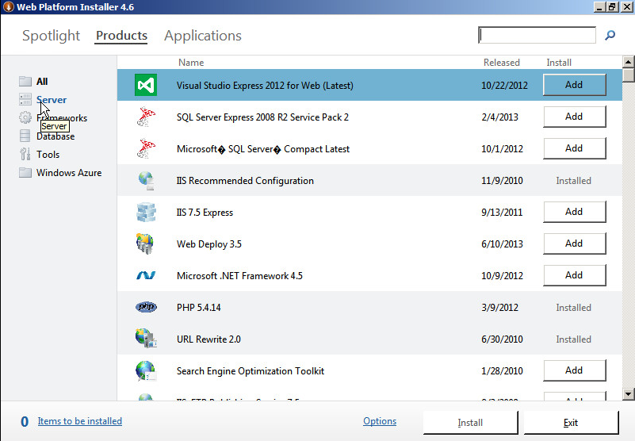
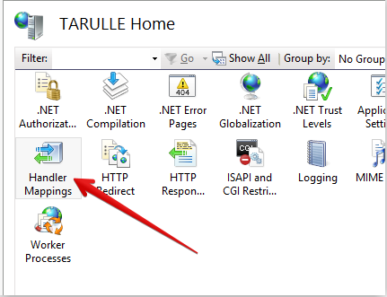
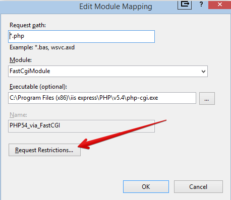
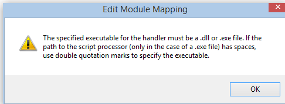
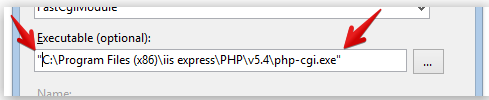
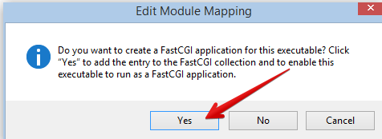

====================================
Microsoft IIS and SQL Server Support
====================================

.. toctree::
    :maxdepth: 2
    :hidden:

The preferred approach to installing the necessary prerequisites for ownCloud
is to use the Microsoft Web Platform Installer (WPI).  This free utility can be
downloaded from this link,
`http://www.microsoft.com/web/downloads/platform.aspx <http://www.microsoft.com/web/downloads/platform.aspx>`_.

Configuration
=============

Once downloaded and installed, invoke the WPI.
It will look like the following:

.. image:: ../images/mswpi-1.png
    :width: 6.5in
    :height: 4.55in

Navigate to the “Products” tab:

And install the following by selecting “Add” next to the instance.

Server
------

IIS Recommended Configuration

IIS Static Content

IIS Default Document

IIS Directory Browsing

IIS HTTP Errors

IIS HTTP Redirection

IIS CGI

IIS ISAPI Extensions

IIS ISAPI Filters

IIS Server Side Includes

IIS HTTP Logging

IIS Logging Tools

IIS Request Monitor

IIS Tracing

IIS Custom Logging

IIS Client Certificate Mapping Authentication

IIS URL Authorization

IIS Request Filtering

IIS IP Domain Restrictions

IIS Static Content Compression

IIS Dynamic Content Compression

IIS Management Console

IIS Management Scripts and Tools

IIS Management Service

Frameworks
----------

PHP 5.4.14

Windows Cache Extension 1.3 for PHP 5.4

Database
--------

Microsoft Drivers for PHP v5.4 for SQL Server IIS

Tools
-----

PHP Manager for IIS

Installation
------------

Once these selections have been made, click the install button and allow the web platform installer to lay
down the needed code to configure the web server.

Verbs
-----

It is important to enable all verbs in the PHP FastCGI settings in order for the sync to work properly.

In the IIS Management application, double click Handler Mappings.

Then double-click on the PHP FastCGI Settings.

.. image:: ../images/mswpi-4.png
    :width: 6.5in
    :height: 2.2299in

Select “Request Restrictions”.

Navigate to the Verbs tab and verify that “All Verbs” is selected.

.. image:: ../images/mswpi-6.png
    :width: 4.7811in
    :height: 3.8957in

The following error may appear when this value is set and OK is selected.

The resolution is to put quotes around the exe name as follows.

When prompted to create a FastCGI application, select Yes.

Restart the IIS service to make sure all settings are applied.

Install ownCloud
================

Once the prerequisites have been installed, the system is ready for the ownCloud installation

To install ownCloud simply copy the ownCloud code to the IIS root directory, change the permissions on the
folder to make sure that the user that IIS will use for access can indeed access the files.

Data directory
--------------

Verify the desired storage directory has proper permissions for the user IIS is using to access.
For example, if IIS users anonymous access, the user is “webusr”.
Make certain “webusr” has access to the directory or share.

Run ownCloud
------------

At this time, ownCloud is installed.
Navigate to the ownCloud web interface in the browser and initialize the instance.
Select MSSQL option for the database under the Advanced tab.
Provide the location for the database server as well as the login and password for the database.

