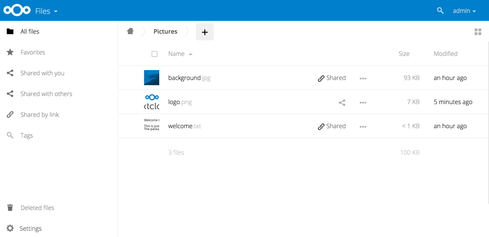

=======================
Providing Default Files
=======================

You may distribute a set of default files and folders to all users by placing 
them in the :file:`owncloud/core/skeleton` directory on your ownCloud server. 
These files appear only to new users after their initial login, and existing 
users will not see files that are added to this directory after their first 
login. The files in the :file:`skeleton` directory are copied into the users' 
data directories, so they may change and delete the files without affecting the 
originals.

This screenshot shows a set of photos in the :file:`skeleton` directory.

.. image:: ../images/skeleton-files.png

They appear on the user's ownCloud Files page just like any other files.

Additional Configuration
------------------------

The configuration option ``skeletondirectory`` available in your
``config.php`` (See 
:doc:`../configuration_server/config_sample_php_parameters`) allows
you to configure the directory where the skeleton files are located.
These files will be copied to the data directory of new users. Leave
empty to not copy any skeleton files.