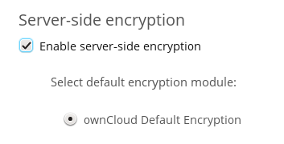
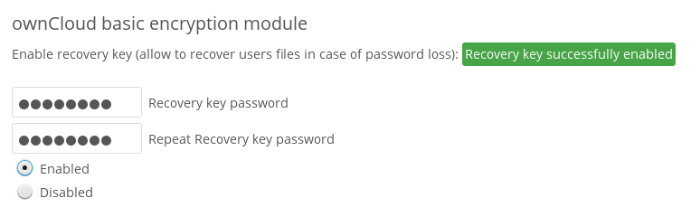

========================
Encryption Configuration
========================

If you are upgrading from ownCloud 8.0, and have encryption enabled, please see 
:ref:`upgrading_encryption_label` (below) for the correct steps to upgrade your 
encryption.

The primary purpose of the ownCloud server-side encryption is to protect users' 
files on remote storage, such as Dropbox and Google Drive, and to do it easily 
and seamlessly from within ownCloud.

In ownCloud 8.2 the server-side encryption has a number of changes and 
improvements, including:

* An option to create a master encryption key, which replaces all individual 
  user keys. This is especially useful for single-sign on.
* Encrypt all data files at once when enabling encryption.
* Decrypt all data files, or per user.
* Users may decrypt their own files.
* Migrate all keys after a major upgrade, or per user.
* Move your keys to a different folder.

ownCloud server-side encryption encrypts files stored on the ownCloud server, 
and files on remote storage that is connected to your ownCloud server. 
Encryption and decryption are performed on the ownCloud server. All files sent 
to remote storage will be encrypted by the ownCloud server, and upon retrieval, 
decrypted before serving them to you and anyone you have shared them with.

.. note:: Encrypting files increases their size by roughly 35%, so you must 
   take this into account when you are provisioning storage and setting 
   storage quotas. User's quotas are based on the unencrypted file size, and 
   not the encrypted file size.

When files on external storage are encrypted in ownCloud, you cannot share them 
directly from the external storage services, but only through ownCloud sharing 
because the key to decrypt the data never leaves the ownCloud server.

ownCloud's server-side encryption generates a strong encryption key, which is 
unlocked by user's passwords. Your users don't need to track an extra 
password, but simply log in as they normally do. It encrypts only the contents 
of files, and not filenames and directory structures.

You should regularly backup all encryption keys to prevent permanent data loss. 
The encryption keys are stored in the following directories:

``data/<user>/files_encryption`` 
  Users' private keys and all other keys necessary to decrypt the users' files
``data/files_encryption``
  private keys and all other keys necessary to decrypt the files stored on a
  system wide external storage
  
When encryption is enabled, all files are encrypted and decrypted by the 
ownCloud application, and stored encrypted on your remote storage.
This protects your data on externally hosted storage. The ownCloud 
admin and the storage admin will see only encrypted files when browsing backend 
storage.  
  
.. note:: Encryption keys are stored only on the ownCloud server, eliminating
   exposure of your data to third-party storage providers. The encryption app 
   does **not** protect your data if your ownCloud server is compromised, and it
   does not prevent ownCloud administrators from reading user's files. This 
   would require client-side encryption, which this app does not provide. If 
   your ownCloud server is not connected to any external storage services then 
   it is better to use other encryption tools, such as file-level or 
   whole-disk encryption. 
   
   Note also that SSL terminates at or before Apache on the ownCloud server, and 
   all files will exist in an unencrypted state between the SSL connection 
   termination and the ownCloud code that encrypts and decrypts files. This is 
   also potentially exploitable by anyone with administrator access to your 
   server. Read `How ownCloud uses encryption to protect your data 
   <https://owncloud.org/blog/how-owncloud-uses-encryption-to-protect-your- 
   data/>`_ for more information.
   
Before Enabling Encryption
--------------------------

Plan very carefully before enabling encryption because it is not reversible via 
the ownCloud Web interface. If you lose your encryption keys your files are not 
recoverable. Always have backups of your encryption keys stored in a safe 
location, and consider enabling all recovery options.

You have more options via the ``occ`` command (see :ref:`occ_encryption_label`)

.. _enable_encryption_label:

Enabling Encryption
-------------------

ownCloud encryption consists of two parts. The base encryption system is 
enabled and disabled on your Admin page. First you must enable this, and then 
select an encryption module to load. Currently the only available encryption 
module is the ownCloud Default Encryption Module.

First go to the **Server-side encryption** section of your Admin page and check 
**Enable server-side encryption**. You have one last chance to change your mind.

.. figure:: ../images/encryption3.png

After clicking the **Enable Encryption** button you see the message "No 
encryption module loaded, please load a encryption module in the app menu", so 
go to your Apps page to enable the ownCloud Default Encryption Module.

.. figure:: ../images/encryption1.png

Return to your Admin page to see the ownCloud Default Encryption 
Module added to the module selector, and automatically selected. Now you must 
log out and then log back in to initialize your encryption keys.

Sharing Encrypted Files
-----------------------

After encryption is enabled your users must also log out and log back in to 
generate their personal encryption keys. They will see a yellow warning banner 
that says "Encryption App is enabled but your keys are not initialized, please 
log-out and log-in again." 

Share owners may need to re-share files after encryption is enabled; users 
trying to access the share will see a message advising them to ask the share 
owner to re-share the file with them. For individual shares, un-share and 
re-share the file. For group shares, share with any individuals who can't access 
the share. This updates the encryption, and then the share owner can remove the 
individual shares.

.. figure:: ../images/encryption9.png

Encrypting External Mountpoints
-------------------------------

You and your users can encrypt individual external mountpoints. You must have 
external storage enabled on your Admin page, and enabled for your users.

Encryption settings can be configured in the mount options for an external
storage mount, see :ref:`external_storage_mount_options_label`
(:doc:`external_storage_configuration_gui`)

Enabling Users' File Recovery Key
---------------------------------

If you lose your ownCloud password, then you lose access to your encrypted 
files. If one of your users loses their ownCloud password their files are 
unrecoverable. You cannot reset their password in the normal way; you'll see a 
yellow banner warning "Please provide an admin recovery password, otherwise all 
user data will be lost".

To avoid all this, create a Recovery Key. Go to the Encryption section of your 
Admin page and set a recovery key password.

Then your users have the option of enabling password recovery on their Personal 
pages. If they do not do this, then the Recovery Key won't work for them.

.. figure:: ../images/encryption7.png

For users who have enabled password recovery, give them a new password and 
recover access to their encrypted files by supplying the Recovery Key on the 
Users page.

.. figure:: ../images/encryption8.png

You may change your Recovery Key password.

.. figure:: ../images/encryption12.png

.. _occ_encryption_label:

occ Encryption Commands
-----------------------

If you have shell access you may use the ``occ`` command to perform encryption 
operations, and you have additional options such as decryption and creating a 
single master encryption key.

Get the current status of encryption and the loaded encryption module::

 occ encryption:status

This is equivalent to checking **Enable server-side encryption** on your Admin
page::

 occ encryption:enable
 
List the available encryption modules::

 occ encryption:list-modules

Select a different default Encryption module::

 occ encryption:set-default-module [Module ID]. 
 
The [module ID] is taken from the ``encryption:list-modules`` command.

Encrypt all data files for all users. For performance reasons, when you enable 
encryption on an ownCloud server only new and changed files are encrypted. This 
command gives you the option to encrypt all files. This command give You must 
first put your ownCloud server into single-user mode to prevent any user 
activity until encryption is completed::

 occ encryption:encrypt-all

Decrypt all user data files, or optionally a single user::
 
 occ encryption:decrypt-all [username]

Move keys to a different folder::

 occ encryption:change-key-storage-root
 
View current location of keys::

 occ encryption:show-key-storage-root
 
Create a new master key. Use this when you have a single-sign on 
infrastructure.  Use this only on fresh installations with no existing data, or 
on systems where encryption has not already been enabled. It is not possible to 
disable it::

 occ encryption:enable-master-key
 
See :ref:`encryption_label`  for detailed instructions on using ``occ``.

Files Not Encrypted
-------------------

Only the data in the files in ``data/user/files`` is encrypted, and not the 
filenames or folder structures. These files are never encrypted:

- Files in the trash bin
- Versions
- Image thumbnails from the Gallery app
- Previews from the Files app
- The search index from the full text search app
- Third-party app data

There may be other files that are not encrypted; only files that are exposed to 
third-party storage providers are guaranteed to be encrypted.

LDAP and Other External User Back-ends
--------------------------------------

If you use an external user back-end, such as an LDAP or Samba server, and you 
change a user's password on the back-end, the user will be prompted to change 
their ownCloud login to match on their next ownCloud login. The user will need 
both their old and new passwords to do this. If you have enabled the Recovery 
Key then you can change a user's password in the ownCloud Users panel to match 
their back-end password, and then, of course, notify the user and give them 
their new password.

.. _upgrading_encryption_label:

Upgrading From ownCloud 8.0
---------------------------

The encryption backend has changed in ownCloud 8.1, so you must take some 
additional steps to migrate encryption correctly. If you do not follow these 
steps you may not be able to access your files.

Before you start your upgrade, put your ownCloud server into 
``maintenance:singleuser`` mode (See :doc:`../maintenance/enable_maintenance`.) 
You must do this to prevent users and sync clients from accessing files before 
you have completed your encryption migration.

After your upgrade is complete, follow the steps in :ref:`enable_encryption_label` to 
enable the new encryption system. Then click the **Start Migration** button on 
your Admin page to migrate your encryption keys, or use the ``occ`` command. We 
strongly recommend using the ``occ`` command; the **Start Migration** button is 
for admins who do not have access to the console, for example installations on 
shared hosting. This example is for Debian/Ubuntu Linux::

 $ sudo -u www-data php occ encryption:migrate
 
This example is for Red Hat/CentOS/Fedora Linux::

 $ sudo -u apache php occ encryption:migrate
 
You must run ``occ`` as your HTTP user; see 
:doc:`../configuration_server/occ_command`.

When you are finished, take your ownCloud server out of 
``maintenance:singleuser`` mode.

Where Keys are Stored
---------------------

All of your encryption keys are stored in your ownCloud :file:`data/` 
directory. When you run the migration command your old keys are backed up in 
your data directory:

Backup for system-wide keys:
 :file:`data/encryption_migration_backup_<timestamp>`

Backup for user-specific keys: 
 :file:`data/<user>/encryption_migration_backup_<timestamp>`

Both backup directories contain the keys in the old file structure. This is the 
old file structure for ownCloud 8.0:

Private public share key:
 :file:`data/files_encryption/pubShare_<public-share-key-id>.privateKey`
    
Private recovery key: 
 :file:`data/files_encryption/recovery_<recovery-key-id>.privateKey`
 
Public keys of all users: 
 :file:`data/files_encryption/public_keys`
 
File keys for system-wide mount points: 
 :file:`data/files_encryption/keys/<file_path>/<filename>/fileKey`

Share keys for files on a system-wide mount point (one key for the owner and one key for each user with access to the file): 
 :file:`data/files_encryption/keys/<file_path>/<filename>/<user>.shareKey`

Users' private keys: 
 :file:`data/<user>/files_encryption/<user>.privateKey`

File keys for files owned by the user: 
 :file:`data/<user>/files_encryption/keys/<file_path>/<filename>/fileKey`

Share keys for files owned by the user (one key for the owner and one key for each user with access to the file):
 :file:`data/<user>/files_encryption/keys/<file_path>/<filename>/<user>.shareKey`
 
This is the new file structure for ownCloud 8.1:

Private public share key:
 :file:`data/files_encryption/OC_DEFAULT_MODULE/pubShare_<public-share-key-id>.privateKey`

Private recovery key: 
 :file:`data/files_encryption/OC_DEFAULT_MODULE/recovery_<recovery-key-id>.privateKey`

Public public share key: 
 :file:`data/files_encryption/OC_DEFAULT_MODULE/pubShare_<public-share-key-id>.publicKey`

Public recovery key: 
 :file:`data/files_encryption/OC_DEFAULT_MODULE/recovery_<recovery-key-id>.publicKey`

File keys for system-wide mount points: 
 :file:`data/files_encryption/keys/<file_path>/<filename>/OC_DEFAULT_MODULE/fileKey`

Share keys for files on a system-wide mount point (one key for the owner and one key for each user with access to the file): 
 :file:`data/files_encryption/keys/<file_path>/<filename>/OC_DEFAULT_MODULE/<user>.shareKey`

Users' private keys: 
 :file:`data/<user>/files_encryption/OC_DEFAULT_MODULE/<user>.privateKey`

Users' public keys:
 :file:`data/<user>/files_encryption/OC_DEFAULT_MODULE/<user>.publicKey`

File keys for files owned by the user: 
 :file:`data/<user>/files_encryption/keys/<file_path>/<filename>/OC_DEFAULT_MODULE/fileKey`

Share keys for files owned by the user (one key for the owner and one key for each user with access to the file):
 :file:`data/<user>/files_encryption/keys/<file_path>/<filename>/OC_DEFAULT_MODULE/<user>.shareKey`

.. references --  https://github.com/owncloud/QA/issues/16
.. 