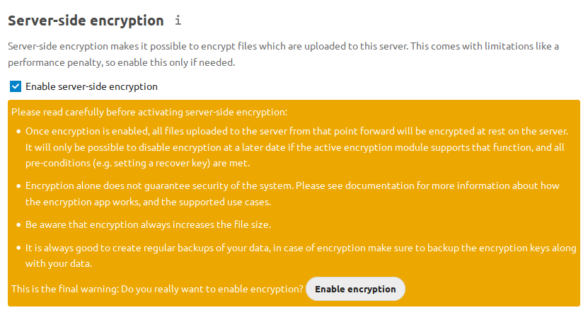
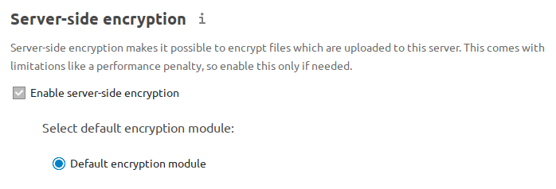
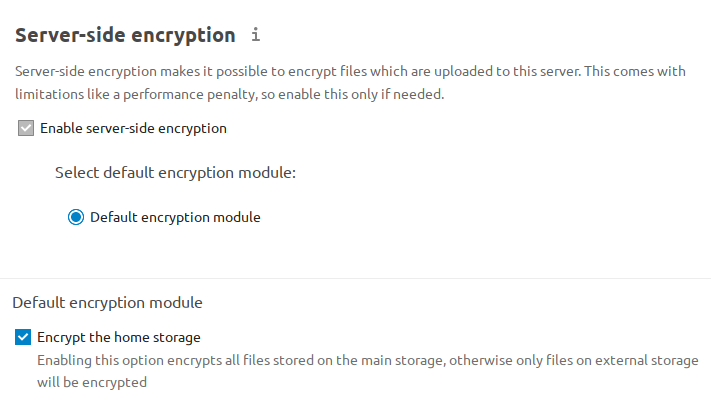
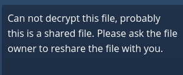
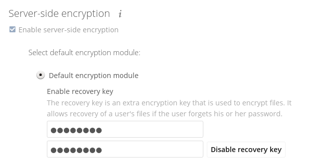
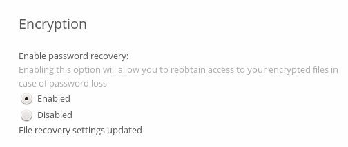
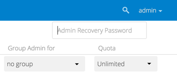
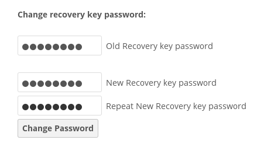

======================
Server-side Encryption
======================

Overview
--------

Nextcloud provides several encryption methods to protect your data. These work at
different layers of the system and address different security needs. This guide
focuses on Nextcloud's built-in Server-Side Encryption (SSE).

.. note::
   Encryption and risk management is a complex and nuanced topic. Unless you are
   already an expert, it is recommended to consult a professional or perform a
   deep dive to ensure your approach targets your specific concerns.
   You may also find this Nextcloud Blog post helpful:
   `Data encryption methods in Nextcloud <https://nextcloud.com/blog/encryption-in-nextcloud/>`_.
   It provides a solid high-level overview of the different approaches commonly
   considered when using Nextcloud.

Definitions
-----------

- **Server-Side Encryption (SSE):** Performed by the Nextcloud server, protecting
  files at rest on local and external storage. Encryption keys are stored on the server.
- **End-to-End Encryption (E2EE):** Performed by Nextcloud desktop or mobile clients
  before uploading files. Only the client can decrypt, making data inaccessible to
  server administrators and external storage providers.
- **Master Key:** A central key controlled by the server, used to encrypt all files.
- **User Keys:** Each user has their own key, protected by their password, to encrypt
  their files.
- **Recovery Key:** An admin-defined key to recover files if users lose their passwords.
- **Disk/Block Device Encryption:** A method of securing all data stored on a physical 
  storage device by encrypting it at the hardware or filesystem level - typically using 
  tools such as LUKS on Linux - so that data is only accessible after the device is 
  unlocked with the correct key or password.

Encryption Method Comparison
----------------------------

.. list-table::
   :header-rows: 1
   :widths: 20 20 25 35

   * - Method
     - Encryption Location
     - Who Can Decrypt?
     - Protects Against
   * - SSE (Master Key)
     - Server
     - Admins & users
     - External storage providers
   * - SSE (User Keys)
     - Server
     - Users & malicious admins
     - External storage providers
   * - SSE (User Keys w/ Recovery)
     - Server
     - Users & admins with recovery key
     - External storage providers
   * - E2EE
     - Client
     - Users only
     - Admins, external storage providers
   * - Disk/Block Encryption
     - Server
     - OS admin
     - Physical tampering, theft

Key Points & Limitations
------------------------

- Encryption methods are not interchangeable; each is designed for specific risks.
- **Server-Side Encryption (SSE)** is mainly for protecting files on external, third-party storage.
- **End-to-End Encryption (E2EE)** is for scenarios where server administrators must not access data.
- SSE does **not** encrypt filenames or folder structures, only file contents.
- SSE does not protect data from a compromised Nextcloud server or malicious administrator.
  Use E2EE for this threat.
- SSE cannot be reversed via the Nextcloud Web interface.
- Troubleshooting SSE generally requires ``occ`` command access. Make sure you have
  this before enabling SSE!
- Losing encryption keys or your instance secret results in permanent data loss.
- Nextcloud quotas are based on unencrypted file size; files encrypted with SSE may be ~1% larger
  (was 35% before Nextcloud 25).
- SSL/TLS (HTTPS) terminates before files are encrypted, so files may be exposed in memory
  between SSL/TLS and Nextcloud’s SSE encryption code.
- When files on external storage are encrypted with SSE, you cannot share them directly
  from the external storage provider; sharing is only possible via Nextcloud, since the
  decryption key never leaves the Nextcloud server.
- For local storage, it may be better to use other encryption tools, such as disk/block device
  encryption (e.g., LUKS) provided by your operating system. This protects against other concerns,
  such as theft of your physical server, which is not SSE's goal.

.. warning::
   SSE does **not** encrypt filenames or folder structures, only file contents.

.. note::
   Don't confuse Nextcloud's SSE with S3 SSE-C (also supported).

.. versionchanged:: 9.0.0
   Nextcloud (since v9.0.0) supports Authenticated Encryption for all newly encrypted files.
   See https://hackerone.com/reports/108082 for technical details.

.. tip::
   For maximum security, configure external storage with "Check for changes: Never".
   This causes Nextcloud to ignore new files not added via Nextcloud, preventing unauthorized
   additions by external storage admins. Do not use this if your storage is subject to legitimate
   external changes.

Before You Enable Encryption
----------------------------

1. Read this guide fully and understand the risks.
2. Back up your instance configuration and all encryption keys in a safe location before proceeding.
3. Decide which key management mode suits your needs (see below).

Key Management Modes
--------------------

**Master Key (default):**

- All files are encrypted with a central server-controlled key.
- Admins can decrypt any user’s files.
- Offers better performance and compatibility with more login/authentication modes.
- Best for organizations that need to recover files if users forget their passwords.

**User Keys:**

- Each user’s files are encrypted with a password-protected key.
- Admins cannot (readily) decrypt files without the user's password, unless a recovery key is defined.
- If a user forgets their password and no recovery key exists, their files are lost.

**How to choose:**

- If you trust your server administrators, use master key mode.
- If you need to prevent admins from accessing files, use E2EE.
- User key mode offers some protection against malicious server administrators, but has limitations.

**To select user key mode:**  

Run:

.. code-block:: bash

   occ encryption:disable-master-key

before enabling encryption.

Enabling Encryption (Step-by-Step)
----------------------------------

1. Go to the **Server-side encryption** section of your Admin page.
2. Check **Enable server-side encryption**.
3. You’ll see a message: "No encryption module loaded."
   Go to your Apps page and enable the Nextcloud Default Encryption Module.
4. Return to your Admin page. The module will appear and be auto-selected.
5. Log out and log back in to initialize your encryption keys.
6. Optional: Un-check the box for encrypting home storage if you wish to keep local files unencrypted.

Backups
-------

Encryption keys are stored in:

- ``data/<user>/files_encryption`` (per-user keys)
- ``data/files_encryption`` (system-wide/external storage keys)

Encrypting External Mountpoints and Team Folders
------------------------------------------------

- You and your users can encrypt external mountpoints.

   - Set encryption options in the mount configuration for each external storage.
   - See :ref:`external_storage_mount_options_label` in :doc:`external_storage_configuration_gui`.

- To encrypt Team Folders, run:

.. code-block:: bash

   occ config:app:set groupfolders enable_encryption --value=true

.. note::
   Only new or updated files in team folders will be encrypted.

Managing Encryption via occ Commands
------------------------------------

Here is a reference table for common occ commands:

.. list-table::
   :header-rows: 1
   :widths: 35 65

   * - Command
     - Description
   * - occ encryption:status
     - Show encryption status and module
   * - occ encryption:enable
     - Enable server-side encryption
   * - occ encryption:list-modules
     - List available encryption modules
   * - occ encryption:set-default-module [Module ID]
     - Select default encryption module
   * - occ encryption:encrypt-all
     - Encrypt all files for all users
   * - occ encryption:decrypt-all [user]
     - Decrypt all files (or for one user)
   * - occ encryption:show-key-storage-root
     - Show key storage location
   * - occ encryption:change-key-storage-root [dir]
     - Move key storage directory
   * - occ encryption:enable-master-key
     - Enable master key mode
   * - occ encryption:disable-master-key
     - Enable user key mode
   * - occ encryption:fix-encrypted-version
     - Fix bad signature errors
   * - occ encryption:fix-key-location [user]
     - Fix key not found errors

.. tip::
   See the :ref:`encryption_label` section of the ``occ`` reference guide for further ``encryption`` command examples and details.

**Example: Move keys to a new directory (Ubuntu Linux):**

.. code-block:: bash

   cd /your/nextcloud/data
   mkdir keys
   chown -R root:www-data keys
   chmod -R 0770 keys
   occ encryption:change-key-storage-root keys

Encrypting All Files
--------------------

By default, only new and changed files are encrypted when you enable SSE.
To encrypt all files for all users run:

.. code-block:: bash

   occ encryption:encrypt-all

- **Make sure you have backups before running.**
- The command creates a key pair for each user and encrypts their files.
- Progress is displayed until all files are encrypted.
- **Make sure no users access files during this process.**

.. _occ_disable_encryption_label:

Decrypting Files / Disabling Encryption
---------------------------------------

- Only possible via occ.
- First, decrypt all files:

.. code-block:: bash

   occ encryption:decrypt-all

- **Make sure you have backups before running.**
- Server enters maintenance mode. If interrupted, rerun until complete.
- If some files remain encrypted, rerun the command after resolving issues.
- **Warning:** Disabling encryption without decrypting all files will cause unpredictable errors.

You can decrypt for individual users:

.. code-block:: bash

   occ encryption:decrypt-all <user-id>

Data Not Encrypted
-------------------

Only file contents are encrypted. The following are **not** encrypted:

.. list-table::
   :header-rows: 1

   * - Not Encrypted
   * - Filenames and folder structures
   * - Existing trash bin files
   * - Existing historical file versions
   * - Image thumbnails
   * - Image previews
   * - Full text search index
   * - Application data that isn't file-based (e.g., Deck, Tables)

User Keys: Sharing & Recovery
-----------------------------

**Sharing encrypted files:**

- After enabling user key mode, users must log out and log in to generate keys.
- Users who see "Encryption App is enabled but your keys are not initialized..." must log out and back in.
- Shared files may need to be re-shared after encryption is enabled.
    - For individual shares: un-share and re-share the file.
    - For group shares: share with any individuals who cannot access the share, then remove their individual shares.

**Enabling file recovery keys:**

- If you lose your Nextcloud password, you lose access to your encrypted files.
- If a user loses their password, their files are unrecoverable unless a recovery key is enabled.
- To enable recovery, go to Encryption in Admin page and set a recovery key password.
- Users must enable password recovery in their Personal settings for the Recovery Key to work.
- For users who have enabled password recovery, admins can reset passwords and recover files using the Recovery Key.

LDAP and External User Backends
-------------------------------

- If using LDAP/Samba and changing passwords on the backend, users will need both their old and new passwords on next login.
- If recovery key is enabled, admins can reset the password via Nextcloud and notify users.

Troubleshooting
---------------

Invalid private key for encryption app
^^^^^^^^^^^^^^^^^^^^^^^^^^^^^^^^^^^^^^

See `GitHub Issue #8546 <https://github.com/nextcloud/server/issues/8546>`_ and
`workaround <https://github.com/nextcloud/server/issues/8546#issuecomment-514139714>`_.

Bad signature error
^^^^^^^^^^^^^^^^^^^

In some rare cases, encrypted files cannot be downloaded and return a "500 Internal Server Error." If the Nextcloud log contains an error about "Bad Signature," run the following command to repair affected files::

   occ encryption:fix-encrypted-version userId --path=/path/to/broken/file.txt

Replace "userId" and the path accordingly.
The command will perform a test decryption for all files and automatically repair those with a signature error.

.. _troubleshooting_encryption_key_not_found:

Encryption key cannot be found
^^^^^^^^^^^^^^^^^^^^^^^^^^^^^^

If the logs contain an error stating that the encryption key cannot be found, you can manually search the data directory for a folder that has the same name as the file name.
For example, if a file "example.md" cannot be decrypted, run::

   find path/to/datadir -name example.md -type d

Then check the results located in the ``files_encryption`` folder.
If the key folder is in the wrong location, move it to the correct folder and try again.

The ``data/files_encryption`` folder contains encryption keys for group folders and system-wide external storages,
while ``data/$userid/files_encryption`` contains the keys for specific user storage files.

.. note::

   This can happen if encryption was disabled at some point but the :ref:`occ command for decrypt-all<occ_disable_encryption_label>` was not run.
   If someone then moved the files to another location, the keys did not get moved.

Encryption key cannot be found with external storage or group folders
^^^^^^^^^^^^^^^^^^^^^^^^^^^^^^^^^^^^^^^^^^^^^^^^^^^^^^^^^^^^^^^^^^^^^

To resolve this issue, run the following command::

   sudo -E -u www-data php occ encryption:fix-key-location <user-id>

This will attempt to recover keys that were not moved properly.

If this doesn't resolve the problem, refer to the section :ref:`Encryption key cannot be found<troubleshooting_encryption_key_not_found>` for a manual procedure.

.. note::

   There were two known issues where:

   - moving files between an encrypted and non-encrypted storage like external storage or group folder `would not move the keys with the files <https://github.com/nextcloud/groupfolders/issues/1896>`_.
   - putting files on system-wide external storage would store the keys in the `wrong location <https://github.com/nextcloud/server/pull/32690>`_.

Further Reading
---------------

- :ref:`occ Command Reference: Encryption <encryption_label>`
- `How Nextcloud uses encryption to protect your data <https://nextcloud.com/blog/encryption-in-nextcloud/>`_
- `Technical impact of Authenticated Encryption <https://hackerone.com/reports/108082>`_
- `Nextcloud SSE Implementation Details <encryption_details.html>`_
- `Nextcloud Encryption (SSE & E2EE) Recovery Tools <https://github.com/nextcloud/encryption-recovery-tools>`_
- `Nextcloud E2EE Server API App (required for E2EE usage) <https://github.com/nextcloud/end_to_end_encryption/>`_
