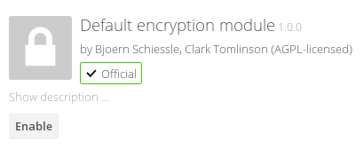
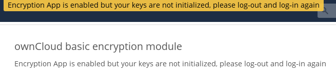
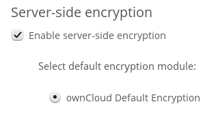
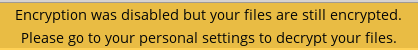
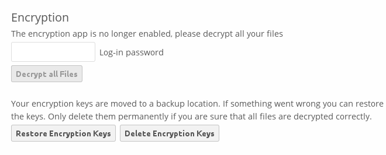
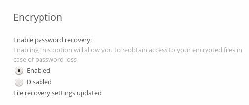
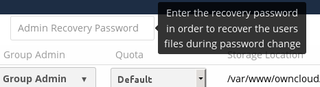

========================
Encryption Configuration
========================

ownCloud includes a server-side encryption application. The Encryption app 
encrypts all files stored on the ownCloud server, and all files on remote 
storage that is connected to your ownCloud server. Encryption and decryption are 
performed on the ownCloud server. All files sent to remote storage (for example 
Dropbox and Google Drive) will be encrypted by the ownCloud server, and upon 
retrieval, decrypted before serving them to you and anyone you have shared them 
with.

.. note:: Encrypting files increases their size by roughly 35%, so you must take 
   this into account when you are provisioning storage and setting storage 
   quotas. User's quotas are based on the unencrypted file size, and not the 
   encrypted file size.

When files on external storage are encrypted in ownCloud, you cannot share them 
directly from the external storage services, but only through ownCloud sharing 
because the key to decrypt the data never leaves the ownCloud server.

The main purpose of the Encryption app is to protect users' files on remote 
storage, and to do it easily and seamlessly from within ownCloud. 

The Encryption app generates a strong encryption key, which is unlocked by 
user's passwords. So your users don't need to track an extra password, but 
simply log in as they normally do.

Encryption is applied server-wide; it cannot be applied to selected users or 
files.

The Encryption app encrypts only the contents of files, and not filenames and 
folder structures.

You should regularly backup all encryption keys to prevent permanent data loss. 
The encryption keys are stored in following folders:

``data/owncloud_private_key`` 
  Recovery key, if enabled, and public share key
``data/public-keys`` 
  Public keys for all users
``data/<user>/files_encryption`` 
  Users' private keys and all other keys necessary to decrypt the users' files
``data/files_encryption``
  private keys and all other keys necessary to decrypt the files stored on a
  system wide external storage

.. note:: Encryption keys are stored only on the ownCloud server, eliminating
   exposure of your data to third party storage providers. The encryption app 
   does **not** protect your data if your ownCloud server is compromised, and it
   does not prevent ownCloud administrators from reading user's files. This 
   would require client-side encryption, which this app does not provide. If 
   your ownCloud server is not connected to any external storage services then 
   it is better to  use other encryption tools, such as file-level or 
   whole-disk encryption. Read 
   `How ownCloud uses encryption to protect your data 
   <https://owncloud.org/blog/how-owncloud-uses-encryption-to-protect-your-data/>`_ 
   for more information. 

Enabling the Encryption App
---------------------------

The Encryption app is bundled with ownCloud, so first go to your Apps page to 
enable it.

After you click the ``Enable`` button you must log out, and then log back in. 
If you continue to work without logging out, you'll see a yellow banner at 
the top of your Files page that warns you "Encryption App is enabled but your 
keys are not initialized, please log-out and log-in again."

When you log out and then log back in, your encryption keys are initialized and 
your files are encrypted. This is a one-time process, and it will take a few 
minutes depending on how many files you have.

.. note:: The more files you have, the longer the initial encryption will take. It is
   better to activate the encryption app after a new ownCloud installation, to avoid
   possible timeouts.

When the encryption process is complete you'll be returned to your default 
ownCloud page. Every user will go through this process when they log in after 
you enable encryption, and each user will get unique encryption keys. Users can change 
their passwords whenever they want on their Personal pages, and ownCloud will update 
their encryption keys automatically.

Sharing Encrypted Files
-----------------------

Only users who have private encryption keys have access to shared encrypted files and 
folders. Users who have not yet created their private encryption keys will not have access 
to encrypted shared files; they will see folders and filenames, but will not be able to 
open or download the files. They will see a yellow warning banner that says "Encryption 
App is enabled but your keys are not initialized, please log-out and log-in again." 

Share owners may need to re-share files after encryption is enabled; users trying to 
access the share will see a message advising them to ask the share owner to re-share the 
file with them. For individual shares, un-share and re-share the file. For group shares, 
share with any individuals who can't access the share. This updates the encryption, and 
then the share owner can remove the individual shares.

.. figure:: ../images/encryption9.png

Decrypting Encrypted Files
--------------------------

You have the option of changing your mind and disabling the Encryption app. 
Just click its Disable button on the Apps page, and when you go to your Files 
page you'll see the yellow banner warning "Encryption was disabled but your 
files are still encrypted. Please go to your personal settings to decrypt your 
files".

Go to your Personal page and enter your password in the Encryption removal form, and your 
files will all be decrypted.

Your users will also have to follow this step to decrypt their files. If 
something goes wrong with decryption, click the ``Restore Encryption Keys`` 
button to re-encrypt your files, and then review your logfile to see what 
happened. 

Enabling a File Recovery Key
----------------------------

If you lose your ownCloud password, then you lose access to your encrypted files. If one 
of your users loses their ownCloud password their files are unrecoverable. You cannot 
reset their password in the normal way; you'll see a yellow banner warning "Please provide 
an admin recovery password, otherwise all user data will be lost".

To avoid all this, create a Recovery Key. Go to the Encryption section of your 
Admin page and set a recovery key password.

.. figure:: ../images/encryption6.png

Then your users have the option of enabling password recovery on their Personal 
pages. If they do not do this, then the Recovery Key won't work for them.

For users who have enabled password recovery, give them a new password and recover access 
to their encrypted files by supplying the Recovery Key on the Users page.

Files Not Encrypted
-------------------

Only the data in your files is encrypted, and not the filenames or folder
structures. These files are never encrypted:

- Old files in the trash bin.
- Image thumbnails from the Gallery app.
- Previews from the Files app.
- The search index from the full text search app.
- Third-party app data

There may be other files that are not encrypted; only files that are exposed to 
third-party storage providers are guaranteed to be encrypted.

LDAP and Other External User Back-ends
--------------------------------------

If you use an external user back-end, such as an LDAP or Samba server, and you change a 
user's password on the back-end, the user will be prompted to change their ownCloud login 
to match on their next ownCloud login. The user will need both their old and new passwords 
to do this. If you have enabled the Recovery Key then you can change a user's password in 
the ownCloud Users panel to match their back-end password, and then, of course, notify the 
user and give them their new password.

"Missing requirements" Message on Windows Servers
-------------------------------------------------

If you get a "Missing requirements" error message when you enable encryption on 
a Windows server, enter the absolute location of your openSSL configuration file in 
``config.php``::

  'openssl' => array(
      'config' => 'C:\path\to\openssl.cnf',
  ),
  
For example, in a typical installation on a 64-bit Windows 7 system it looks like this::

  'openssl' => array(
      'config' => 'C:\OpenSSL-Win64\openssl.cnf',
  ),

There are many ways to configure OpenSSL, so be sure to verify your correct file
location.
