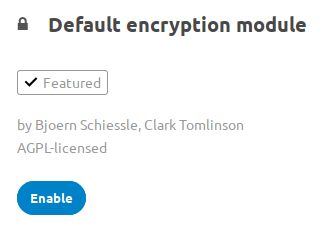

========================
Encryption configuration
========================

The primary purpose of the Nextcloud server-side encryption is to protect users' 
files on remote storage, such as Dropbox and Google Drive, and to do it easily 
and seamlessly from within Nextcloud.

Server-side encryption separates encryption of local and remote storage. 
This allows you to encrypt remote storage, such as Dropbox and 
Google, without having to also encrypt your home storage on your Nextcloud 
server.

.. note:: Nextcloud supports Authenticated Encryption for all
   newly encrypted files. See https://hackerone.com/reports/108082 for more 
   technical information about the impact.
   
   For maximum security make sure to configure external storage with "Check for 
   changes: Never". This will let Nextcloud ignore new files not added via Nextcloud, 
   so a malicious external storage administrator could not add new files to the 
   storage without your knowledge. Of course, this is not wise if your external 
   storage is subject to legitimate external changes.

Nextcloud server-side encryption encrypts files stored on the Nextcloud server, 
and files on remote storage that is connected to your Nextcloud server. 
Encryption and decryption are performed on the Nextcloud server. All files sent 
to remote storage will be encrypted by the Nextcloud server, and upon retrieval, 
decrypted before serving them to you and anyone you have shared them with.

.. note:: Encrypting files increases their size by roughly 35%, so you must 
   take this into account when you are provisioning storage and setting 
   storage quotas. User's quotas are based on the unencrypted file size, and 
   not the encrypted file size.

When files on external storage are encrypted in Nextcloud, you cannot share them 
directly from the external storage services, but only through Nextcloud sharing 
because the key to decrypt the data never leaves the Nextcloud server.

Nextcloud's server-side encryption generates a strong encryption key, which is 
unlocked by user's passwords. Your users don't need to track an extra 
password, but simply log in as they normally do. It encrypts only the contents 
of files, and not filenames and directory structures.

You should regularly backup all encryption keys to prevent permanent data loss. 
The encryption keys are stored in the following directories:

``data/<user>/files_encryption`` 
  Users' private keys and all other keys necessary to decrypt the users' files
``data/files_encryption``
  private keys and all other keys necessary to decrypt the files stored on a
  system wide external storage
  
When encryption is enabled, all files are encrypted and decrypted by the 
Nextcloud application, and stored encrypted on your remote storage.
This protects your data on externally hosted storage. The Nextcloud 
admin and the storage admin will see only encrypted files when browsing backend 
storage.  
  
.. warning:: Encryption keys are stored only on the Nextcloud server, eliminating
   exposure of your data to third-party storage providers. The encryption app 
   does **not** protect your data if your Nextcloud server is compromised, and it
   does not prevent Nextcloud administrators from reading user's files. This 
   would require client-side encryption, which this app does not provide. If 
   your Nextcloud server is not connected to any external storage services then 
   it is better to use other encryption tools, such as file-level or 
   whole-disk encryption. 
   
   Note also that SSL terminates at or before Apache on the Nextcloud server, and 
   all files will exist in an unencrypted state between the SSL connection 
   termination and the Nextcloud code that encrypts and decrypts files. This is 
   also potentially exploitable by anyone with administrator access to your 
   server. Read `How Nextcloud uses encryption to protect your data 
   <https://nextcloud.com/blog/encryption-in-nextcloud/>`_ for more information.
   
Before enabling encryption
--------------------------

Plan very carefully before enabling encryption because it is not reversible via 
the Nextcloud Web interface. If you lose your encryption keys your files are not 
recoverable. Always have backups of your encryption keys stored in a safe 
location, and consider enabling all recovery options.

You have more options via the ``occ`` command (see :ref:`occ_encryption_label`)

.. _enable_encryption_label:

Enabling encryption
-------------------

Nextcloud encryption consists of two parts. The base encryption system is 
enabled and disabled on your Admin page. First you must enable this, and then 
select an encryption module to load. Currently the only available encryption 
module is the Nextcloud Default Encryption Module.

First go to the **Server-side encryption** section of your Admin page and check 
**Enable server-side encryption**. You have one last chance to change your mind.

After clicking the **Enable Encryption** button you see the message "No 
encryption module loaded, please load a encryption module in the app menu", so 
go to your Apps page to enable the Nextcloud Default Encryption Module.

Return to your Admin page to see the Nextcloud Default Encryption 
Module added to the module selector, and automatically selected. Now you must 
log out and then log back in to initialize your encryption keys.

.. figure:: images/encryption14.png

When you log back in, there is a checkbox for enabling encryption on your home 
storage. This is checked by default. Un-check to avoid encrypting your home 
storage.

Sharing encrypted files
-----------------------

After encryption is enabled your users must also log out and log back in to 
generate their personal encryption keys. They will see a yellow warning banner 
that says "Encryption App is enabled but your keys are not initialized, please 
log-out and log-in again." 

Share owners may need to re-share files after encryption is enabled; users 
trying to access the share will see a message advising them to ask the share 
owner to re-share the file with them. For individual shares, un-share and 
re-share the file. For group shares, share with any individuals who can't access 
the share. This updates the encryption, and then the share owner can remove the 
individual shares.

.. figure:: images/encryption9.png

Encrypting external mountpoints
-------------------------------

You and your users can encrypt individual external mountpoints. You must have 
external storage enabled on your Admin page, and enabled for your users.

Encryption settings can be configured in the mount options for an external
storage mount, see :ref:`external_storage_mount_options_label`
(:doc:`external_storage_configuration_gui`)

.. _enable-file-recovery-key:

Enabling users file recovery keys
---------------------------------

If you lose your Nextcloud password, then you lose access to your encrypted 
files. If one of your users loses their Nextcloud password their files are 
unrecoverable. You cannot reset their password in the normal way; you'll see a 
yellow banner warning "Please provide an admin recovery password, otherwise all 
user data will be lost".

To avoid all this, create a Recovery Key. Go to the Encryption section of your 
Admin page and set a recovery key password.

.. figure:: images/encryption10.png

Then your users have the option of enabling password recovery on their Personal 
pages. If they do not do this, then the Recovery Key won't work for them.

.. figure:: images/encryption7.png

For users who have enabled password recovery, give them a new password and 
recover access to their encrypted files by supplying the Recovery Key on the 
Users page.

.. figure:: images/encryption8.png

You may change your Recovery Key password.

.. _occ_encryption_label:

occ encryption commands
-----------------------

If you have shell access you may use the ``occ`` command to perform encryption 
operations, and you have additional options such as decryption and creating a 
single master encryption key. See :ref:`encryption_label`  for detailed 
instructions on using ``occ``.

Get the current status of encryption and the loaded encryption module::

 occ encryption:status
  - enabled: false                 
  - defaultModule: OC_DEFAULT_MODULE

This is equivalent to checking **Enable server-side encryption** on your Admin
page::

 occ encryption:enable
 Encryption enabled

 Default module: OC_DEFAULT_MODULE
 
List the available encryption modules::

 occ encryption:list-modules
  - OC_DEFAULT_MODULE: Default encryption module [default*]

Select a different default Encryption module (currently the only available 
module is OC_DEFAULT_MODULE)::

 occ encryption:set-default-module [Module ID]. 
 
The [module ID] is taken from the ``encryption:list-modules`` command.

Encrypt all data files for all users. For performance reasons, when you enable 
encryption on a Nextcloud server only new and changed files are encrypted. This 
command gives you the option to encrypt all files. 

Run ``occ``::

 occ encryption:encrypt-all
 
 You are about to start to encrypt all files stored in your Nextcloud.
 It will depend on the encryption module you use which files get encrypted.
 Depending on the number and size of your files this can take some time.
 Please make sure that no users access their files during this process!

 Do you really want to continue? (y/n) 
 
When you type ``y`` it creates a key pair for each of your users, and then 
encrypts their files, displaying progress until all user files are encrypted. 

Decrypt all user data files, or optionally a single user::
 
 occ encryption:decrypt-all [username]
 
View current location of keys::

 occ encryption:show-key-storage-root
 Current key storage root:  default storage location (data/) 

Move keys to a different folder, either locally or on a different server. 
The folder must already exist, be owned by root and your HTTP group, and be 
restricted to root and your HTTP group. Further the folder needs to be located
somewhere in your Nextcloud data folder, either physically, or as a mount. 
This example is for Ubuntu Linux. Note that the new folder is relative to your ``occ`` directory::

 cd /your/nextcloud/data
 mkdir keys
 chown -R root:www-data keys
 chmod -R 0770 keys
 occ encryption:change-key-storage-root keys
 Start to move keys:
    4 [============================]
 Key storage root successfully changed to keys
 
Create a new master key. Use this when you have a single-sign on 
infrastructure.  Use this only on fresh installations with no existing data, or 
on systems where encryption has not already been enabled. It is not possible to 
disable it::

 occ encryption:enable-master-key

Fix Bad signature errors::

 occ encryption:fix-encrypted-version --all
 occ encryption:fix-encrypted-version <userid>
 occ encryption:fix-encrypted-version <userid> -p <path>

Fix key not found errors::

 occ encryption:fix-key-location <userid>
 
.. _occ_disable_encryption_label:

Disabling encryption
--------------------

You may disable encryption only with ``occ``. Make sure you have backups of all 
encryption keys, including users'.
Disable your encryption module with this command::

 occ encryption:decrypt-all

It will put your server into maintenance mode and back.
It also takes care of disabling encryption when all files have been decrypted.
If the command is aborted some files have been decrypted and others are still encrypted.
In this case the command will keep the encryption turned on
and Nextcloud can handle this situation fine.
You can proceed decrypting the remaining files by calling the command again
once the problems that caused the abortion have been resolved.

.. warning:: Disabling encryption without decrypting all the files will lead to decryption errors in the future as this state causes unpredictable behaviors.
.. note:: The ``occ encryption:decrypt-all`` can take a lot of time. You can run one user at a time like so: ``occ encryption:decrypt-all <user-id>``.

Files not encrypted
-------------------

Only the data in the files in ``data/user/files`` are encrypted, and not the 
filenames or folder structures. These files are never encrypted:

- Existing files in the trash bin & Versions. Only new and changed files after 
  encryption is enabled are encrypted.
- Existing files in Versions
- Image thumbnails from the Gallery app
- Previews from the Files app
- The search index from the full text search app
- Third-party app data

There may be other files that are not encrypted; only files that are exposed to 
third-party storage providers are guaranteed to be encrypted.

LDAP and other external user back-ends
--------------------------------------

If you use an external user back-end, such as an LDAP or Samba server, and you 
change a user's password on the back-end, the user will be prompted to change 
their Nextcloud login to match on their next Nextcloud login. The user will need 
both their old and new passwords to do this. If you have enabled the Recovery 
Key then you can change a user's password in the Nextcloud Users panel to match 
their back-end password, and then, of course, notify the user and give them 
their new password.

Troubleshooting
---------------

Invalid private key for encryption app
^^^^^^^^^^^^^^^^^^^^^^^^^^^^^^^^^^^^^^

This `issue <https://github.com/nextcloud/server/issues/8546>`_ is being worked
on. In the meantime there is a 
`workaround <https://github.com/nextcloud/server/issues/8546#issuecomment-514139714>`_
which unfortunately is only suitable for administrators comfortable with the
command line.
