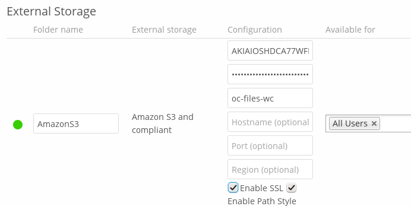

=========
Amazon S3
=========

To connect your Amazon S3 buckets to ownCloud, you will need:

- S3 access key
- S3 secret key
- Bucket name

In the **Folder name** field enter a local folder name for your S3 mountpoint. 
If this does not exist it will be created.

In the **Available for** field enter the users or groups who have permission to 
access your S3 mount.

The ``Enable SSL`` checkbox enables HTTPS connections; using HTTPS is always 
highly-recommended.

Optionally, you can override the hostname, port and region of your S3 server,
which is required for non-Amazon servers such as Ceph Object Gateway.

**Enable path style** is usually not required (and is, in fact, incompatible
with newer Amazon datacenters), but can be used with non-Amazon servers where
the DNS infrastructure cannot be controlled. Ordinarily, requests will be
made with ``http://bucket.hostname.domain/``, but with path style enabled,
requests are made with ``http://hostname.domain/bucket`` instead.

See :doc:`../external_storage_configuration_gui` for additional mount 
options and information.

See :doc:`auth_mechanisms` for more information on authentication schemes.
