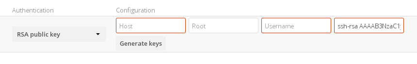

==========================================
External Storage authentication mechanisms
==========================================

Nextcloud storage backends accept one or more authentication schemes such as
passwords, OAuth, or token-based, to name a few examples. Each authentication
scheme may be implemented by combining multiple authentication mechanisms. Different
mechanisms require different configuration parameters, depending on their
behavior.

.. figure:: images/authentication-types.png
   :alt: Authentication types

Special mechanisms
------------------

The **None** authentication mechanism requires no configuration parameters, and
is used when a backend requires no authentication.

The **Built-in** authentication mechanism itself requires no configuration
parameters, but is used as a placeholder for legacy storages that have not been
migrated to the new system and do not take advantage of generic authentication
mechanisms. The authentication parameters are provided directly by the backend.

Password-based mechanisms
-------------------------

The **Username and password** mechanism requires a manually-defined username and
password. These get passed directly to the backend and are specified during the
setup of the mount point.

The **Log-in credentials, save in session** mechanism uses the Nextcloud login
credentials of the user to connect to the storage. These are not stored anywhere
on the server, but rather in the user session, giving increased security.
This method has some important drawbacks, since Nextcloud has no access to the storage
credentials and therefore cannot perform any background tasks on the storage:

* Sharing is disabled
* Background file scanning does not work
* Background versions expiration does not work
* Desktop and mobile clients that use tokens to authenticate can not access those shares
* Other services that might request the file through a different request like Collabora Online or OnlyOffice will not be able to open files from that storage
* The method cannot be used with SAML/SSO authentication, because Nextcloud does not get a hold of any credentials whatsoever

The **Log-in credentials, save in database** mechanism uses the Nextcloud login
credentials of the user to connect to the storage. These are stored in the
database encrypted with the shared secret. This allows to share files from
within this mount point.

* The method cannot be used with SAML/SSO authentication, because Nextcloud does not get a hold of any credentials whatsoever

The **User entered, store in database** mechanism work in the same way as the
"Username and password" mechanism but the credentials need to be specified by
each user individually. Before the first access to that mount point the user
will be prompted to enter the credentials.

The **Global credentials** mechanism uses the general input field for "Global
credentials" in the external storage settings section as source for the
credentials instead of individual credentials for a mount point.

Public-key mechanisms
---------------------

Currently only the RSA mechanism is implemented, where a public/private
keypair is generated by Nextcloud and the public half shown in the GUI. The keys
are generated in the SSH format, and are currently 1024 bits in length. Keys
can be regenerated with a button in the GUI.

After generating your keys, you need to copy your new public key to the
destination server to ``.ssh/authorized_keys``.

See :doc:`./sftp` for additional information on how to set up certificate based authentication on SFTP.

