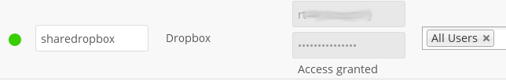
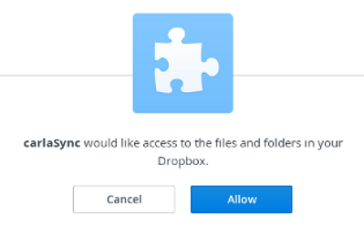

=======
Dropbox
=======

While Dropbox supports the newer OAuth 2.0, ownCloud uses OAuth 1.0, so you can
safely ignore any references to OAuth 2.0 in the Dropbox configuration.

Connecting Dropbox is a little more work because you have to create a Dropbox 
app. Log into the `Dropbox Developers page <http://www.dropbox.com/developers>`_ 
and click **App Console**:

.. figure:: images/dropbox.png

If you have not already created any Dropbox apps it will ask you to accept 
their terms and conditions. Then you are presented with the choice to create 
either a Drop-ins App or a Dropbox API App. Click **Dropbox API App**, and then 
check:

* Files and datastores.
* No -- My app needs access to files already on Dropbox.
* All file types -- My app needs access to a user's full Dropbox. Only 
  supported via the CoreAPI.
  
Then enter whatever name you want for your app.

.. figure:: images/dropbox-app.png

Now click the **Create App** button. Under **Status**, do not click 
**Development (Apply for production status)** because that is for apps that you 
want to release publicly.

Click **Enable additional users** to allow multiple ownCloud users to use your 
new Dropbox share.

Note your App key and App secret, which you will enter in the External Storage 
form on your ownCloud Admin page.

.. figure:: images/dropbox-configapp.png
  
Your ownCloud configuration requires only the local mount name, the App Key and 
the App Secret, and which users or groups have access to the share.

You must be logged into Dropbox, and when ownCloud successfully verifies your 
connection Dropbox will ask for verification to connect to your Dropbox 
account. Click **Allow**, and you're done.

See :doc:`../external_storage_configuration_gui` for additional mount 
options and information.

See :doc:`auth_mechanisms` for more information on authentication schemes.
