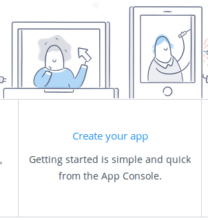
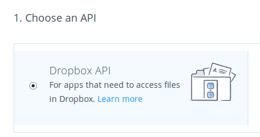
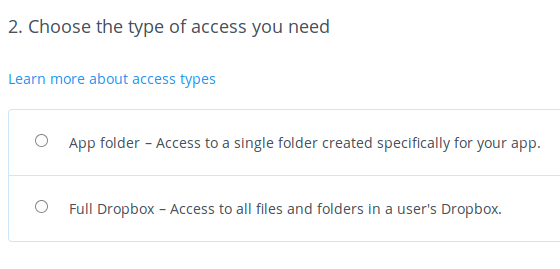
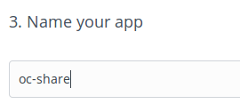
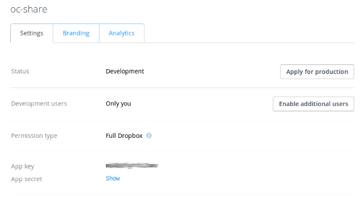
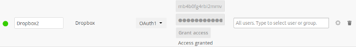
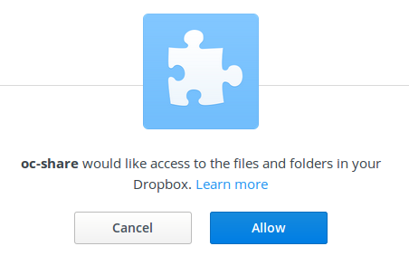

=======
Dropbox
=======

While Dropbox supports the newer OAuth 2.0, ownCloud uses OAuth 1.0, so you can
safely ignore any references to OAuth 2.0 in the Dropbox configuration.

Connecting Dropbox is a little more work because you have to create a Dropbox 
app. Log into the `Dropbox Developers page <http://www.dropbox.com/developers>`_ 
and click **Create Your App**:

Next, for **Choose an API** check **Dropbox API**.

The next option is choosing which folders to share, or to share everything in 
your Dropbox.

   
Then enter your app name. This is anything you want it to be. 

   
Then click the **Create App** button.   
   
Now you are on your app page, which displays its settings and more options. Do 
not click **Development (Apply for production)** because that is for apps 
that you want to release publicly.

Click **Enable additional users** to allow multiple ownCloud users to access 
your new Dropbox share.
  
Now go to your ownCloud Admin page. Your ownCloud configuration requires only 
the local mount name, the **App Key** and the **App Secret**, and which users 
or groups have access to the share. Remember the little gear icon at the 
far right for additional options.

After entering your local mount name, **App Key** and **App Secret**, click 
**Grant access**.

If you are not already logged into Dropbox, you will be prompted to login 
and authorize access. This happens only once, when you are first creating 
the new share. Click **Allow**, and you're done.

See :doc:`../external_storage_configuration_gui` for additional mount 
options and information.

See :doc:`auth_mechanisms` for more information on authentication schemes.
