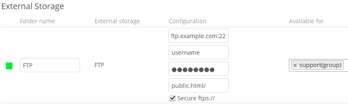

========
FTP/FTPS
========

To connect to an FTP server, you will need:

* A folder name for your local mountpoint; the folder will be created if it 
  does not exist
* The URL of the FTP server
* Port number (default: 21)
* FTP server username and password
* Remote Subfolder, the FTP directory to mount in Nextcloud. Nextcloud defaults 
  to the root directory. If you specify a subfolder you must leave 
  off the leading slash. For example, ``public_html/images``
  
Your new mountpoint is available to all users by default, and you may restrict 
access by entering specific users or groups in the **Available for** field.  

Optionally, Nextcloud can use FTPS (FTP over SSL) by checking **Secure ftps://**. 
This requires additional configuration with your root certificate if the FTP 
server uses a self-signed certificate.

.. note:: The external storage ``FTP/FTPS`` needs the ``allow_url_fopen`` PHP
   setting to be set to ``1``. When having connection problems make sure that it 
   is not set to ``0`` in your ``php.ini``. See :ref:`label-phpinfo` to learn 
   how to find the right ``php.ini`` file to edit.

See :doc:`../external_storage_configuration_gui` for additional mount 
options and information.

FTP uses the password authentication scheme; see :doc:`auth_mechanisms` for 
more information on authentication schemes.
