============
Google Drive
============

ownCloud uses OAuth 2.0 to connect to Google Drive. This requires configuration
through Google to get an app ID and app secret, as ownCloud registers itself
as an app.

All applications that access a Google API must be registered through the 
`Google Cloud Console <https://console.developers.google.com/>`_. Follow along carefully 
because the Google interface is a bit of a maze and it's easy to get lost. 

If you already have a Google account, such as Groups, Drive, or Mail, you can 
use your existing login to log into the Google Cloud Console. After logging in 
click  the **Create Project** button.

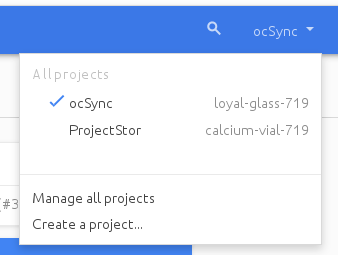

Give your project a name, and either accept the default **Project ID** or 
create 
your own, then click the **Create** button.

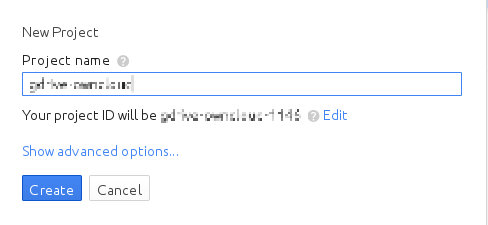

You'll be returned to your dashboard.

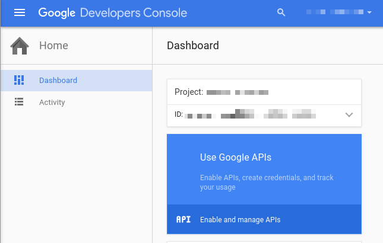
   
Google helpfully highlights your next step in blue, the **Use Google APIs** 
box. Make sure that your new project is selected, click on **Use Google APIs** , 
and it takes you to Google's APIs screen. There are many Google APIs; look for 
the **Google Apps APIs** and click **Drive API.**

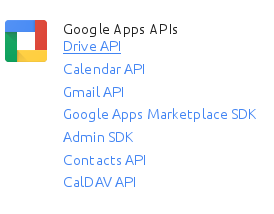

**Drive API** takes you to the API Manager overview. Click the blue **Enable 
API** button.

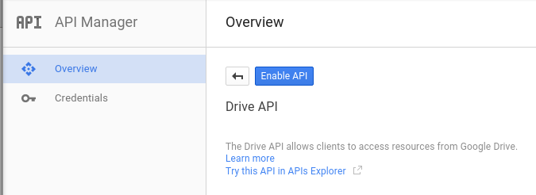

Now you must create your credentials, so click on **Go to credentials**.
   
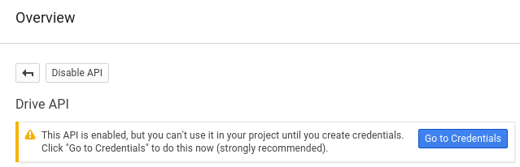
   
For some reason Google warns us again that we need to create credentials. We 
will use 0Auth 2.0.

.. figure:: images/google-drive6.png
   :alt: Another warning to create credentials.
   
Now we have to create a consent screen. This is the information in the screen 
Google shows you when you connect your new Google app to ownCloud the first 
time. Click **Configure consent screen**. Then fill in the required form fields. 
Your logo must be hosted, as you cannot upload it, so enter its URL. When 
you're finished click **Save**.

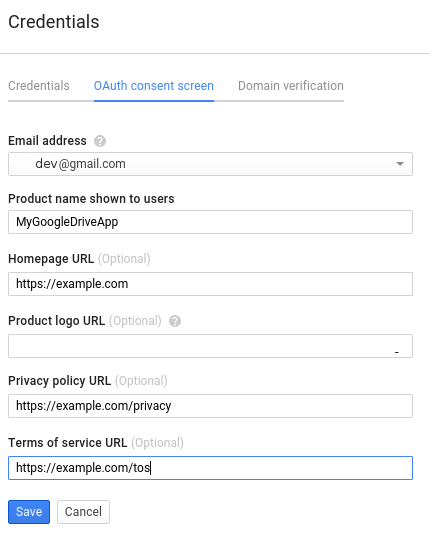

The next screen that opens is **Create Client ID**. Check **Web Application**,  
then enter your app name. **Authorized JavaScript Origins** is your root domain, 
for example ``https://example.com``, without a trailing slash. You need two 
**Authorized Redirect URIs**, and they must be in this form::

  https://example.com/owncloud/index.php/settings/personal
  https://example.com/owncloud/index.php/settings/admin
  
Replace ``https://example.com/owncloud/`` with your own ownCloud server URL, 
then click **Create**.

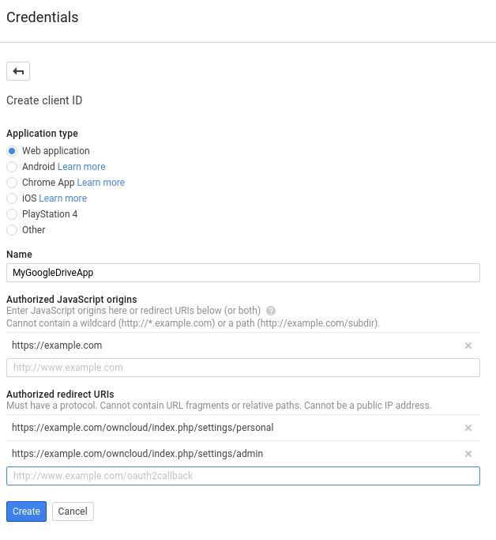

Now Google reveals to you your **Client ID** and **Client Secret**. Click 
**OK**.

.. figure:: images/google-drive10.png
   :alt: Client ID and client secret.

You can see these anytime in your Google console; just click on your app name 
to see complete information.   

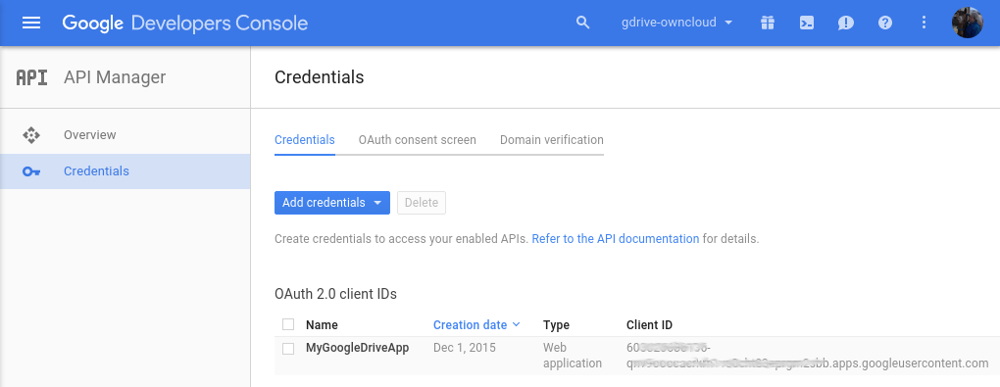
   
Now you have everything you need to mount your Google Drive in ownCloud. 

Go to the External Storage section of your Admin page, create your new folder 
name, enter the Client ID and Client Secret, and click **Grant Access**. Your 
consent page appears when ownCloud makes a successful connection. Click 
**Allow**.

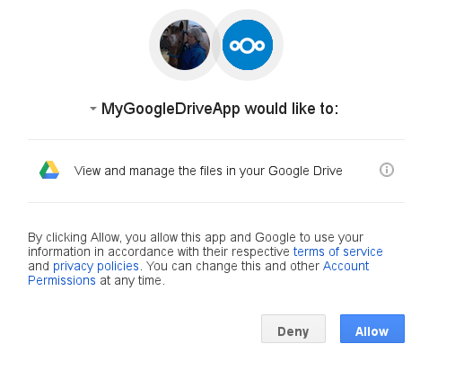

When you see the green light confirming a successful connection
you're finished.

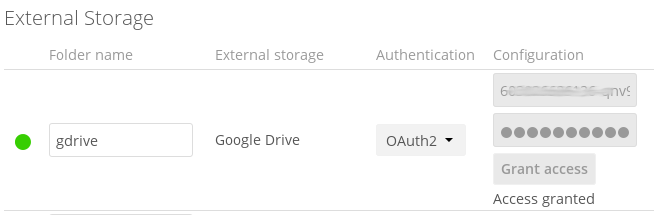

See :doc:`../external_storage_configuration_gui` for additional mount 
options and information.

See :doc:`auth_mechanisms` for more information on authentication schemes.
603026686136-qnv9ooocacrkrh1vs0cht83eprgm2sbb.apps.googleusercontent.com