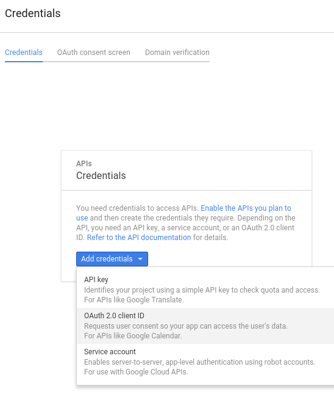

============
Google Drive
============

ownCloud uses OAuth 2.0 to connect to Google Drive. This requires configuration
through Google to get an app ID and app secret, as ownCloud registers itself
as an app.

All applications that access a Google API must be registered through the 
`Google Cloud Console <https://console.developers.google.com/>`_. Follow along carefully 
because the Google interface is a bit of a maze and it's easy to get lost. 

.. note:: Your ownCloud server must have a registered domain name and be 
   accessible over the Internet; Google Drive will not connect to a LAN-only 
   server.

If you already have a Google account, such as Groups, Drive, or Mail, you can 
use your existing login to log into the Google Cloud Console. After logging in 
click  the ``Create Project`` button.

.. figure:: images/google-drive.png

Give your project a name, and either accept the default ``Project ID`` or create 
your own, then click the ``Create`` button.

.. figure:: images/google-drive1.png

The next screen is your ``Project Dashboard``. The Activities screen on the 
bottom left shows your current status. In the left sidebar click ``APIs 
& Auth > APIs``, and then click ``Google Apps APIs > Drive API``.

.. figure:: images/google-drive2.png

Before you click ``Enable API`` you might want to click on ``Learn more`` or 
``Explore this API``. Then click ``Enable API``.

.. figure:: images/google-drive3.png

``Enable API`` takes you to the Drive API dashboard, with tabs for 
``Overview, Usage, Quota``, and ``Drive UI Integration``. Feel free to 
explore, and then go to ``APIs & Auth > Credentials``. This screen has two 
sections: ``0Auth`` and ``Public API Access``.

Click ``0Auth > Create New Client ID``. The next screen that opens is ``Create 
Client ID``. Check ``Web Application`` and click the ``Configure Consent 
Screen`` button. You'll see the consent screen the first time you create a 
mountpoint for your Google Drive in owncloud.

There are just a few required fields on the Consent Screen form: the email 
address of your Google account and your app name. The optional fields include 
your site URL, a link to your logo, and links to your privacy and terms of 
service policies. Your logo must be a hosted file because there is no upload 
dialogue. Click ``Save`` when you're finished.

Now you should be on the ``Edit Client Settings`` screen. The ``Authorized 
JavaScript Origins`` is your root domain, for example 
``https://www.example.com``. You need two ``Authorized Redirect URIs``, which 
must be in the following form:: 

  https://example.com/owncloud/index.php/settings/personal
  https://example.com/owncloud/index.php/settings/admin
  
Replace ``https://example.com/owncloud/`` with your own ownCloud server URL, 
then click ``Save``.

.. figure:: images/google-drive10.png

This should take you back to the 0Auth screen, with a summary of your settings 
and editing buttons. This contains your ``Client ID`` and ``Client Secret``, 
which you need to set up your ownCloud connection.

Go to your ``Admin`` page in ownCloud, create your new folder name, enter the 
Client ID and Client Secret, select your users and groups, and click ``Grant 
Access``.

.. figure:: images/google-drive8.png

Google will open a dialogue asking for permission to connect to ownCloud. Click 
``Accept``. When you see the green light confirming a successful connection
you're finished.

