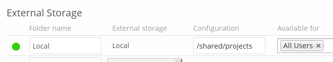

=====
Local
=====

Local storages provide access to any directory on the ownCloud server. Since
this is a significant security risk, Local storage can only be configured in
the ownCloud admin settings. Non-admin users cannot create Local storage 
mounts. 

Use this to mount any directory on your ownCloud server that is outside 
of your ownCloud ``data/`` directory. This directory must be readable and 
writable by your HTTP server user. These ownership and permission examples 
are on Ubuntu Linux::

 sudo -u www-data chown -R www-data:www-data /localdir
 sudo -u www-data chmod -R 0750 /localdir
 
See :ref:`strong_perms_label` for information on correct file permissions, and 
find your HTTP user :ref:`label-phpinfo`.
 
In the **Folder name** field enter the folder name that you want to appear on 
your ownCloud Files page.

In the **Configuration** field enter the full filepath of the directory you 
want to mount.

In the **Available for** field enter the users or groups who have permission to 
access the mount. By default all users have access.

See :doc:`../external_storage_configuration_gui` for additional mount 
options and information.

See :doc:`auth_mechanisms` for more information on authentication schemes.
