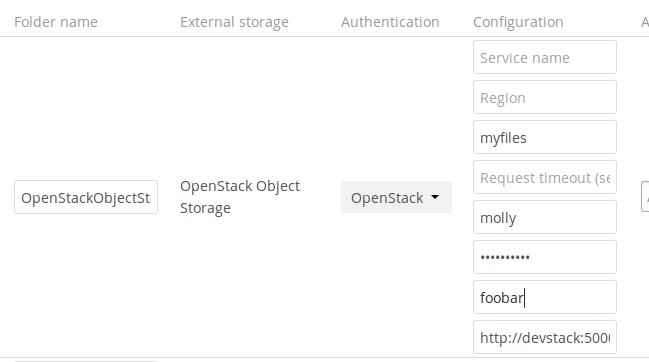
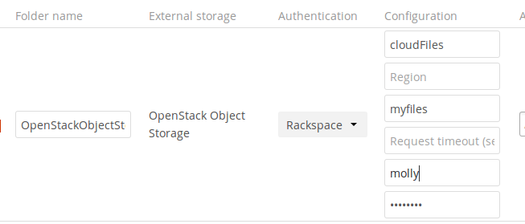

========================
OpenStack Object Storage
========================

OpenStack Object Storage is used to connect to an OpenStack Swift server, or to 
Rackspace. Two authentication mechanisms are available: one is the generic 
OpenStack mechanism, and the other is used exclusively for Rackspace, a provider 
of object storage that uses the OpenStack Swift protocol.

The OpenStack authentication mechanism uses the OpenStack Keystone v2
protocol, connecting to the server specified in the **Identity 
Endpoint URL** field. You need your **Bucket**, **Username**, **Password** and 
**Tenant name**.

The Rackspace authentication mechanism requires a Rackspace 
""Bucket**, **Username** and **API key**. You must also enter **cloudFiles** in 
the **Service name** field.

It may be necessary to specify a **Region**. The timeout of
HTTP requests is set in the **Request timeout** field, in seconds.

See :doc:`../external_storage_configuration_gui` for additional mount 
options and information.

See :doc:`auth_mechanisms` for more information on authentication schemes.
