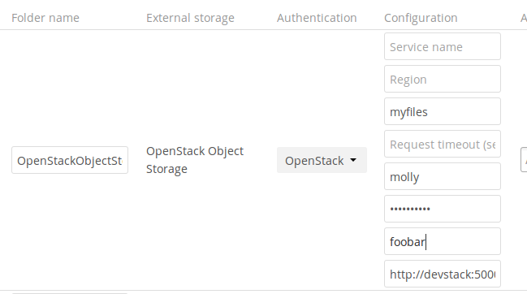
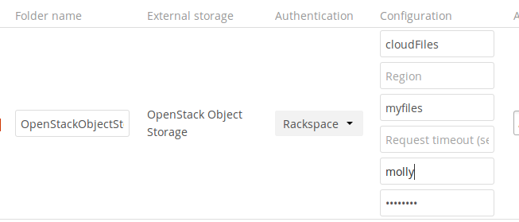

========================
OpenStack Object Storage
========================

OpenStack Object Storage is used to connect to an OpenStack Swift server, or to
Rackspace. Nextcloud supports OpenStack Keystone **v2** and **v3** authentication,
plus a Rackspace-specific mechanism that uses the OpenStack Swift protocol.

Shared backend fields (all OpenStack/Rackspace mounts)
------------------------------------------------------

* **Bucket**. This is user-defined; think of it as a subdirectory of your total
  storage. The bucket will be created if it does not exist.
* **Region**. Your region as shown in the OpenStack or Rackspace account.
* **Service name** (optional). Defaults depend on the provider; Rackspace uses
  ``cloudFiles``.
* **Request timeout** (optional), in seconds.

OpenStack Keystone v2
---------------------

Select the **OpenStack v2** authentication mechanism. Your Nextcloud configuration
needs:

* **Login** (username) of your account.
* **Password** of your account.
* **Tenant name** of your account. (A tenant is similar to a user group.)
* **Identity endpoint URL**, typically ending in ``/v2.0``.

OpenStack Keystone v3
---------------------

Select the **OpenStack v3** authentication mechanism when your cloud requires
Keystone v3 (common on current OpenStack deployments). In addition to the shared
backend fields above, configure:

* **Login** (username) of your account.
* **Domain** of the user (often ``Default``).
* **Password** of your account.
* **Tenant name** (project name) of your account.
* **Identity endpoint URL**, typically ending in ``/v3``.

The user domain is required for v3. The tenant/project is scoped using the
project name together with the identity endpoint; map these from your OpenRC
file (``OS_USERNAME``, ``OS_USER_DOMAIN_NAME``, ``OS_PASSWORD``,
``OS_PROJECT_NAME`` / ``OS_TENANT_NAME``, ``OS_AUTH_URL``).

.. note::

   Primary object storage (``config.php`` ``objectstore``) has separate v2/v3
   examples in :doc:`../primary_storage`. Field names differ slightly from the
   External Storage GUI described here.

Rackspace
---------

The Rackspace authentication mechanism requires:

* **Bucket**
* **Username**
* **API key**.

You must also enter the term **cloudFiles** in the **Service name** field.

It may be necessary to specify a **Region**. Your region should be named in
your account information, and you can read about Rackspace regions at
`About Regions <https://support.rackspace.com/how-to/about-regions/>`_.

The timeout of HTTP requests is set in the **Request timeout** field, in
seconds.

See :doc:`../external_storage_configuration_gui` for additional mount
options and information.

See :doc:`auth_mechanisms` for more information on authentication schemes.
