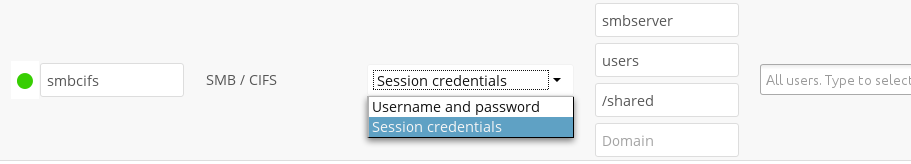

========
SMB/CIFS
========

Nextcloud can connect to Windows file servers or other SMB-compatible servers
with the SMB/CIFS backend.

.. note:: The SMB/CIFS backend requires ``smbclient`` or 
   the PHP smbclient module to be installed on the Nextcloud server. The PHP 
   smbclient module is preferred, but either will work. These 
   should be included in any Linux distribution. (See `PECL smbclient 
   <https://pecl.php.net/package/smbclient>`_ if your distro does not include 
   them.)

You need the following information:

*    Folder name for your local mountpoint.
*    Host: The URL of the Samba server.
*    Username: The username or domain/username used to login to the Samba 
     server.
*    Password: the password to login to the Samba server.
*    Share: The share on the Samba server to mount.
*    Remote Subfolder: The remote subfolder inside the Samba share to mount 
     (optional, defaults to /). To assign the Nextcloud logon username 
     automatically to the subfolder, use ``$user`` instead of a particular 
     subfolder name. 
*    And finally, the Nextcloud users and groups who get access to the share.

Optionally, you can specify a ``Domain``. This is useful in 
cases where the
SMB server requires a domain and a username, and an advanced authentication
mechanism like session credentials is used so that the username cannot be
modified. This is concatenated with the username, so the backend gets
``domain\username``

.. note:: For improved reliability and performance, we recommended installing   
          ``libsmbclient-php``, a native PHP module for connecting to
          SMB servers.
		  

See :doc:`../external_storage_configuration_gui` for additional mount 
options and information.

See :doc:`auth_mechanisms` for more information on authentication schemes.

------------------------
SMB update notifications
------------------------

Starting with Nextcloud 10, Nextcloud can use smb update notifications to
listen to changes made to a configured SMB/CIFS storage and detect external
changes made to the storage in near real-time.

.. note:: Due to limitations of linux based SMB servers, this feature only works
   reliably on Windows SMB servers.

.. note:: Using update notifications requires ``smbclient`` 4.x or newer.
   Due to limitations with the smbclient PHP module, the ``smbclient`` binary
   is required even when using the PHP module.

To start listening to update notifications, start the ``occ`` command like this::

 occ files_external:notify <mount_id>

You can find the mount id for a specific storage using ``occ files_external:list``

On default this command shows no output, can you see the list of detected changes by
passing the ``-v`` option to the command.

~~~~~~~~~~~~~~~~~~
SMB Authentication
~~~~~~~~~~~~~~~~~~

In some cases (such as when using login credentials) it's not possible to read the
smb credentials from the storage configuration, in those cases you can provide
the username and password using the ``--username`` and ``--password`` arguments.
