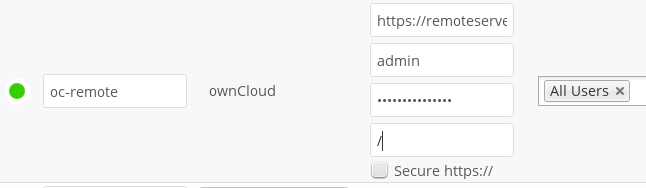

======
WebDAV
======

Use this backend to mount a directory from any WebDAV server, or another 
ownCloud server.

The following information is required:

- ``URL`` -- The URL of the WebDAV or ownCloud server, including subdirectories

WebDAV uses the password authentication scheme, see :doc:`auth_mechanisms`

Optionally, a ``Remote Subfolder`` can be specified to change the desination
directory. The default is to use the whole root.

The ``Secure https://`` checkbox can be used as an alternative to specifying
``https://`` in the ``URL`` field.

.. Note:: CPanel users should install `Web Disk 
   <https://documentation.cpanel.net/display/ALD/Web+Disk>`_ to enable WebDAV 
   functionality.
