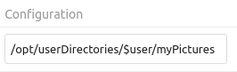

================
External Storage
================

The External Storage Support application enables you to mount external storage 
services and devices as secondary Nextcloud storage devices. You may also allow 
users to mount their own external storage services.

Enabling
--------

External Storage Support is provided by a bundled (automatically installed) app. It is 
disabled by default, so to use this feature you simply need to enable it under
**Apps**.

.. figure:: external_storage/images/enable-app.png
   :alt: Enable external storage on your Apps page.

Configuring
-----------

To access the settings for configuring external storage mounts, click your Profile icon
in the top right and select **Settings** from the dropdown. On the left side, under
**Administration**, select **External Storage**.

.. note::
   External storage can also be configured via the occ command. See :ref:`occ 
   documentation <files_external_label>`.

To create a new external storage mount, select an available backend from the
**Add storage** dropdown. Each backend has different required options, which 
are configured in the configuration fields.

.. figure:: external_storage/images/add_storage.png

Each backend may also accept multiple authentication methods. These are selected 
with the dropdown under **Authentication**. Different backends support different 
authentication mechanisms; some are specific to the backend, while others are more 
generic. See :doc:`external_storage/auth_mechanisms` for more detailed 
information.

When you select an authentication mechanism, the configuration fields change as 
appropriate for the chosen mechanism. For example, the SFTP backend supports 
**Username and password**, **Log-in credentials, save in session**, and **RSA 
public key**.

.. figure:: external_storage/images/auth_mechanism.png
   :alt: An SFTP configuration example.

Required fields are marked with a red border. When all required fields are 
filled, the storage is automatically saved. A green dot next to the storage row 
indicates the storage is ready for use. A red or yellow icon indicates 
that Nextcloud could not connect to the external storage, so you need to 
re-check your configuration and network availability.

If there is an error on the storage, it will be marked as unavailable for ten 
minutes. To re-check it, click the colored icon or reload your Admin page.

Usage of Variables for Mount Paths
----------------------------------

The external storage mounting mechanism accepts variables in the mount path.

Use ``$user`` for automatic substitution with the logged-in user's username.

Use ``$home`` for automatic substitution with a configurable home directory variable
(requires LDAP; see :ref:`LDAP_Special_Attributes` in the LDAP configuration documentation for details).

In the following example, the mount point for a logged-in user "alice" would resolve 
to ``/opt/userDirectories/alice/myPictures``.

User and Group Permissions
--------------------------

A storage configured in a user's personal settings is available only to the user 
who created it. A storage configured in the Admin settings is available to 
all users by default, but it can be restricted to specific users and groups in 
the **Available for** field.

.. figure:: external_storage/images/applicable.png
   :alt: User and groups selector

.. _external_storage_mount_options_label:

Mount Options
-------------

The overflow menu (three dots) exposes the settings and trashcan icons. Click the trashcan to delete the
mount point. The settings button allows you to configure each storage mount
individually with the following options:

* Encryption
* Previews
* Enable Sharing
* Filesystem check frequency (Never, Once per direct access)
* Mac NFD Compatibility
* Read Only

The **Encryption** checkbox is visible only when the Encryption app is enabled. Note that server-side
encryption is not available for other Nextcloud servers used as external storage.

**Enable Sharing** allows the Nextcloud admin to enable or disable sharing on individual mount points.
When sharing is disabled, the shares are retained internally so that you can re-enable sharing
and the previous shares become available again. Sharing is disabled by default.

.. figure:: external_storage/images/mount_options.png
   :alt: Additional mount options exposed on mouseover.

Using Self-Signed Certificates
------------------------------

When using self-signed certificates for external storage mounts, the certificate
must be imported into the personal settings of the user. Please refer to 
`Nextcloud HTTPS External Mount 
<https://ownclouden.blogspot.de/2014/11/owncloud-https-external-mount.html>`_
for more information.

Available Storage Backends
--------------------------

The following backends are provided by the external storages app.

.. toctree::
    :maxdepth: 1

    external_storage/amazons3
    external_storage/ftp
    external_storage/local
    external_storage/nextcloud
    external_storage/openstack
    external_storage/sftp
    external_storage/smb
    external_storage/webdav

.. note:: A non-blocking or correctly configured SELinux setup is needed
   for these backends to work. Please refer to :ref:`selinux-config-label`.

Allow Users to Mount External Storage
-------------------------------------

Check **Enable User External Storage** to allow your users to mount their own 
external storage services, and check the backends you want to allow. Beware, as 
this allows a user to make potentially arbitrary connections to other services 
on your network!

.. figure:: external_storage/images/user_mounts.png
   :alt: Checkboxes to allow users to mount external storage services.

Adding Files
------------

We recommend configuring the background job **Webcron** or
**Cron** (see :doc:`../configuration_server/background_jobs_configuration`)
to enable Nextcloud to automatically detect files added to your external
storages.

Nextcloud may not always be able to detect changes made remotely (files changed without going through Nextcloud), especially
when files are located deep in the folder hierarchy of the external storage.

You might need to set up a cron job that runs ``sudo -E -u www-data php occ files:scan --all``
(or replace ``--all`` with the username; see also :doc:`../occ_command`)
to trigger a rescan of the user's files periodically (for example, every 15 minutes), which includes
the mounted external storage.

.. _trouble-file-encoding-ext-storages:

Troubleshooting File Name Encoding
----------------------------------

.. TODO: This should be reviewed by a knowledgeable party at a future date to determine if any changes are relevant with the HFS+ to APFS migration in macOS.

When using external storage, it can happen that some files with special characters will not
appear in the file listing, or they will appear but not be accessible.

When this happens, please run the :ref:`files scanner<occ_files_scan_label>`, for example::

  sudo -E -u www-data php occ files:scan --all

If the scanner reports an encoding issue on the affected file, please enable Mac encoding
compatibility in the :ref:`mount options<external_storage_mount_options_label>`
and then :ref:`rescan the external storage<occ_files_scan_label>`.

.. note::
   This mode comes with a performance impact because Nextcloud will always try both encodings when detecting files
   on external storages.

   Mac computers use the NFD Unicode normalization for file names, which is different from NFC, the one used
   by other operating systems. Mac users might upload files directly to the external storage using NFD-normalized
   file names. When uploading through Nextcloud, file names will always be normalized to the NFC standard for consistency.

   It is recommended to let Nextcloud use external storages exclusively to avoid such issues.

   See also the `technical explanation about NFC vs NFD normalizations <https://www.win.tue.nl/~aeb/linux/uc/nfc_vs_nfd.html>`_.
