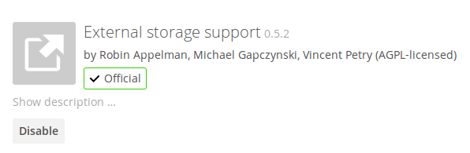
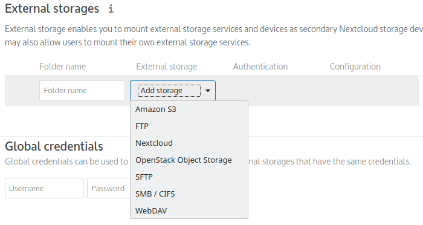
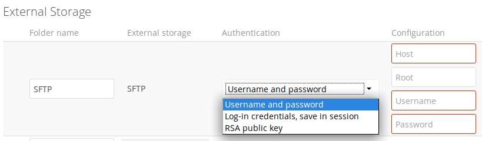
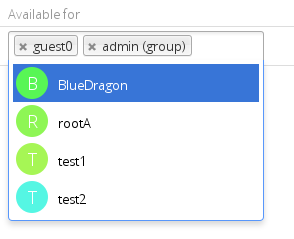
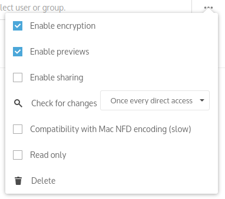

==================================
Configuring External Storage (GUI)
==================================

The External Storage Support application enables you to mount external storage 
services and devices as secondary Nextcloud storage devices. You may also allow 
users to mount their own external storage services.

Nextcloud 9.0 introduces a new set of :ref:`occ commands for managing external storage <files_external_label>`.

Also new in 9.0 is an option for the Nextcloud admin to enable or disable sharing 
on individual external mountpoints (see 
:ref:`external_storage_mount_options_label`). Sharing on such mountpoints is 
disabled by default.

Enabling External Storage Support
---------------------------------

.. warning:: Enabling this app will disable the **Stay logged in** checkbox on the login page.

The External storage support application is enabled on your Apps page.

Storage configuration
---------------------

To create a new external storage mount, select an available backend from the
dropdown **Add storage**. Each backend has different required options, which 
are configured in the configuration fields.

Each backend may also accept multiple authentication methods. These are selected 
with the dropdown under **Authentication**. Different backends support different 
authentication mechanisms; some specific to the backend, others are more 
generic. See :doc:`external_storage/auth_mechanisms` for more detailed 
information.

When you select an authentication mechanism, the configuration fields change as 
appropriate for the mechanism. The SFTP backend, for one example, supports 
**username and password**, **Log-in credentials, save in session**, and **RSA 
public key**.

Required fields are marked with a red border. When all required fields are 
filled, the storage is automatically saved. A green dot next to the storage row 
indicates the storage is ready for use. A red or yellow icon indicates 
that Nextcloud could not connect to the external storage, so you need to 
re-check your configuration and network availability.

If there is an error on the storage, it will be marked as unavailable for ten 
minutes. To re-check it, click the colored icon or reload your Admin page.

User and group permissions
--------------------------

A storage configured in a user's Personal settings is available only to the user 
that created it. A storage configured in the Admin settings is available to 
all users by default, and it can be restricted to specific users and groups in 
the **Available for** field.

.. _external_storage_mount_options_label:

Mount options
-------------

Hover your cursor to the right of any storage configuration to expose
the settings button and trashcan. Click the trashcan to delete the
mountpoint. The settings button allows you to configure each storage mount
individually with the following options:

* Encryption
* Previews
* Enable Sharing
* Filesystem check frequency (Never, Once per direct access)

The **Encryption** checkbox is visible only when the Encryption app is enabled. 

**Enable Sharing** allows the Nextcloud admin to enable or disable sharing on individual mountpoints.
When sharing is disabled the shares are retained internally, so that you can re-enable sharing
and the previous shares become available again. Sharing is disabled by default.

Using self-signed certificates
------------------------------

When using self-signed certificates for external storage mounts the certificate
must be imported into the personal settings of the user. Please refer to 
`Nextcloud HTTPS External Mount 
<http://ownclouden.blogspot.de/2014/11/owncloud-https-external-mount.html>`_
for more information.

Available storage backends
--------------------------

The following backends are provided by the external storages app. Other apps
may provide their own backends, which are not listed here. Google Drive and Dropbox
were moved to external apps which are still in development (Github-Repos for `Google Drive 
<https://github.com/owncloud/files_external_gdrive>`_ and `Dropbox 
<https://github.com/icewind1991/files_external_dropbox>`_).

.. toctree::
    :maxdepth: 1

    external_storage/amazons3
    external_storage/ftp
    external_storage/local
    external_storage/nextcloud
    external_storage/openstack
    external_storage/sftp
    external_storage/smb
    external_storage/webdav

.. note:: A non-blocking or correctly configured SELinux setup is needed
   for these backends to work. Please refer to the :ref:`selinux-config-label`.

Allow users to mount external Storage
-------------------------------------

Check **Enable User External Storage** to allow your users to mount their own 
external storage services, and check the backends you want to allow. Beware, as 
this allows a user to make potentially arbitrary connections to other services 
on your network!

.. figure:: external_storage/images/user_mounts.png
   :alt: Checkboxes to allow users to mount external storage services.

Adding files to external storages
---------------------------------

We recommend configuring the background job **Webcron** or
**Cron** (see :doc:`../configuration_server/background_jobs_configuration`)
to enable Nextcloud to automatically detect files added to your external
storages.

Nextcloud may not always be able to find out what has been
changed remotely (files changed without going through Nextcloud), especially
when it's very deep in the folder hierarchy of the external storage.

You might need to setup a cron job that runs ``sudo -u www-data php occ files:scan --all``
(or replace "--all" with the user name, see also :doc:`../configuration_server/occ_command`)
to trigger a rescan of the user's files periodically (for example every 15 minutes), which includes
the mounted external storage.
