Configuring External Storage (GUI)
==================================

The External Storage Support application enables you to mount external storage services 
and devices as secondary ownCloud storage devices. You may also allow users to 
mount their own external storage services.

All of these connect to a LAN ownCloud server that is not publicly accessible, 
with one exception: Google Drive requires an ownCloud server with a registered 
domain name that is accessible over the Internet.

Supported mounts
----------------

ownCloud admins may mount these external storage services and devices:

*   Local
*   Amazon S3 and S3 compliant
*   Dropbox
*   FTP/SFTP
*   Google Drive
*   OpenStack Object Storage
*   SMB/CIFS
*   SMB/CIFS using OC login
*   ownCloud
*   WebDAV

ownCloud users can be given permission to mount any of these, except local 
storage.

Enabling External Storage Support
---------------------------------

The ``External storage support`` application is enabled on the ``Apps`` page.

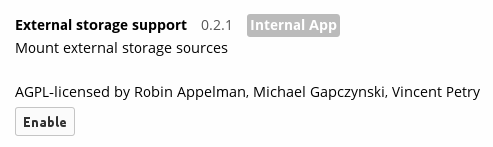

After enabling it, go to your ``Admin`` page to set up your external 
storage mounts.

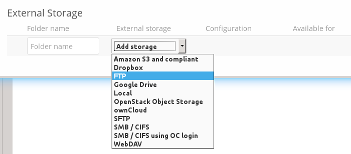

When your configuration is correct you'll see a green light at the left, and if 
it isn't you'll see a red light.

Check ``Enable User External Storage`` to allow your users to mount their own 
external storage services, and check the services you want to allow.

.. figure:: ../images/external-storage-app-usermounts.png

After creating your external storage mounts, you can share them and control 
permissions just like any other ownCloud share.

Using self-signed certificates
------------------------------

When using self-signed certificates for external storage mounts the certificate
needs to be imported in the personal settings of the user. Please refer to `this <http://ownclouden.blogspot.de/2014/11/owncloud-https-external-mount.html>`_
blogpost for more informations.

Local Storage
-------------

Use this to mount any directory on your ownCloud server that is outside of your 
ownCloud ``data/`` directory. This directory must be readable and writable by 
your HTTP server user.

In the ``Folder name`` field enter the folder name that you want to appear on 
your ownCloud ``Files`` page. 

In the ``Configuration`` field enter the full filepath of the directory you 
want to mount.

In the ``Available for`` field enter the users or groups who have permission to 
access the mount.

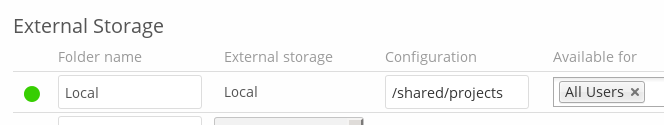

Amazon S3
---------

All you need to connect your Amazon S3 buckets to ownCloud is your S3 Access 
Key, Secret Key, and your bucket name.

In the ``Folder name`` field enter the folder name that you want to appear on 
your ownCloud ``Files`` page. 

In the ``Access Key`` field enter your S3 Access Key.

In the ``Secret Key`` field enter your S3 Secret Key.

In the ``Bucket`` field enter the name of your S3 bucket you want to share.

In the ``Available for`` field enter the users or groups who have permission to 
access your S3 mount.

The hostname, port, and region of your S3 server are optional; you will need 
to use these for non-Amazon S3-compatible servers.

.. figure:: ../images/external-storage-amazons3.png

Dropbox
-------

Connecting Dropbox is a little more work because you have to create a Dropbox 
app. Log into the `Dropbox Developers page <http://www.dropbox.com/developers>`_ 
and click ``App Console``:

.. figure:: ../images/external-storage-dropbox.png

If you have not already created any Dropbox apps it will ask you to accept 
their terms and conditions. Then you are presented with the choice to create 
either a Drop-ins App or a Dropbox API App. Click ``Dropbox API App``, and then 
check:

* Files and datastores.
* No -- My app needs access to files already on Dropbox.
* All file types -- My app needs access to a user's full Dropbox. Only 
  supported via the CoreAPI.
  
Then enter whatever name you want for your app.

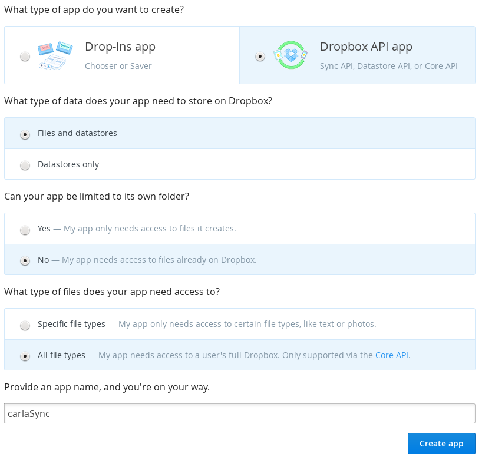

Now click the ``Create App`` button. Under ``Status``, do not click 
``Development (Apply for production status)`` because that is for apps that you 
want to release publicly.

Click ``Enable additional users`` to allow multiple oC users to use your new 
Dropbox share.

Note your App key and App secret, which you will enter in the External Storage 
form on your ownCloud Admin page.

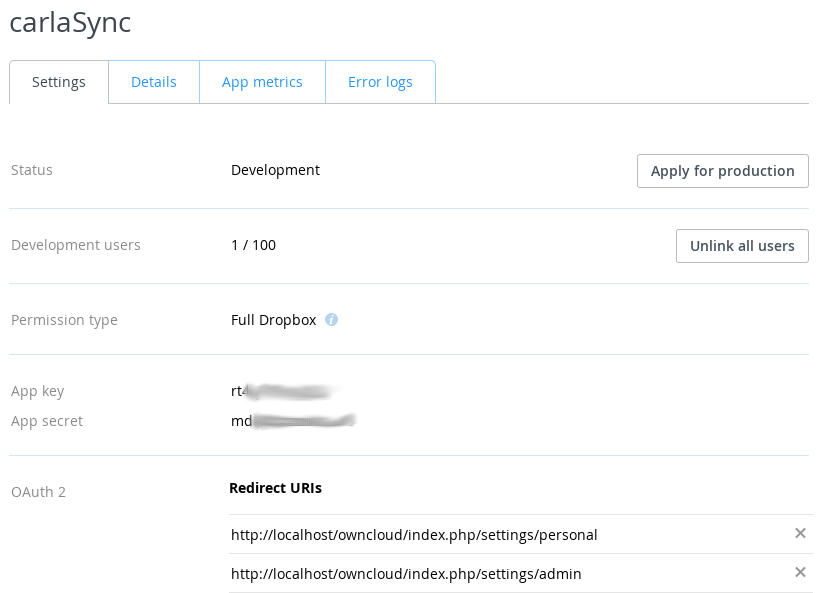

You need two ``Redirect URIs``. You may use ``localhost`` as the hostname for 
testing because you don't need to use HTTPS, but this is not recommended for 
production use because it sends all traffic in the clear::

  http://localhost/owncloud/index.php/settings/personal
  http://localhost/owncloud/index.php/settings/admin
  
HTTPS is recommended for production use to encrypt your sessions::

  https://localhost/owncloud/index.php/settings/personal
  https://localhost/owncloud/index.php/settings/admin
  
  https://example.com/owncloud/index.php/settings/personal
  https://example.com/owncloud/index.php/settings/admin
  
Your ownCloud configuration requires only the local mount name, the App Key and 
the App Secret, and which users or groups have access to the share.

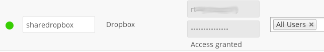

You must be logged into Dropbox, and when ownCloud successfully verifies your 
connection Dropbox will ask for verification to connect to your Dropbox 
account. Click ``Allow``, and you're done.

.. figure:: ../images/external-storage-dropbox-allowshare.png

FTP/FTPS/SFTP
-------------

Connecting to an FTP server requires:

* Whatever name you want for your local mountpoint.
* The URL of your FTP server.
* FTP server username and password.
* Remote Subfolder, the FTP directory to mount in ownCloud. ownCloud defaults to the root 
  directory. When you specify a different directory you must leave off the 
  leading slash. For example, if you want to connect your 
  ``public_html/images`` directory, then type it exactly like that. 
* Choose whether to connect in the clear with ``ftp://``, or to encrypt your 
  FTP session with SSL/TLS over ``ftps://`` (Your FTP server must be 
  configured to support ``ftps://``)
* Enter the ownCloud users or groups who are allowed to access the share.  
  
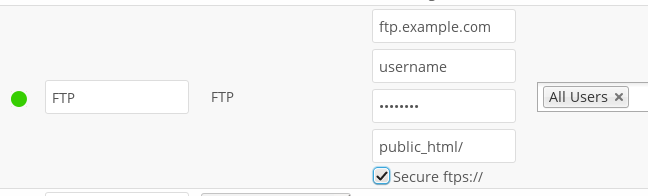

SFTP uses SSH rather than SSL, as FTPS does, so your SFTP sessions are always 
safely tucked inside an SSH tunnel. To connect an SFTP server you need:

* Whatever name you want for your local mountpoint.
* The URL of your SFTP server.
* SFTP server username and password.
* Remote Subfolder, the SFTP directory to mount in ownCloud.
* The ownCloud users or groups who are allowed to access the share. 

Google Drive
------------

All applications that access a Google API must be registered through the 
`Google Cloud Console <https://console.developers.google.com/>`_. Follow along carefully 
because the Google is a bit of a maze and it's easy to get lost. 

.. note:: Your ownCloud server must have a registered domain name and be 
   accessible over the Internet; Google Drive will not connect to a LAN-only 
   server.

If you already have a Google account, such as Groups, Drive, or Mail, you can 
use your existing login to log into the Google Cloud Console. After logging in 
click ``Go to my console``, and then click the ``Create Project`` button. It 
takes a minute or two to create your new project.

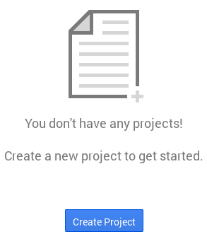

In the next screen give your project a name, accept the default ``Project ID`` 
or create your own, click the Terms of Service box, and click the ``Create`` 
button.

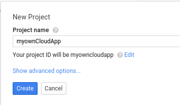

The next screen is your ``Project Dashboard``. In the left sidebar click ``APIs 
& Auth > APIs``, and then enable the ``Drive API`` and ``Drive SDK`` by 
toggling the boxes in the far-right ``Status`` column to the green On buttons.

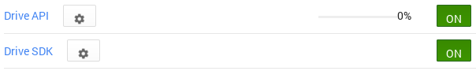

This brings you to the ``Google Drive SDK`` screen. Click ``API Access``.

.. figure:: ../images/external-storage-google-drive-sdk.png

This opens the ``API Access`` screen. Click the ``Create a 0Auth 2.0 Client 
ID`` button. 

.. figure:: ../images/external-storage-google-drive-0auth.png

The next screen that opens is ``Create Client ID: Branding Information``. Google 
requires to you to fill this out. When you're finished move on to the ``Create 
Client ID: Client ID Settings`` screen.

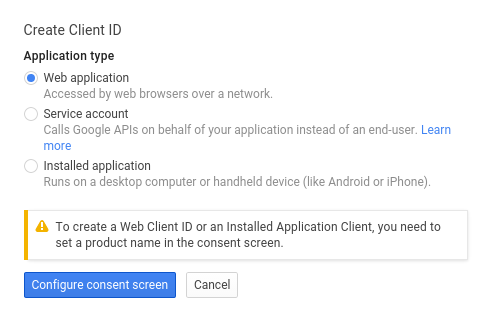

The ``Application Type`` is Web application.

Click ``Your site or hostname (more options)`` to expose  ``Authorized 
Redirect URIs``. Enter two Redirect URIs like these examples, replacing 
``https://example.com/owncloud/`` with your own ownCloud server 
URL. You must use a registered domain name, and you cannot use the server's 
IP address.

  https://example.com/owncloud/index.php/settings/personal
  https://example.com/owncloud/index.php/settings/admin
  
Click ``Create client ID`` and you'll see a screen like this:

.. figure:: ../images/external-storage-google-drive-9.png

This contains your ``Client ID`` and ``Client Secret``, which you need to set up 
your ownCloud connection. Go to your ``Admin`` page in ownCloud, create your new 
folder name, enter the Client ID and Client Secret, select your users and 
groups, and click ``Grant Access``.

.. figure:: ../images/external-storage-google-drive8.png

Google will open a dialogue asking for permission to connect to ownCloud. Click 
``Accept`` and you're finished.

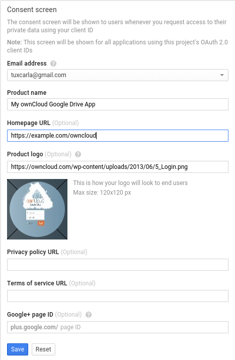

SMB/CIFS
--------

You can mount SMB/CIFS file shares on ownCloud servers that run on Linux. This 
only works on Linux ownCloud servers because you must have ``smbclient`` 
installed. SMB/CIFS file servers include any Windows file share, Samba servers 
on Linux and other Unix-type operating systems, and NAS appliances. 

You need the following information:

*   Folder name -- Whatever name you want for your local mountpoint.
*   Host -- The URL of the Samba server.
*   Username -- The username or domain/username used to login to the Samba server.
*   Password -- The password to login to the Samba server.
*   Share -- The share on the Samba server to mount.
*   Remote Subfolder -- The remote subfolder inside the Samba share to mount (optional, defaults to 
    ``/``). To assign the ownCloud logon username automatically to the subfolder, use ``$user`` instead of a particular subfolder name.

And finally, the ownCloud users and groups who get access to the share.    

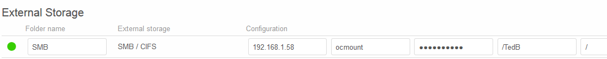

SMB/CIFS using OC login
-------------------------

This works the same way as setting up a SMB/CIFS mount, except you can use your 
ownCloud logins intead of the SMB/CIFS server logins. To make this work, your 
ownCloud users need the same login and password as on the SMB/CIFS server. 

.. note:: Shares set up with ``SMB/CIFS using OC login`` cannot be shared in 
   ownCloud. If you need to share your SMB/CIFS mount, then use the SMB/CIFS 
   mount without oC login.

ownCloud and WebDAV
-------------------

Use these to mount a directory from any WebDAV server, or another 
ownCloud server.

*   Folder name -- Whatever name you want for your local mountpoint.
*   URL -- The URL of the WebDAV or ownCloud server.
*   Username and password for the remote server
*   Remote Subfolder -- The remote subfolder you want to mount (optional, defaults 
    to ``/``)
*   Secure ``https://`` - Whether to use ``https://`` to connect to the WebDav 
    server instead of ``http://`` (We always recommend ``https://`` for 
    security)

.. figure:: ../images/external-storage-webdav.png

OpenStack Object Storage
------------------------

Use this to mount a container on an OpenStack Object Storage server. You need 
the following information:

*   Username
*   Bucket
*   Region
*   API Key
*   Tenantname
*   Password
*   Service Name
*   URL of identity Endpoint
*   Timeout of HTTP request

Configuration File
------------------

The configuration of mounts created within the External Storage App are stored 
in the ``data/mount.json`` file. This file contains all settings in JSON 
(JavaScript Object Notation) format. Two different types of entries exist:

*   Group mounts: Each entry configures a mount for each user in group.
*   User mount: Each entry configures a mount for a single user or all users.

For each type, there is a JSON array with the user/group name as key and an 
array of configuration values as the value. Each entry consist of the class name 
of the storage backend and an array of backend specific options (described 
above) and will be replaced by the user login.

Although configuration may be done by making modifications to the 
``mount.json`` file, it is recommended to use the Web-GUI in the administrator 
panel (as described in the above section) to add, remove, or modify mount 
options to prevent any problems. See :doc:`external_storage_configuration` for 
configuration examples.

