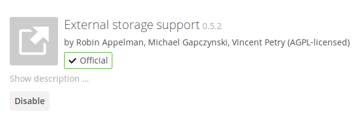
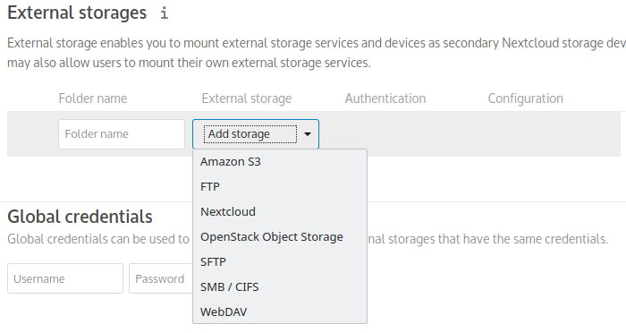
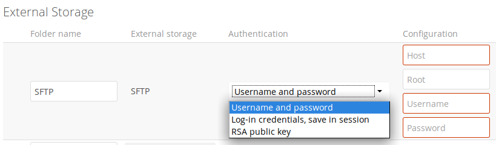
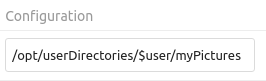
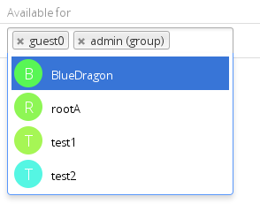
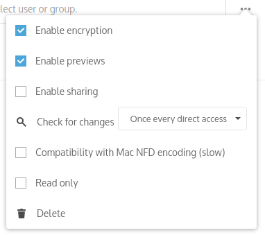
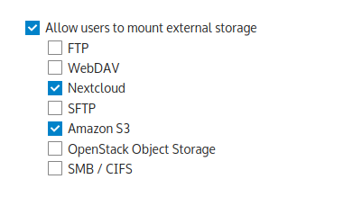

================
External Storage
================

The External Storage Support application enables you to mount external storage
services and devices as secondary Nextcloud storage devices. You may also allow
users to mount their own external storage services.

Enabling
--------

External Storage Support is provided by a bundled (automatically installed) app. It is
disabled by default, so to use this feature you simply need to enable it under
**Apps**.

Configuring
-----------

To access the settings for configuring external storage mounts, click your **Profile** icon
and select **Settings** from the dropdown. On the left side, under
**Administration**, select **External Storage**.

.. note::
   External storage can also be configured via the occ command. See :ref:`occ
   documentation <files_external_label>`.

To create a new external storage mount, select an available backend from the
**Add storage** dropdown. Each backend has different required options, which
are configured in the configuration fields.

Each backend may also accept multiple authentication methods. These are selected
with the dropdown under **Authentication**. Different backends support different
authentication mechanisms; some are specific to the backend, while others are more
generic. See :doc:`external_storage/auth_mechanisms` for more detailed
information.

When you select an authentication mechanism, the configuration fields change as
appropriate for the chosen mechanism. For example, the SFTP backend supports
**Username and password**, **Log-in credentials, save in session**, and **RSA
public key**.

Required fields are marked with a red border. When all required fields are
filled, the storage is automatically saved. A green dot next to the storage row
indicates the storage is ready for use. A red or yellow icon indicates
that Nextcloud could not connect to the external storage, so you need to
re-check your configuration and network availability.

If there is an error on the storage, it will be marked as unavailable for ten
minutes. To re-check it, click the colored icon or reload your Admin page.

Folder name
-----------
The ``Folder name`` is the name the folder will have within Nextcloud - the
name that will be visible to NextCloud users.

Note that the folder name cannot include a path or subdirectory - do not
include slashes in your ``Folder name.``

Usage of variables for mount paths
----------------------------------

The external storage mounting mechanism accepts variables in the mount path.

Use ``$user`` for automatic substitution with the logged-in user's username.

Use ``$home`` for automatic substitution with a configurable home directory variable
(requires LDAP; see :ref:`LDAP_Special_Attributes` in the LDAP configuration documentation for details).

In the following example, the mount point for a logged-in user "alice" would resolve
to ``/opt/userDirectories/alice/myPictures``.

User and Group Permissions
--------------------------

A storage configured in a user's personal settings is available only to the user
who created it. A storage configured in the Admin settings is available to
all users by default, but it can be restricted to specific users and groups in
the **Available for** field.

.. _external_storage_mount_options_label:

Mount Options
-------------

The overflow menu (three dots) exposes the settings and trashcan icons. Click the trashcan to delete the
mount point. The settings button allows you to configure each storage mount
individually with the following options:

* Encryption
* Previews
* Enable Sharing
* **Filesystem check frequency** — controls how the server rescans an external
  storage path when a WebDAV ``PROPFIND`` request arrives for it.
  **Once per direct access** makes a shallow rescans on each ``PROPFIND`` request;
  **Never** skips the rescan entirely. This setting does *not* cause Nextcloud
  or desktop clients to poll automatically. See
  :ref:`external_storage_change_detection_label` for details.
* Mac NFD Compatibility
* Read Only

The **Encryption** checkbox is visible only when the Encryption app is enabled. Note that server-side
encryption is not available for other Nextcloud servers used as external storage.

**Enable Sharing** allows the Nextcloud admin to enable or disable sharing on individual mount points.
When sharing is disabled, the shares are retained internally so that you can re-enable sharing
and the previous shares become available again. Sharing is disabled by default.

Using Self-Signed Certificates
------------------------------

When using self-signed certificates for external storage mounts, the certificate
must be imported into the personal settings of the user. Please refer to
`Nextcloud HTTPS External Mount
<https://ownclouden.blogspot.de/2014/11/owncloud-https-external-mount.html>`_
for more information.

Available Storage Backends
--------------------------

The following backends are provided by the external storages app.

.. toctree::
    :maxdepth: 1

    external_storage/amazons3
    external_storage/ftp
    external_storage/local
    external_storage/nextcloud
    external_storage/openstack
    external_storage/sftp
    external_storage/smb
    external_storage/webdav

.. note:: A non-blocking or correctly configured SELinux setup is needed
   for these backends to work. Please refer to :ref:`selinux-config-label`.

Allow Users to Mount External Storage
-------------------------------------

Check **Enable User External Storage** to allow your users to mount their own
external storage services, and check the backends you want to allow. Beware, as
this allows a user to make potentially arbitrary connections to other services
on your network!

.. _external_storage_change_detection_label:

Detecting changes made outside Nextcloud
-----------------------------------------

When files are added, modified, or deleted on an external storage **directly**
(without going through Nextcloud), Nextcloud will not know about those changes
immediately. Nextcloud maintains an internal index (the *filecache*) that is only
updated when Nextcloud itself performs a scan. Until that scan happens, the
filecache is stale and the changes are invisible to Nextcloud, desktop clients,
and mobile apps.

How the "Filesystem check frequency" option works
^^^^^^^^^^^^^^^^^^^^^^^^^^^^^^^^^^^^^^^^^^^^^^^^^^

The **Filesystem check frequency** mount option (see
:ref:`external_storage_mount_options_label`) controls what happens when a WebDAV
``PROPFIND`` request reaches the Nextcloud server for a path inside the external
storage:

* **Once per direct access** — during ``PROPFIND`` requests made to a given directory,
  Nextcloud rescans that directory level then updates the filecache with what it finds there.
* **Never** — the server never rescans the external storage during ``PROPFIND`` requests
  and always returns the content stored in its internal index.

This option is *only* about the server's behavior during a ``PROPFIND``. It does
not trigger any background polling and does not change how desktop clients or
mobile apps behave.

Because this rescan is driven by user actions (opening a folder in the web UI,
browsing in the mobile app, or a client issuing a ``PROPFIND``), change detection
remains random and unreliable for deep folder hierarchies.

Why desktop clients miss deep changes
^^^^^^^^^^^^^^^^^^^^^^^^^^^^^^^^^^^^^^

The desktop sync client only issues a ``PROPFIND`` on the root of the sync folder
on every sync cycle because scanning the entire tree would be too expensive. It
relies on **etag propagation**: when a file changes, the etag of every parent
folder up to the root must also change, giving the client a trail to follow down
to the changed file.

When a change is made outside Nextcloud, no etag is updated. The client sees no
trail from the root and never follows it down to the changed file.

How to make external changes reliably detectable
^^^^^^^^^^^^^^^^^^^^^^^^^^^^^^^^^^^^^^^^^^^^^^^^^

There are two approaches, depending on the storage type:

**A) SMB/CIFS storages — use update notifications**

The ``files_external:notify`` command listens for change events sent by the SMB
server itself. When a change event arrives, Nextcloud rescans the affected path
and propagates the etag changes up to the root, so desktop clients pick up the
change on their next sync cycle.

.. code-block:: console

   occ files_external:notify <mount_id>

See :doc:`external_storage/smb` for setup details, including authentication
requirements and how to reduce sync delay.

**B) All other storages — periodic rescan via cron**

For storage types that do not support push notifications, set up a cron job that
rescans the external storage periodically using its mount ID:

.. code-block:: console

   sudo -E -u www-data php occ files_external:scan <mount_id>

You can find the mount ID with ``occ files_external:list``. See
:doc:`../occ_command` for the full ``files_external:scan`` reference. A typical
interval is every 15 minutes; adjust to balance freshness against server load.

.. note::
   If you are running Nextcloud AIO, the equivalent command is:

   .. code-block:: console

      sudo docker exec --user www-data -i nextcloud-aio-nextcloud php occ files_external:scan <mount_id>

Limitation: renames are not detected reliably
^^^^^^^^^^^^^^^^^^^^^^^^^^^^^^^^^^^^^^^^^^^^^

Whenever Nextcloud rescans an external storage — whether via periodic cron
(option B) or via the **Once per direct access** filesystem check frequency setting —
the scanner cannot reliably detect that an entry was **renamed**. It sees the old
name as deleted and the new name as a newly created entry. This causes
**metadata loss**: all shares, tags, comments, and activity history associated
with the old entry are permanently deleted from Nextcloud's database.

.. warning::
   If users rename files or folders directly on the external storage (outside
   Nextcloud), that metadata loss is unavoidable. To preserve metadata, all renames
   should be done through Nextcloud itself, or — for SMB — use update notifications
   (option A) which handles renames via the SMB change event stream.

.. _trouble-file-encoding-ext-storages:

Troubleshooting File Name Encoding
----------------------------------

When using external storage, it can happen that some files with special characters will not
appear in the file listing, or they will appear but not be accessible.

When this happens, please run the :ref:`files scanner<occ_files_scan_label>`, for example::

  sudo -E -u www-data php occ files:scan --all

If the scanner reports an encoding issue on the affected file, please enable Mac encoding
compatibility in the :ref:`mount options<external_storage_mount_options_label>`
and then :ref:`rescan the external storage<occ_files_scan_label>`.

.. note::
   This mode comes with a performance impact because Nextcloud will always try both encodings when detecting files
   on external storages.

   Mac computers use the NFD Unicode normalization for file names, which is different from NFC, the one used
   by other operating systems. Mac users might upload files directly to the external storage using NFD-normalized
   file names. When uploading through Nextcloud, file names will always be normalized to the NFC standard for consistency.

   It is recommended to let Nextcloud use external storages exclusively to avoid such issues.

   See also the `technical explanation about NFC vs NFD normalizations <https://www.win.tue.nl/~aeb/linux/uc/nfc_vs_nfd.html>`_.
