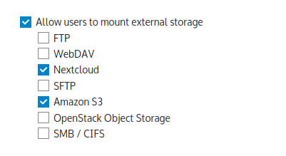

==================================
Configuring External Storage (GUI)
==================================

The External Storage Support application enables you to mount external storage 
services and devices as secondary ownCloud storage devices. You may also allow 
users to mount their own external storage services.

Enabling External Storage Support
---------------------------------

The ``External storage support`` application is enabled on the ``Apps`` page.

.. figure:: external_storage/images/enable_app.png

Storage configuration
---------------------

To create a new external storage mount, select an available backend from the
dropdown 'Add storage'. Each backend has different required options, which can
be configured in the 'Configuration' fields.

.. figure:: external_storage/images/add_storage.png

Each backend may also accept multiple authentication methods. These can be
selected with the dropdown under 'Authentication'. Different backends support
different authentication mechanisms, some specific to the backend, others more
generic. See :doc:`external_storage/auth_mechanisms` for more detailed
information.

When an authentication mechanism is selected, the configuration fields will
change as appropriate for the mechanism. Some backends may not be migrated to
the new authentication mechanism system, and will be displayed with a mechanism
of 'Built-in'.

Here is an example of the SFTP backend, which supports both password-based
authentication and public key authentication:

If any required fields remain incomplete, they will be marked with a red
border. When all required fields are filled, the storage will be saved. A green
dot next to the storage row indicates the storage is ready for use, a red
square indicates an error occurred - double check your configuration settings.
A yellow icon indicates that ownCloud could not verify the storage, perhaps due
to missing information at that moment in time.

Applicable users/groups
-----------------------

A storage configured in the personal settings will be available only to the
user that created it, but a storage configured in the admin settings can be
assigned to users and groups. By default, all users are assigned the storage;
this can be restricted with the 'Available for' selection.

.. figure:: external_storage/images/applicable.png

.. _external_storage_mount_options:

Mount options
-------------

Hover your cursor to the right of any storage configuration to expose
the settings button and trashcan. Click the trashcan to delete the
mountpoint. The settings button allows you to configure each storage mount
individually with the following options:

* Encryption
* Previews
* Filesystem check frequency (Never, Once per direct access, every time the
  filesystem is used)

.. figure:: external_storage/images/mount_options.png

Using self-signed certificates
------------------------------

When using self-signed certificates for external storage mounts the certificate
needs to be imported in the personal settings of the user. Please refer to 
`this blogpost <http://ownclouden.blogspot.de/2014/11/owncloud-https-external-mount.html>`_
for more information.

Available storage backends
--------------------------

The following backends are provided by the external storages app. Other apps
may provide their own backends, which are not listed here.

.. toctree::
    :maxdepth: 1

    external_storage/amazons3
    external_storage/dropbox
    external_storage/ftp
    external_storage/google
    external_storage/local
    external_storage/openstack
    external_storage/owncloud
    external_storage/sftp
    external_storage/smb
    external_storage/webdav

.. note:: A non-blocking or correctly configured SELinux setup is needed
   for these backends to work. Please refer to the :ref:`selinux-config-label`.

Configuring backends mountable by the user
------------------------------------------

Check ``Enable User External Storage`` to allow your users to mount their own 
external storage services, and check the backends you want to allow. Beware,
this allows a user to make potentially arbitrary connections to other services
on your network!

Adding files to external storages
---------------------------------

In general it is recommended to configure the background job ``Webcron`` or
``Cron`` as described in :doc:`../configuration_server/background_jobs_configuration`
so ownCloud is able to detect files added to your external storages without the need
for a user to be browsing your ownCloud installation.

Please also be aware that ownCloud might not always be able to find out what has been
changed remotely (files changed without going through ownCloud), especially
when it's very deep in the folder hierarchy of the external storage.

You might need to setup a cron job that runs ``sudo -u www-data php occ files:scan --all``
(or replace "--all" with the user name, see also :doc:`../configuration_server/occ_command`)
to trigger a rescan of the user's files periodically (for example every 15 minutes), which includes
the mounted external storage.

Configuration file
------------------

Storage mount configurations are stored in a JSON formatted file. Admin
storages are stored in ``data/mount.json``, while personal storages are stored
in ``data/$user/mount.json``. For more advanced usecases, including
provisioning external storages from outside ownCloud, see
:doc:`external_storage_configuration`.

