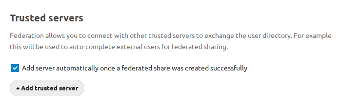
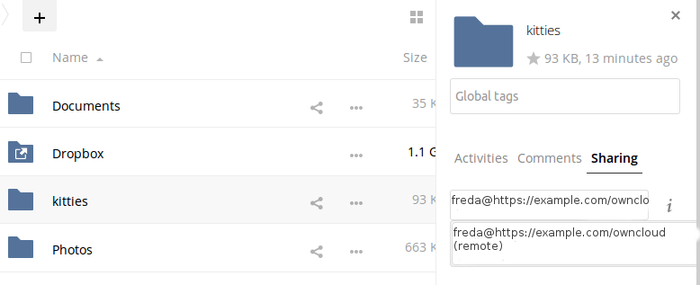
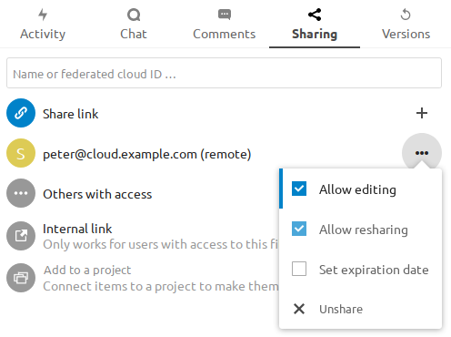
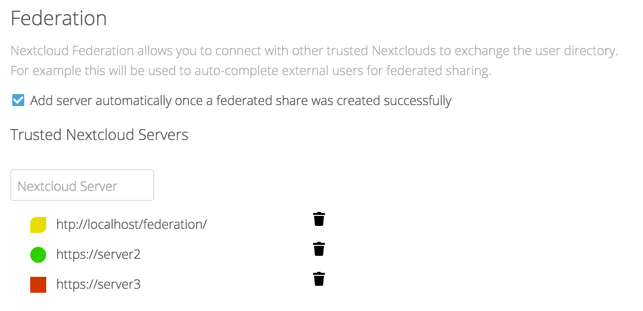
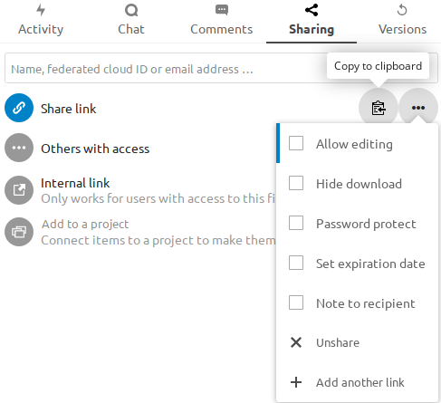
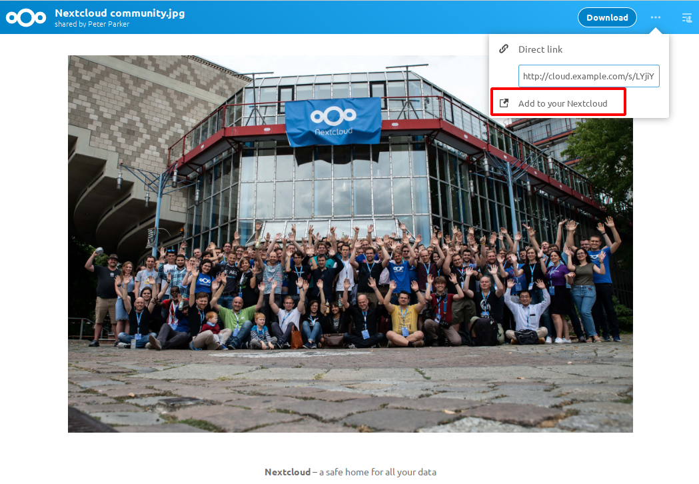
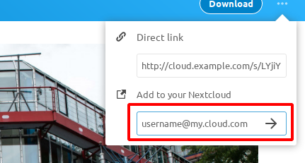
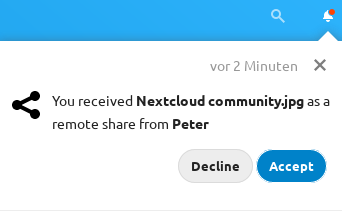

==============================
Configuring Federation Sharing
==============================

Federated Cloud Sharing is now managed by the Federation app (9.0+), and is 
now called Federation sharing. When you enable the Federation app you can 
easily and securely link file shares between Nextcloud servers, in effect 
creating a cloud of Nextclouds.
 

.. _label-direct-share-link:   
   
Creating a new Federation Share
-------------------------------

Follow these steps to create a new Federation share between two Nextcloud 
servers. This requires no action by the user on the remote server; all it takes 
is a few steps on the originating server.

1. Enable the Federation app.

2. Go to your Nextcloud Admin page and scroll to the Sharing 
   section. Verify that **Allow users on this server to send shares to other 
   servers** and **Allow users on this server to receive shares from other 
   servers** are enabled. 

3. Now go to the Federation 
   section. By default, **Add server automatically once a federated share was 
   created successfully** is checked. The Federation app supports creating a 
   list of trusted Nextcloud servers, which allows the trusted servers to 
   exchange user directories and auto-complete the names of external users when 
   you create shares. If you do not want this enabled, then un-check it.

   
4. Now go to your Files page and select a folder to share. Click the share 
   icon, and then enter the username and URL of the user on the remote Nextcloud 
   server. In this example, that is ``freda@https://example.com/nextcloud``. 
   When Nextcloud verifies the link, it displays it with the **(remote)** label. 
   Click on this label to establish the link.

5. When the link is successfully completed, you have a single share option, 
   and that is **can edit**.

You may disconnect the share at any time by clicking the trash can icon.

Configuring trusted Nextcloud servers
-------------------------------------

You may create a list of trusted Nextcloud servers for Federation sharing. This 
allows your linked Nextcloud servers to share user directories, and to auto-fill 
user names in share dialogs. If **Add server automatically once a federated 
share was created successfully** is enabled on your Admin page, servers will be 
automatically added to your trusted list when you create new Federation shares.

You may also enter Nextcloud server URLs in the **Add Nextcloud Server** field. 
The yellow light indicates a successful connection, with no user names 
exchanged. The green light indicates a successful connection with user names 
exchanged. A red light means the connection failed.

.. _label-public-link-share:

Creating Federation Shares via public Link Share
------------------------------------------------

Check the ``Share Link`` checkbox to expose more sharing options (which are 
described more fully in :doc:`file_sharing_configuration`). You may create a 
Federation share by allowing Nextcloud to create a public link for you, and then 
email it to the person you want to create the share with.

   
You may optionally set a password and expiration date on it. When your recipient 
receives your email they must click the link, or copy it to a Web 
browser. They will see a page displaying a thumbnail of the file, with a button 
to **Add to your Nextcloud**.

Your recipient should click the **Add to your Nextcloud** button. On the next 
screen your recipient needs to enter the URL to their Nextcloud 
server, and then press the return key.

Your recipient has to take one more step, and that is to confirm creating the 
federated cloud share link by clicking the **Add remote share** button.

Un-check the ``Share Link`` checkbox to disable any federated cloud share 
created this way.

Configuration tips
------------------

The Sharing section on your Admin page allows you to control how your users 
manage federated cloud shares:

* Check ``Enforce password protection`` to require passwords on link shares.
* Check ``Set default expiration date`` to require an expiration date on link 
  shares.
* Check ``Allow public uploads`` to allow two-way file sharing.

Your Apache Web server must have ``mod_rewrite`` enabled, and you must have 
``trusted_domains`` correctly configured in ``config.php`` to allow external 
connections (see :doc:`../installation/installation_wizard`). Consider also 
enabling SSL to encrypt all traffic between your servers .

Your Nextcloud server creates the share link from the URL that you used to log 
into the server, so make sure that you log into your server using a URL that is 
accessible to your users. For example, if you log in via its LAN IP address, 
such as ``http://192.168.10.50``, then your share URL will be something like 
``http://192.168.10.50/nextcloud/index.php/s/jWfCfTVztGlWTJe``, which is not 
accessible outside of your LAN. This also applies to using the server name; for 
access outside of your LAN you need to use a fully-qualified domain name such as 
``http://myserver.example.com``, rather than ``http://myserver``.
