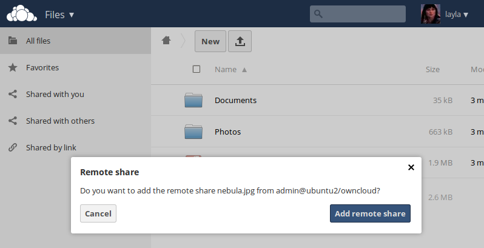
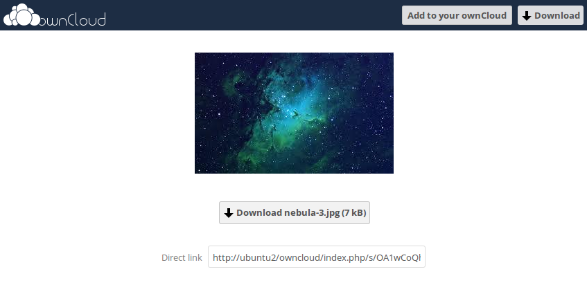

===================================
Configuring Federated Cloud Sharing
===================================

In ownCloud 7 this was called server-to-server sharing. Now it is called 
federated cloud sharing. With just a few clicks you can easily and securely link 
file shares between ownCloud servers, in effect creating a cloud of ownClouds. 
You can automatically send an email notification when you create the share, 
share directly with users on other ownCloud servers, add password protection, 
allow users to upload files, and set an expiration date.

.. Note:: Currently, federated shares cannot be re-shared, and the only visible 
   option when you create the share is **Can edit**.

Follow these steps to create a new federated cloud share:

1. Go to your ownCloud Admin page and scroll to the Federated Cloud Sharing 
section of the Sharing section.

.. figure:: ../images/remote_shares.png
   
2. Check ``Allow other users on this server to send shares to other 
servers`` and ``Allow users on this server to receive shares from other 
servers.`` Leaving the checkboxes blank disables federated cloud sharing.

3. In the Sharing section, check ``Allow users to share via link`` and ``Allow 
users to send mail notification for shared files``.

4. Now you and your users can go to your Files pages to create a new federated 
cloud share. Click the Share icon on the file or directory you want to share to 
expose your first sharing option. 

.. figure:: ../images/create_public_share-1.png

This dialog allows you to create local shares with users and groups on your 
local ownCloud server, and also to create federated cloud shares with users on 
remote ownCloud servers by typing a link to the remote server in the form of 
``<user>@<link-to-owncloud>``. In this screenshot the remote ownCloud server is 
on the local network, so the URL form is ``user@hostname/owncloud``, or 
``layla@remote-server/owncloud`` in the example. The URL you type is echoed by 
the form, and labeled as ``(remote)``.

.. figure:: ../images/create_public_share-2.png

Press the return key, and then wait for the link to be established. You'll see a 
status message while it is working.

.. figure:: ../images/create_public_share-3.png

When the remote server has been successully contacted you'll see a confirmation.

.. figure:: ../images/create_public_share-4.png

The link is created when your remote user confirms the share by clicking the 
**Add remote share** button.

You can return to the share dialog any time to see a list of everyone you have 
shared with, and federated cloud shares are labeled as ``(remote)``.

.. figure:: ../images/create_public_share-5.png

Click the trash can icon to disconnect the share.

Creating Federated Cloud Shares via Email
-----------------------------------------

Check the ``Share Link`` checkbox to expose more sharing options (which are 
described more fully in :doc:`file_sharing_configuration`). You may create a 
federated cloud share by allowing ownCloud to create the link for you, and 
then email it to the person you want to create the share with.

.. figure:: ../images/create_public_share-6.png
   
You may optionally set a password and expiration date on it. When your recipient 
receives your email they must click the link, or copy it to a Web 
browser. They will see a page displaying a thumbnail of the file, with a button 
to **Add to your ownCloud**.

Your recipient should click the **Add to your ownCloud** button. On the next 
screen your recipient needs to enter the URL to their ownCloud 
server, and then press the return key.

.. figure:: ../images/create_public_share-9.png

Your recipient has to take one more step, and that is to confirm creating the 
federated cloud share link by clicking the **Add remote share** button.

.. figure:: ../images/create_public_share-10.png

Un-check the ``Share Link`` checkbox to disable any federated cloud share 
created this way.

Configuration Tips
------------------

The Sharing section on your Admin page allows you to control how your users 
manage federated cloud shares:

* Check ``Enforce password protection`` to require passwords on link shares.
* Check ``Set default expiration date`` to require an expiration date on link 
  shares.
* Check ``Allow public uploads`` to allow two-way file sharing.

Your Apache Web server must have ``mod_rewrite`` enabled, and you must have 
``trusted_domains`` correctly configured in ``config.php`` to allow external 
connections (see :doc:`../installation/installation_wizard`). Consider also 
enabling SSL to encrypt all traffic between your servers .

Your ownCloud server creates the share link from the URL that you used to log 
into the server, so make sure that you log into your server using a URL that is 
accessible to your users. For example, if you log in via its LAN IP address, 
such as ``http://192.168.10.50``, then your share URL will be something like 
``http://192.168.10.50/owncloud/index.php/s/jWfCfTVztGlWTJe``, which is not 
accessible outside of your LAN. This also applies to using the server name; for 
access outside of your LAN you need to use a fully-qualified domain name such as 
``http://myserver.example.com``, rather than ``http://myserver``.
