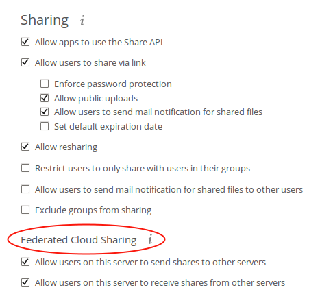
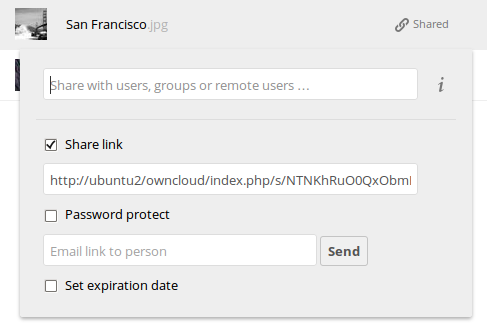

===================================
Configuring Federated Cloud Sharing
===================================

In ownCloud 7 this was called server-to-server sharing. Now it is called 
federated cloud sharing. With just a few clicks you can easily and securely link 
file shares between ownCloud servers, in effect creating a cloud of ownClouds. 
You can automatically send an email notification when you create the share, add 
password protection, allow users to upload files, and set an expiration date.

Follow these steps to create a new federated cloud share:

1. Go to the Admin page and scroll to the Federated Cloud Sharing section.

   
2. Check ``Allow other users on this server to send shares to other 
servers`` and ``Allow users on this server to receive shares from other 
servers.`` Leaving the checkboxes blank disables federated cloud sharing.

3. In the Sharing section, check ``Allow users to share via link`` and ``Allow 
users to send mail notification for shared files``.

4. Now your and your users can go to your Files page to create a new federated 
cloud share. Hover your cursor over the file or directory 
you want to share to expose the sharing options. Check the ``Share 
Link`` checkbox to create the share, and to expose all of your sharing options.

   
Your new public share is labeled with a chain link. Share it by entering the 
email address of the person you want to share it with. You may optionally set a 
password  and expiration date on it. If you do not protect it with a password, 
it is visible to anyone who has the URL. Un-check the ``Share Link`` checkbox to 
disable the share.

The Sharing section on your Admin page allows you to control how your users 
manage federated cloud shares:

* Check ``Enforce password protection`` to require passwords on link shares.
* Check ``Set default expiration date`` to require an expiration date on link 
  shares.
* Check ``Allow public uploads`` to allow two-way file sharing.

Users on other ownCloud servers can mount this share and use it just like any 
ownCloud share. See "Using Federated Cloud Sharing" in the Users Manual to learn 
how to connect to a remote public share.

Notes
-----

Your Apache Web server must have ``mod_rewrite`` enabled, and you must have 
``trusted_domains`` configured in ``config.php``. Consider also enabling SSL to 
encrypt all traffic between your servers.

Your ownCloud server creates the share link from the URL that you used to log 
into the server, so make sure that you log into your server using a URL that is 
accessible to your users. For example, if you log in via its LAN IP address, 
such as ``http://192.168.10.50``, then your share URL will be something like 
``http://192.168.10.50/owncloud/index.php/s/jWfCfTVztGlWTJe``, which is not 
accessible outside of your LAN. This also applies to using the server name; for 
access outside of your LAN you need to use a fully-qualified domain name such as 
``http://myserver.example.com``, rather than ``http://myserver``.