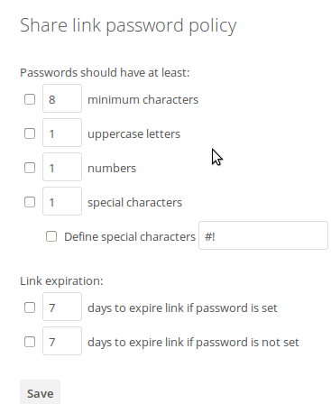

============
File Sharing
============

ownCloud users can share files with their ownCloud groups and other users on 
the same ownCloud server, with ownCloud users on :doc:`other ownCloud servers <federated_cloud_sharing_configuration>`, and create public shares for people who are not 
ownCloud users. You have control of a number of user permissions on file shares:

* Allow users to share files
* Allow users to create public shares
* Require a password on public shares
* Allow public uploads to public shares
* Require an expiration date on public share links
* Allow resharing
* Restrict sharing to group members only
* Allow email notifications of new public shares
* Exclude groups from creating shares

.. note:: ownCloud Enterprise includes a Share Link Password Policy app; see 
   :ref:`password_policy_label`.

Configure your sharing policy on your Admin page in the Sharing section.

.. figure:: images/sharing-files-1.png

* Check ``Allow apps to use the Share API`` to enable users to share files. If 
  this is not checked, no users can create file shares.
* Check ``Allow users to share via link`` to enable creating public shares for  
  people who are not ownCloud users via hyperlink.
* Check ``Enforce password protection`` to force users to set a password on all 
  public share links. This does not apply to local user and group shares.
* Check ``Allow public uploads`` to allow anyone to upload files to 
  public shares.
* Check ``Allow users to send mail notification for shared files`` to enable 
  sending notifications from ownCloud. (Your ownCloud server must be configured 
  to send mail)
* Check ``Set default expiration date`` to set a default expiration date on 
  public shares.
* Check ``Allow resharing`` to enable users to re-share files shared with them.
* Check ``Restrict users to only share with users in their groups`` to confine 
  sharing within group memberships.

    .. note:: This setting does not apply to the Federated Cloud sharing 
       feature. If :doc:`Federated Cloud Sharing 
       <federated_cloud_sharing_configuration>` is
       enabled, users can still share items with any users on any instances
       (including the one they are on) via a remote share.

* Check ``Allow users to send mail notification for shared files`` enables 
  users to send an email notification to every ownCloud user that the file is 
  shared with.
* Check ``Exclude groups from sharing`` to prevent members of specific groups 
  from creating any file shares in those groups. When you check this, you'll 
  get a dropdown list of all your groups to choose from. Members of excluded 
  groups can still receive shares, but not create any
* Check ``Allow username autocompletion in share dialog`` to enable 
  auto-completion of ownCloud usernames.

.. note:: ownCloud does not preserve the mtime (modification time) of 
   directories, though it does update the mtimes on files. See  
   `Wrong folder date when syncing 
   <https://github.com/owncloud/core/issues/7009>`_ for discussion of this.

.. _transfer_userfiles_label:   

Transferring Files to Another User
----------------------------------

You may transfer files from one user to another with ``occ``. This is useful 
when you have to remove a user. Be sure to transfer the files before you delete 
the user!  This transfers all files from user1 to user2, and the shares and 
metadata info associated with those files (shares, tags, comments, etc). 
Trashbin contents are not transferred::

 occ files:transfer-ownership user1 user2
 
(See :doc:`../configuration_server/occ_command` for a complete ``occ`` 
reference.) 
   
Creating Persistent File Shares
-------------------------------

When a user is deleted, their files are also deleted. As you can imagine, this 
is a problem if they created file shares that need to be preserved, because 
these disappear as well. In ownCloud files are tied to their owners, so 
whatever happens to the file owner also happens to the files.

One solution is to create persistent shares for your users. You can retain 
ownership of them, or you could create a special user for the purpose of 
establishing permanent file shares. Simply create a shared folder in the usual 
way, and share it with the users or groups who need to use it. Set the 
appropriate permissions on it, and then no matter which users come and go, the 
file shares will remain. Because all files added to the share, or edited in it, 
automatically become owned by the owner of the share regardless of who adds or 
edits them.   
   
.. _password_policy_label:

Share Link Password Policy
--------------------------

ownCloud Enterprise users have the option of enabling the Share Link Password 
Policy app. This allows you to enforce password length, required characters, 
define special characters, and expiration dates on share links.

Note that you cannot use Emojis as special characters with MySQL, as it 
supports UTF8 characters only of 1-3 bytes, and emojis require 4 bytes.
