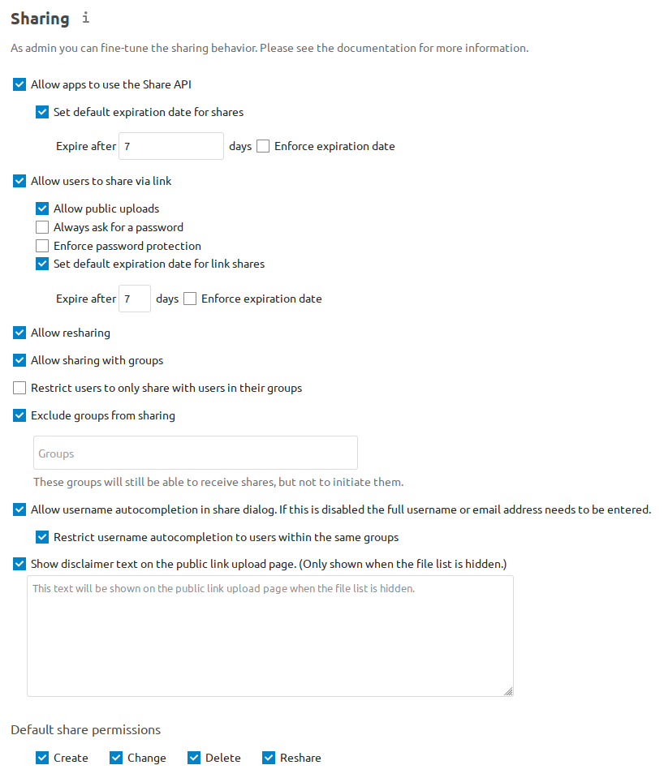

============
File Sharing
============

Nextcloud users can share files with their Nextcloud groups and other users on
the same Nextcloud server, with Nextcloud users on :doc:`other Nextcloud servers <federated_cloud_sharing_configuration>`, and create public shares for people who are not
Nextcloud users. You have control of a number of user permissions on file shares.

Configure your sharing policy on your Admin page in the Sharing section.

* Check ``Allow apps to use the Share API`` to enable users to share files. If
  this is not checked, no users can create file shares.
* Check ``Set default expiration date for shares`` to set a default expiration date
  on local user and group shares.
* Check ``Enforce expiration date`` to always enforce the configured expiration date
  on local user and group shares.

    .. note:: Users will not be able to set the expiration date further
        in the future than the enforced expiration date, although they
        will be able to set a more recent date.
        Also note that users will be able to update the expiration date again at
        a later point. The expiration date is based on the current date and not on the share
        creation date. The user will be able to extend the expiration date again whenever a
        previous expiration date is close to be reached.

* Check ``Allow users to share via link`` to enable creating public shares for
  people who are not Nextcloud users via hyperlink.
* Check ``Allow public uploads`` to allow anyone to upload files to public shares.
* Check ``Always ask for a password`` to proactively ask a user to set a password
  for a share link.
* Check ``Enforce password protection`` to force users to set a password on all
  public share links. This does not apply to local user and group shares.
* Check ``Set default expiration date for link shares`` to set a default expiration date on
  public shares.
* Check ``Enforce expiration date`` to always enforce the configured expiration date
  on public shares.

    .. note:: Users will not be able to set the expiration date further
        in the future than the enforced expiration date, although they
        will be able to set a more recent date.
        Also note that users will be able to update the expiration date again at
        a later point. The expiration date is based on the current date and not on the share
        creation date. The user will be able to extend the expiration date again whenever a
        previous expiration date is close to be reached.

* Check ``Allow resharing`` to enable users to re-share files shared with them.
* Check ``Allow sharing with groups`` to enable users to share with groups.
* Check ``Restrict users to only share with users in their groups`` to confine
  sharing within group memberships.

    .. note:: This setting does not apply to the Federated Cloud sharing
       feature. If :doc:`Federated Cloud Sharing
       <federated_cloud_sharing_configuration>` is
       enabled, users can still share items with any users on any instances
       (including the one they are on) via a remote share.

* Check ``Exclude groups from sharing`` to prevent members of specific groups
  from creating any file shares in those groups. When you check this, you'll
  get a dropdown list of all your groups to choose from. Members of excluded
  groups can still receive shares, but not create any.
* Check ``Allow username autocompletion in share dialog`` to enable
  auto-completion of Nextcloud usernames.
* Check ``Restrict username autocompletion to users within the same groups`` to limit
  username autocompletion to users from within the same groups as the share owner.
* Check ``Show disclaimer text on the public link upload page`` to set and show
  a disclaimer text on public links with hidden file lists.

With ``Default share permissions`` you are able to set the default permissions
for user-shares (``Create``, ``Change``, ``Delete`` and ``Reshare``) without
forcing them.

.. note:: Nextcloud does not preserve the mtime (modification time) of
   directories, though it does update the mtimes on files. See
   `Wrong folder date when syncing
   <https://github.com/owncloud/core/issues/7009>`_ for discussion of this.

.. note:: There are more sharing options on config.php level available:
   `Configuration Parameters <https://docs.nextcloud.com/server/latest/admin_manual/configuration_server/config_sample_php_parameters.html#sharing>`_

.. _transfer_userfiles_label:

Distinguish between max expiration date and default expiration date
-------------------------------------------------------------------

The expiration date which can be set and enforced in the settings above are the hard limit and the
default value at the same time. Sometimes admins want to have a moderate default expire date,
for example 7 days but make sure that the user can't extend it to more than 14 days.

In order to do so, set a enforced expiration date in the settings as described above
and set the default value to something below the maximal possible expiration date with the following
OCC commands::

 occ config:app:set --value <DAYS> core internal_defaultExpDays
 occ config:app:set --value <DAYS> core link_defaultExpDays

Get a notification before a share expires
-----------------------------------------

Users can get a notification before a share expires. In order to do so a cronjob need to be
configured which calls the following OCC command once a day::

 occ sharing:expiration-notification

A notification will be send for all shares which expire within the next 24 hours.

Transferring files to another user
----------------------------------

You may transfer files from one user to another with ``occ``. This is useful
when you have to remove a user. Be sure to transfer the files before you delete
the user!  This transfers all files from user1 to user2, and the shares and
metadata info associated with those files (shares, tags, comments, etc).
Trashbin contents are not transferred::

 occ files:transfer-ownership user1 user2

(See :doc:`../configuration_server/occ_command` for a complete ``occ``
reference.)

Users may also transfer files or folders selectively by themselves.
See `user documentation <https://docs.nextcloud.com/server/latest/user_manual/en/files/transfer_ownership.html>`_ for details.

.. TODO ON RELEASE: Update version number above on release

Creating persistent file Shares
-------------------------------

When a user is deleted, their files are also deleted. As you can imagine, this
is a problem if they created file shares that need to be preserved, because
these disappear as well. In Nextcloud files are tied to their owners, so
whatever happens to the file owner also happens to the files.

One solution is to create persistent shares for your users. You can retain
ownership of them, or you could create a special user for the purpose of
establishing permanent file shares. Simply create a shared folder in the usual
way, and share it with the users or groups who need to use it. Set the
appropriate permissions on it, and then no matter which users come and go, the
file shares will remain. Because all files added to the share, or edited in it,
automatically become owned by the owner of the share regardless of who adds or
edits them.
