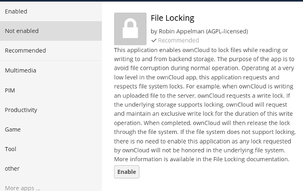

Using the Files Locking App
---------------------------

The Files Locking application enables ownCloud to lock files while reading or 
writing to and from backend storage. The purpose of the app is to avoid file 
corruption during normal operation. Operating at a very low level in ownCloud, 
this application requests and respects file system locks. For example, when 
ownCloud is writing an uploaded file to the server, ownCloud requests a write 
lock. If the underlying storage supports locking, ownCloud will request and 
maintain an exclusive write lock for the duration of this write operation. When 
completed, ownCloud will then release the lock through the filesystem. If the 
file system does not support locking, there is no need to enable this 
application as any lock requested by ownCloud will not be honored in the 
underlying filesystem.

The Files Locking app has no configuration options; all you need to do is 
enable or disable it on your Apps page.

