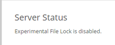

=========================
Experimental File Locking
=========================

ownCloud's new experimental file locking mechanism operates differently than 
the old File Locking application, and will eventually replace it. If you elect 
to use the new file locking mechanism make sure you disable the File Locking 
app.

The new file locking mechanism has these capabilities:

* Operates at a higher level than the filesystem, so you don't need to use a 
  filesystem that supports locking
* Locks parent directories so they cannot be renamed during any activity on 
  files inside the directories
* Releases locks after file transactions are interrupted, for 
  example when a sync client loses the connection during an upload
* Manage locking and releasing locks correctly on shared files during changes 
  from multiple users
* Manages locks correctly on external storage mounts
* Manages encrypted files correctly

You must install the Redis server and ``php-redis`` module for the new file 
locking to work. On Debian/Ubuntu/Mint this is ``redis-server`` and 
``php5-redis``, and on Red Hat/CentOS/Fedora is it ``redis`` 
and ``php-pecl-redis`` from the EPEL repository.

After installing Redis you must enter a simple configuration in your 
``config.php`` file, like this example::

 'filelocking.enabled' => 'true',
 'memcache.local' => '\OC\Memcache\Redis',
 'redis' => array(
	'host' => 'localhost', 
	// can also be a unix domain socket: 
        '/tmp/redis.sock'
	'port' => 6379,
	'timeout' => 0.0,
	// Optional, if undefined SELECT will not run and will use Redis 
        // Server's default DB Index.
	'dbindex' => 0, 
 ),
 
The **Server status** section on your ownCloud Admin page indicates whether 
experimental file locking is enabled or disabled, and if it is configured 
correctly. 

See ``config.sample.php`` to see configuration examples for Redis, and for all 
supported memcaches.

Learn more about Reds at `Redis <http://redis.io/>`_. Memcached, the popular 
distributed memory caching system, is not suitable for the new file locking 
because it is not designed to store locks, and data can disappear from the cache 
at any time. Redis is a key-value store, and it guarantees that cached objects 
are available for as long as they are needed. 
