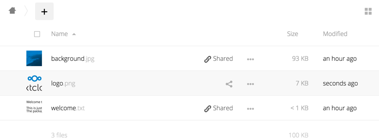

======================
Previews configuration
======================

The Nextcloud thumbnail system generates previews of files for all 
Nextcloud apps that display files, such as Files and Gallery.

The following image shows some examples of previews of various file types.

By default, Nextcloud can generate previews for the following filetypes:

* Images files
* Cover of MP3 files
* Text documents

.. note:: Nextcloud can also generate previews of other file types (such as PDF, SVG,
   various Office document formats, and various video formats). Due to security and
   performance concerns those providers are disabled by default. While those providers 
   are still available, we discourage enabling them and they are considered unsupported. 
   The full list of the preview providers that are enabled by default (as well as those 
   disabled by default) can be found under the ``enabledPreviewProviders`` 
   :doc:`configuration parameter </configuration_server/config_sample_php_parameters>`.

Parameters
----------

Please notice that the Nextcloud preview system comes already with sensible 
defaults, and therefore it is usually unnecessary to adjust those configuration 
values. 

But deemed necessary, following changes have to be made in ``config/config.php`` file. As a best practice, take a backup of this config file before making a lot of changes.

Disabling previews:
^^^^^^^^^^^^^^^^^^^

Under certain circumstances, for example if the server has limited 
resources, you might want to consider disabling the generation of previews. 
Note that if you do this all previews in all apps are disabled, including 
the Gallery app, and will display generic icons instead of 
thumbnails.

Set the configuration option ``enable_previews`` to ``false``:

::

  <?php
    'enable_previews' => false,

Maximum preview size:
^^^^^^^^^^^^^^^^^^^^^

There are two configuration options to set the maximum size of a preview.

::

  <?php
    'preview_max_x' => null,
    'preview_max_y' => null,

By default, both options are set to null. 'Null' is equal to no limit.
Numeric values represent the size in pixels. The following code limits previews
to a maximum size of 100×100px:

::

  <?php
    'preview_max_x' => 100,
    'preview_max_y' => 100,

'preview_max_x' represents the x-axis and 'preview_max_y' represents the y-axis.

Maximum scale factor:
^^^^^^^^^^^^^^^^^^^^^

If a lot of small pictures are stored on the Nextcloud instance and the preview 
system generates blurry previews, you might want to consider setting a maximum 
scale factor. By default, pictures are upscaled to 10 times the original size:

::

  <?php
    'preview_max_scale_factor' => 10,

If you want to disable scaling at all, you can set the config value to '1':

::

  <?php
    'preview_max_scale_factor' => 1,

If you want to disable the maximum scaling factor, you can set the config value 
to 'null':

::

  <?php
    'preview_max_scale_factor' => null,

JPEG quality setting:
^^^^^^^^^^^^^^^^^^^^^

Default JPEG quality setting for preview images is '80'. Change this with:

:: 

  occ config:app:set preview jpeg_quality --value="60"
