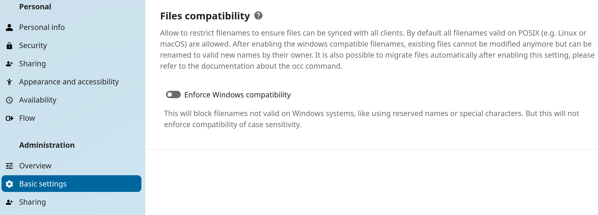

.. _windows_compatible_filenames:

============================
Windows compatible filenames
============================

.. note::

    This feature was introduced in Nextcloud 31.

By default Nextcloud supports all filenames which are valid on the underlying server.
As Nextcloud runs only on POSIX compatible operating systems (Linux),
this means that Nextcloud supports also filenames not valid on Microsoft Windows systems.

If your users use Windows and use the Nextcloud Desktop clients to synchronize their work
to their computer they might encounter files created in the web interface, or on a Linux
machine, which cannot be synchronized as the filename is not valid.

To solve this issue it is possible to enforce filenames only valid on Windows,
this for example forbids characters like ``*`` from filenames
or filenames like ``AUX.txt`` (on Windows ``AUX`` is a reserved name and cannot be used).

.. note::

	Enabling this setting will not enforce case-insensitivity
	as modern Windows systems support case-sensitive filenames.

Enabling Windows compatible filenames
-------------------------------------

This feature can be enabled either by using the web interface
or by using an ``occ`` command.

.. note::

	This feature works by setting a predefined set of system configuration settings.
	So after enabling this the ``config.php`` will be adjusted, which also means enabling
	this feature requires a writable configuration.

Using the web interface
^^^^^^^^^^^^^^^^^^^^^^^

The setting is provided in the **Administration settings** under **Basic settings**.
Within the **Files compatibility** section the Windows compatibility can be enabled.

Using the occ command
^^^^^^^^^^^^^^^^^^^^^

.. note::

    This command was introduced in Nextcloud 32.

To quickly enable or disable the feature an :ref:`occ command <occ_files_windows_filenames>` is provided.

Consequences
------------

After enabling Windows compatible filenames users cannot create or modify files
with invalid filenames. But they can still delete or rename those files (to valid names).

This works by setting a pre-defined set of configuration settings:

- ``forbidden_filename_basenames`` will be set to names reserved on Windows.
- ``forbidden_filename_characters`` will be set to characters not valid for filenames on Windows.
- ``forbidden_filename_extensions`` will be set to strings not allowed as trailing parts, like a trailing dot or spaces.

Sanitizing invalid filenames
----------------------------

After enabling the feature the users have to manually adjust all invalid filenames
to be able to keep working with them.
As an alternative Nextcloud provides the :ref:`occ files:sanitize-filenames <occ_files_sanitize_filenames>` command to automatically rename all invalid files.
