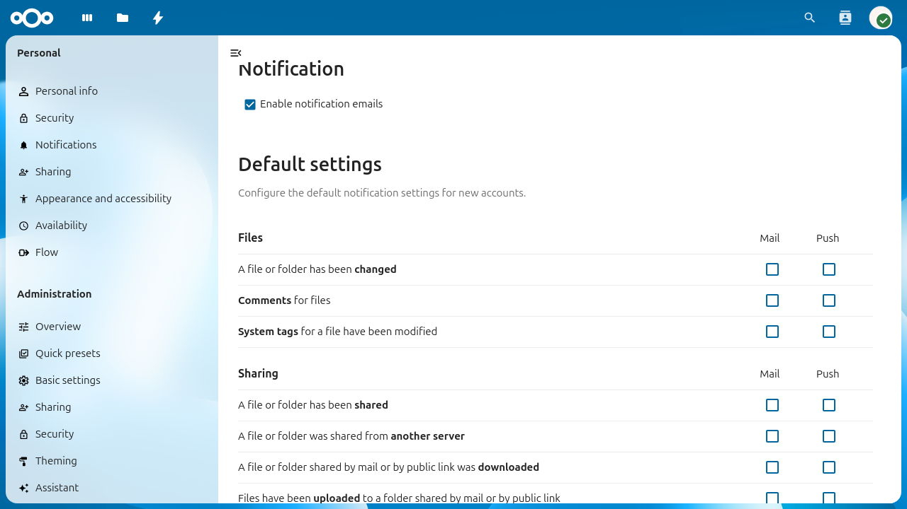

============
Activity app
============

The Activity app tracks events across your Nextcloud instance and can
notify users via the activity stream, email, and push notifications.
It is shipped and enabled by default.

   *The Activity admin settings page showing default notification
   preferences for new accounts.*

Configuring your Nextcloud for the Activity app
------------------------------------------------

Enabling email notifications
^^^^^^^^^^^^^^^^^^^^^^^^^^^^

To send activity notification emails, a working
:doc:`email_configuration` is required.

It is also recommended to configure the background job to ``Webcron``
or ``Cron`` as described in :doc:`background_jobs_configuration`.
The ``Ajax`` mode may delay or skip email delivery.

Admin settings
^^^^^^^^^^^^^^

As an administrator, you can:

* Enable or disable notification emails globally using the
  **Enable notification emails** checkbox in **Settings** >
  **Administration** > **Activity**.
* Configure the default notification preferences for new accounts.
  Existing users keep their personal settings. The defaults apply
  to accounts created after the change.

Configuration reference
-----------------------

The following ``config.php`` options control Activity app behavior.

.. list-table::
   :header-rows: 1
   :widths: 30 15 55

   * - Option
     - Default
     - Description
   * - ``activity_expire_days``
     - ``365``
     - Number of days to retain activity records. A daily background
       job deletes all activities older than this value. Set to ``0``
       to disable expiration.
   * - ``activity_use_cached_mountpoints``
     - ``false``
     - When ``true``, activities in team folders and external storages
       are generated for all users with access, not just the current
       user. See :ref:`label-activities-groupfolders` for details and
       caveats.
   * - ``activity_expire_exclude_users``
     - ``[]``
     - An array of user IDs whose activity records are never deleted
       by the expiration job. See :ref:`label-activities-exclude-users`.

.. _label-activities-groupfolders:

Activities in team folders or external storages
-----------------------------------------------

By default, activities in team folders or external storages are only
generated for the current user. This is due to the underlying logic
of these storage backends. The config flag
``activity_use_cached_mountpoints`` makes activities work like in
normal shares when set to ``true``.

::

  'activity_use_cached_mountpoints' => true,

.. warning::

   This config option comes with the following limitations:

   1. If "Advanced Permissions" (ACLs) are enabled in a team folder,
      activities do not respect the permissions and all users see all
      activities, even for files and directories they do not have
      access to. **This potentially leaks sensitive information!** See
      `this issue <https://github.com/nextcloud/groupfolders/issues/1057>`_
      for more information.
   2. Users that had access to a team folder, share or external
      storage can see activities in their stream and emails that
      happen after they are removed until they log in again.
   3. Users that are newly added to a team folder, share or external
      storage cannot see activities in their stream nor emails that
      happen after they are added until they log in again.

.. _label-activities-exclude-users:

Excluding users from activity expiration
----------------------------------------

For certain users, it might make sense to never expire their activity
data, for example administrators. Set the config value
``activity_expire_exclude_users`` in your ``config.php``::

  'activity_expire_exclude_users' => [
    'admin',
    'group_admin',
    'second_admin'
  ]

For these users, their activity records will never be deleted from the
database.

Better scheduling of activity emails
-------------------------------------

In certain scenarios it makes sense to send the activity emails more
regularly. For example, you may want to send the hourly emails always
at the full hour, daily emails before people start to work in the
morning, and weekly emails on Monday morning.

A console command is available to trigger sending those emails. This
allows you to set up custom cron jobs with specific timing instead of
relying on the Nextcloud background job::

  # crontab -u www-data -e
   0  *  *  *  *    php -f /var/www/nextcloud/occ activity:send-mails hourly
  30  7  *  *  *    php -f /var/www/nextcloud/occ activity:send-mails daily
  30  7  *  *  MON  php -f /var/www/nextcloud/occ activity:send-mails weekly

If you want to manually send out all queued activity emails, you can
run ``occ activity:send-mails`` without any argument.

Troubleshooting
---------------

Users are not receiving notification emails
^^^^^^^^^^^^^^^^^^^^^^^^^^^^^^^^^^^^^^^^^^^

1. Verify that email is configured correctly. Send a test email from
   **Settings** > **Administration** > **Basic settings**.
2. Check that **Enable notification emails** is turned on in
   **Settings** > **Administration** > **Activity**.
3. Verify that the user has email notifications enabled in their
   personal notification settings (**Settings** > **Personal** >
   **Notifications**).
4. Ensure the background job is running. If you use ``Cron``, check
   that the system cron job is executing
   ``php -f /var/www/nextcloud/cron.php`` regularly.
5. Check the Nextcloud log (``data/nextcloud.log``) for mail-related
   errors.

Activities are missing for shared files or team folders
^^^^^^^^^^^^^^^^^^^^^^^^^^^^^^^^^^^^^^^^^^^^^^^^^^^^^^^

By default, activities in team folders and external storages are only
generated for the acting user. See
:ref:`label-activities-groupfolders` for how to enable activities for
all users with access.

Database growing large due to activity data
^^^^^^^^^^^^^^^^^^^^^^^^^^^^^^^^^^^^^^^^^^^

The Activity app stores all events in the database. On instances with
many users or high file turnover, this can lead to significant
database growth. To manage this:

* Set ``activity_expire_days`` to a lower value (e.g. ``90`` or
  ``180``) to automatically clean up older records.
* Monitor the ``oc_activity`` and ``oc_activity_mq`` tables directly
  if you need to assess current size.
* Ensure the Nextcloud background job is running so that the daily
  expiration job executes.
