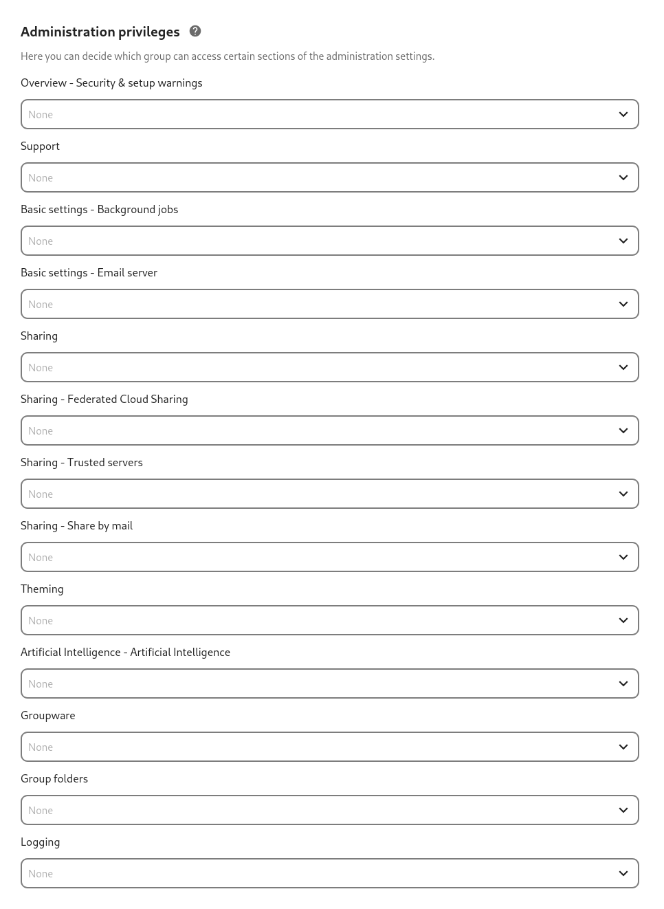

=====================
Admin right privilege
=====================

By default only members of the admin group can access and edit the admin
settings. It is sometimes needed to give some group of users access to a
setting page while not giving them access to everything. For this you can
use the *Admin right privilege* settings.

.. note::
  Not every setting pages support this features. This is due to either the
  feature not being implemented yet for the specific setting page or due
  to possible privilege escalations.

Configuring Admin right privilege
=================================

Go to the *Admin right privilege* Admin page, you should be presented
with the list of settings that support this features.

By clicking on the combobox, you will be able to choose which user groups
are able to access the selected setting. You can revoke the access at any
time by removing the group from the selection.

