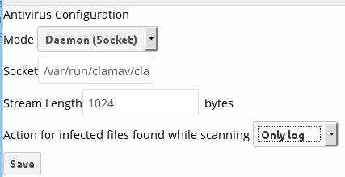
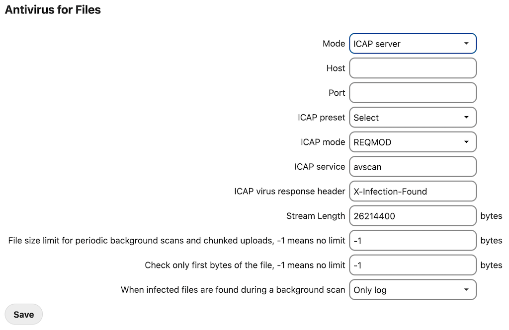

=================
Antivirus scanner
=================

You can configure your Nextcloud server to automatically run a virus scan on
newly-uploaded files with the Antivirus app for Files. The Antivirus app for
Files integrates the open source anti-virus engine `ClamAV
<https://www.clamav.net/index.html>`_  with Nextcloud. ClamAV detects all forms
of malware including Trojan horses, viruses, and worms, and it operates on all
major file types including Windows, Linux, and Mac files, compressed files,
executables, image files, Flash, PDF, and many others. ClamAV's Freshclam
daemon automatically updates its malware signature database at scheduled
intervals.

ClamAV runs on Linux and any Unix-type operating system, and Microsoft Windows.
However, it has only been tested with Nextcloud on Linux, so these instructions
are for Linux systems. You must first install ClamAV, and then install and
configure the Antivirus app for Files on Nextcloud.

Installing ClamAV
-----------------

As always, the various Linux distributions manage installing and configuring
ClamAV in different ways.

Debian, Ubuntu, Linux Mint
  On Debian and Ubuntu systems, and their many variants, install ClamAV with
  these commands::

    apt-get install clamav clamav-daemon

The installer automatically creates default configuration files and launches the
``clamd`` and ``freshclam`` daemons. You don't have to do anything more, though
it's a good idea to review the ClamAV documentation and your settings in
``/etc/clamav/``. Enable verbose logging in both ``clamd.conf`` and
``freshclam.conf`` until you get any kinks worked out.

RedHat Enterprise Linux 7, CentOS 7
  On RedHat Enterprise Linux 7 and related systems you must install the Extra Packages for
  Enterprise Linux (EPEL) repository, and then install ClamAV::

   yum install epel-release
   yum install clamav clamav-scanner clamav-scanner-systemd clamav-server
   clamav-server-systemd clamav-update

This installs two configuration files: ``/etc/freshclam.conf`` and
``/etc/clamd.d/scan.conf``. You must edit both of these before you can run
ClamAV. Both files are well-commented, and ``man clamd.conf`` and ``man
freshclam.conf`` explain all the options.  Refer to ``/etc/passwd`` and
``/etc/group`` when you need to verify the ClamAV user and group.

First edit ``/etc/freshclam.conf`` and configure your options.
``freshclam`` updates your malware database, so you want it to run frequently to
get updated malware signatures. Run it manually post-installation to download
your first set of malware signatures::

  freshclam

The EPEL packages do not include an init file for ``freshclam``, so the quick
and easy way to set it up for regular checks is with a cron job. This example
runs it every hour at 47 minutes past the hour::

  # m   h  dom mon dow  command
    47  *  *   *    *  /usr/bin/freshclam --quiet

Please avoid any multiples of 10, because those are when the ClamAV servers are
hit the hardest for updates.

Next, edit ``/etc/clamd.d/scan.conf``. When you're finished you must enable
the ``clamd`` service file and start ``clamd``::

  systemctl enable clamd@scan.service
  systemctl start clamd@scan.service

That should take care of everything. Enable verbose logging in ``scan.conf``
and ``freshclam.conf`` until it is running the way you want.

Docker, Docker-compose
  To install ClamAV via docker or docker compose you can take official image of ClamAV, or build one by yourself.
  This example is based on docker image from https://github.com/Cisco-Talos/clamav.

You can mount ClamAV Socket from the Docker Container to the host System as volume. In this case you do not need to expose any port outside of container.

For a Docker run this command::
  
  docker run --name clamav -d -v /var/run/clamav/:/var/run/clamav/ -v /var/docker/clamav/virus_db/:/var/lib/clamav/ clamav/clamav:stable_base
    
For a Docker-compose use following settings::

  version: "3.6"
  services:
    clamav:
      image: "clamav/clamav:stable_base"
      container_name: "clamav"
      volumes:
        # Socket
        - /var/run/clamav/:/var/run/clamav/
        # Virus DB
        - /var/docker/clamav/virus_db/:/var/lib/clamav/
      restart: unless-stopped

Enabling the antivirus app for files
------------------------------------

Place the ``files_antivirus`` app into the ``apps`` directory of your Nextcloud
server. Then the app shows up on the Nextcloud Apps page where it simply can be
enabled.

.. figure:: ../images/antivirus-app.png

Configuring ClamAV on Nextcloud
-------------------------------

Next, go to your Nextcloud Admin page and set your Nextcloud logging level to
Everything.

Now find your Antivirus Configuration panel on your Admin page.

ClamAV runs in one of three modes:

* Daemon (Socket): ClamAV is running on the same server as Nextcloud. The ClamAV
  daemon, ``clamd``, runs in the background. When there is no activity ``clamd``
  places a minimal load on your system. If your users upload large volumes of
  files you will see high CPU usage.

* Daemon: ClamAV is running on a different server. This is a good option
  for Nextcloud servers with high volumes of file uploads.

* Executable: ClamAV is running on the same server as Nextcloud, and the
  ``clamscan`` command is started and then stopped with each file upload.
  ``clamscan`` is slow and not always reliable for on-demand usage; it is
  better to use one of the daemon modes.

Daemon (Socket)
  Nextcloud should detect your ``clamd`` socket and fill in the ``Socket``
  field. This is the ``LocalSocket`` option in ``clamd.conf``. You can
  run ``netstat`` to verify::

   netstat -a|grep clam
   unix 2 [ ACC ] STREAM LISTENING 15857 /var/run/clamav/clamd.ctl

  .. figure:: ../images/antivirus-daemon-socket.png

  The ``Stream Length`` value sets the number of bytes read in one pass.
  10485760 bytes, or ten megabytes, is the default. This value should be
  no larger than the PHP ``memory_limit`` settings, or physical memory if
  ``memory_limit`` is set to -1 (no limit).

  ``Action for infected files found while scanning`` gives you the choice of
  logging any alerts without deleting the files, or immediately deleting
  infected files.

Daemon
  For the Daemon option you need the hostname or IP address of the remote
  server running ClamAV, and the server's port number.

  .. figure:: ../images/antivirus-daemon.png

Executable
  The Executable option requires the path to ``clamscan``, which is the
  interactive ClamAV scanning command. Nextcloud should find it automatically.

  .. figure:: ../images/antivirus-executable.png

When you are satisfied with how ClamAV is operating, you might want to go
back and change all of your logging to less verbose levels.

Confirm everything is working
-----------------------------

Every antivirus provider implements a test virus string, that way tests are quite easy. You find the files here:
https://www.eicar.org/download-anti-malware-testfile/

Uploading the file will trigger an error:
   "Virus Win.Test.EICAR_HDB-1 is detected in the file. Upload cannot be completed."

Manage the background scanner
-----------------------------

The background scanner does not require any manual intervention.
However at times you might want to inspect it or perform tasks on it.

Get info about files in the scan queue
~~~~~~~~~~~~~~~~~~~~~~~~~~~~~~~~~~~~~~

::

    sudo -u www php occ files_antivirus:status [-v]

Manually trigger the background scan
~~~~~~~~~~~~~~~~~~~~~~~~~~~~~~~~~~~~

::

    sudo -u www php occ files_antivirus:background-scan [-v] [-m MAX]

Manually scan a single file
~~~~~~~~~~~~~~~~~~~~~~~~~~~

::

    sudo -u www php occ files_antivirus:scan <path>

Mark a file as scanned or unscanned
~~~~~~~~~~~~~~~~~~~~~~~~~~~~~~~~~~~

::

    sudo -u www php occ files_antivirus:mark <path> <scanned|unscanned>
  
Files marked as scanned will not be scanned for the next four weeks.

Configuring ICAP on Nextcloud
-----------------------------

Nextcloud offers the integration of antivirus protection based on the ICAP protocol.
The settings are outlined here.
Additional documentation is work in progress.

Disabling background scan task
------------------------------

You can disable background scan with occ to only scan files during upload::

    sudo -u www php occ config:app:set files_antivirus av_background_scan --value="off"
