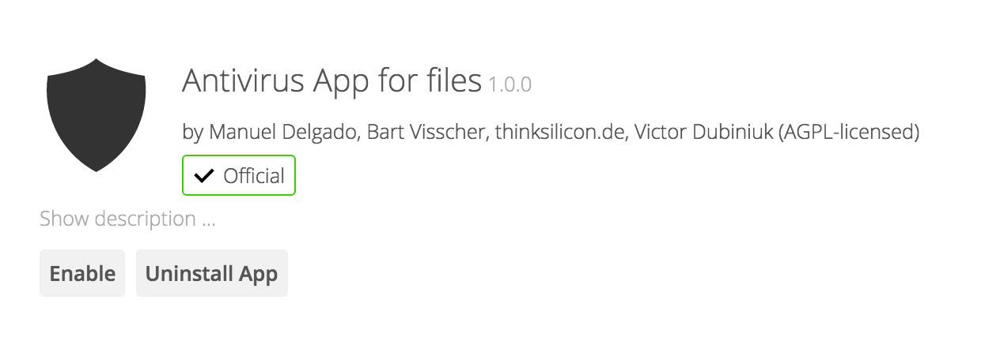
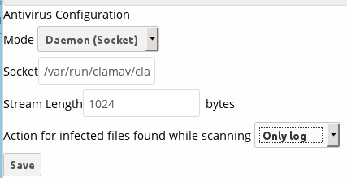
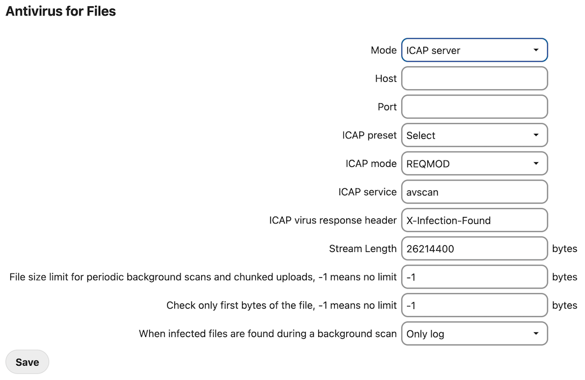

=================
Antivirus scanner
=================

You can configure your Nextcloud server to automatically run a virus scan on
newly-uploaded files with the Antivirus app for Files. The Antivirus app for
Files integrates the open source anti-virus engine `ClamAV
<https://www.clamav.net/index.html>`_  with Nextcloud. ClamAV detects all forms
of malware including Trojan horses, viruses, and worms, and it operates on all
major file types including Windows, Linux, and Mac files, compressed files,
executables, image files, Flash, PDF, and many others. ClamAV's Freshclam
daemon automatically updates its malware signature database at scheduled
intervals.

ClamAV runs on Linux and any Unix-type operating system, and Microsoft Windows.
However, it has only been tested with Nextcloud on Linux, so these instructions
are for Linux systems. You must first install ClamAV, and then install and
configure the Antivirus app for Files on Nextcloud.

Installing ClamAV
-----------------

As always, the various Linux distributions manage installing and configuring
ClamAV in different ways.

Debian, Ubuntu, Linux Mint
  On Debian and Ubuntu systems, and their many variants, install ClamAV with
  these commands::

    apt-get install clamav clamav-daemon

The installer automatically creates default configuration files and launches the
``clamd`` and ``freshclam`` daemons. You don't have to do anything more, though
it's a good idea to review the ClamAV documentation and your settings in
``/etc/clamav/``. Enable verbose logging in both ``clamd.conf`` and
``freshclam.conf`` until you get any kinks worked out.

RedHat Enterprise Linux 7, CentOS 7
  On RedHat Enterprise Linux 7 and related systems you must install the Extra Packages for
  Enterprise Linux (EPEL) repository, and then install ClamAV::

   yum install epel-release
   yum install clamav clamav-scanner clamav-scanner-systemd clamav-server
   clamav-server-systemd clamav-update

This installs two configuration files: ``/etc/freshclam.conf`` and
``/etc/clamd.d/scan.conf``. You must edit both of these before you can run
ClamAV. Both files are well-commented, and ``man clamd.conf`` and ``man
freshclam.conf`` explain all the options.  Refer to ``/etc/passwd`` and
``/etc/group`` when you need to verify the ClamAV user and group.

First edit ``/etc/freshclam.conf`` and configure your options.
``freshclam`` updates your malware database, so you want it to run frequently to
get updated malware signatures. Run it manually post-installation to download
your first set of malware signatures::

  freshclam

The EPEL packages do not include an init file for ``freshclam``, so the quick
and easy way to set it up for regular checks is with a cron job. This example
runs it every hour at 47 minutes past the hour::

  # m   h  dom mon dow  command
    47  *  *   *    *  /usr/bin/freshclam --quiet

Please avoid any multiples of 10, because those are when the ClamAV servers are
hit the hardest for updates.

Next, edit ``/etc/clamd.d/scan.conf``. When you're finished you must enable
the ``clamd`` service file and start ``clamd``::

  systemctl enable clamd@scan.service
  systemctl start clamd@scan.service

That should take care of everything. Enable verbose logging in ``scan.conf``
and ``freshclam.conf`` until it is running the way you want.

Docker, Docker-compose
  To install ClamAV via docker or docker compose you can take official image of ClamAV, or build one by yourself.
  This example is based on docker image from https://github.com/Cisco-Talos/clamav.

You can mount ClamAV Socket from the Docker Container to the host System as volume. In this case you do not need to expose any port outside of container.

For a Docker run this command::

  docker run --name clamav -d -v /var/run/clamav/:/var/run/clamav/ -v /var/docker/clamav/virus_db/:/var/lib/clamav/ clamav/clamav:stable_base

For a Docker-compose use following settings::

  version: "3.6"
  services:
    clamav:
      image: "clamav/clamav:stable_base"
      container_name: "clamav"
      volumes:
        # Socket
        - /var/run/clamav/:/var/run/clamav/
        # Virus DB
        - /var/docker/clamav/virus_db/:/var/lib/clamav/
      restart: unless-stopped

Enabling the antivirus app for files
------------------------------------

Place the ``files_antivirus`` app into the ``apps`` directory of your Nextcloud
server. Then the app shows up on the Nextcloud Apps page where it simply can be
enabled.

Configuring ClamAV on Nextcloud
-------------------------------

Next, go to your Nextcloud Admin page and set your Nextcloud logging level to
Everything.

Now find your Antivirus Configuration panel on your Admin page.

ClamAV runs in one of three modes:

* Daemon (Socket): ClamAV is running on the same server as Nextcloud. The ClamAV
  daemon, ``clamd``, runs in the background. When there is no activity ``clamd``
  places a minimal load on your system. If your users upload large volumes of
  files you will see high CPU usage.

* Daemon: ClamAV is running on a different server. This is a good option
  for Nextcloud servers with high volumes of file uploads.

* Executable: ClamAV is running on the same server as Nextcloud, and the
  ``clamscan`` command is started and then stopped with each file upload.
  ``clamscan`` is slow and not always reliable for on-demand usage; it is
  better to use one of the daemon modes.

Daemon (Socket)
  Nextcloud should detect your ``clamd`` socket and fill in the ``Socket``
  field. This is the ``LocalSocket`` option in ``clamd.conf``. You can
  run ``netstat`` to verify::

   netstat -a|grep clam
   unix 2 [ ACC ] STREAM LISTENING 15857 /var/run/clamav/clamd.ctl

  .. figure:: ../images/antivirus-daemon-socket.png

  The ``Stream Length`` value sets the number of bytes read in one pass.
  26214400 bytes, or 25 MiB, is the default. This value should be
  no larger than the PHP ``memory_limit`` settings, or physical memory if
  ``memory_limit`` is set to -1 (no limit).

  ``Action for infected files found while scanning`` gives you the choice of
  logging any alerts without deleting the files, or immediately deleting
  infected files.

Daemon
  For the Daemon option you need the hostname or IP address of the remote
  server running ClamAV, and the server's port number.

  .. figure:: ../images/antivirus-daemon.png

Executable
  The Executable option requires the path to ``clamscan``, which is the
  interactive ClamAV scanning command. Nextcloud should find it automatically.

  .. figure:: ../images/antivirus-executable.png

When you are satisfied with how ClamAV is operating, you might want to go
back and change all of your logging to less verbose levels.

Confirm everything is working
-----------------------------

Every antivirus provider implements a test virus string, that way tests are quite easy. You find the files here:
https://www.eicar.org/download-anti-malware-testfile/

Uploading the file will trigger an error:
   "Virus Win.Test.EICAR_HDB-1 is detected in the file. Upload cannot be completed."

Encrypted File Detection Limitations with ClamAV
------------------------------------------------

By default, ClamAV may still return "OK" for password-protected archives and encrypted files.
This known ClamAV behavior bypasses "Block unscannable files" option of Antivirus app.
You may configure additional alert options in ``clamd.conf``, that should catch it:

* ``AlertEncryptedArchive`` - Alert on encrypted archives with heuristic signature (encrypted .zip, .7zip, .rar).
* ``AlertEncryptedDoc`` - Alert on encrypted archives with heuristic signature (encrypted .pdf).
* ``AlertEncrypted`` - Alert on both encrypted archives and documents with heuristic signature.

For reliable detection and blocking of encrypted files, consult available antivirus backends documentation.

Manage the background scanner
-----------------------------

The background scanner does not require any manual intervention.
However at times you might want to inspect it or perform tasks on it.

How the background scanner works
~~~~~~~~~~~~~~~~~~~~~~~~~~~~~~~~~

Each time the background scanner runs, it processes files in three passes (in priority order),
up to the configured batch size per run:

1. **Unscanned files** — files that have never been scanned, including files that were
   uploaded or existed before the Antivirus app was installed. All such files will
   eventually be scanned as the background job runs repeatedly.

2. **Modified files** — files whose modification time is newer than their last scan time,
   i.e. files that have been updated since they were last scanned.

3. **Outdated files** — files that were last scanned more than 28 days ago (configurable
   via ``av_rescan_days``), to account for updated virus definitions.

The scanner runs at most once every 15 minutes by default. The effective
frequency is also bounded by how often Nextcloud's background job mechanism
(cron, webcron, or ajax) runs.

To change the minimum interval between runs (in seconds)::

    sudo -E -u www-data php occ config:app:set files_antivirus av_scan_interval --value="900"

To change the number of days before already-scanned files are rescanned::

    sudo -E -u www-data php occ config:app:set files_antivirus av_rescan_days --value="28"

**External storage:** files on external storage are included in passes 1 and 2
(initial scan and rescan on modification). However, the periodic 28-day rescan
(pass 3) applies only to files under ``files/`` (i.e. home storage), not external storage.

Get info about files in the scan queue
~~~~~~~~~~~~~~~~~~~~~~~~~~~~~~~~~~~~~~

::

    sudo -E -u www-data php occ files_antivirus:status [-v]

Manually trigger the background scan
~~~~~~~~~~~~~~~~~~~~~~~~~~~~~~~~~~~~

::

    sudo -E -u www-data php occ files_antivirus:background-scan [-v] [-m MAX]

Manually scan a single file
~~~~~~~~~~~~~~~~~~~~~~~~~~~

::

    sudo -E -u www-data php occ files_antivirus:scan <path>

Mark a file as scanned or unscanned
~~~~~~~~~~~~~~~~~~~~~~~~~~~~~~~~~~~

::

    sudo -E -u www-data php occ files_antivirus:mark <path> <scanned|unscanned>

Files marked as scanned will not be scanned for the next four weeks.

Configuring ICAP on Nextcloud
-----------------------------

Instead of talking to ClamAV directly, the Antivirus app for Files can hand
files to an external scanning service using ICAP, the Internet Content
Adaptation Protocol (`RFC 3507 <https://www.rfc-editor.org/rfc/rfc3507>`_).
In this mode Nextcloud does not run a scanner itself: it opens a TCP
connection to an ICAP server, streams the file to it and acts on the verdict
that comes back.

Use ICAP mode when:

* you already operate an enterprise scanning appliance or scanning service
  that speaks ICAP, possibly shared with your mail gateway or proxy. The app
  contains specific handling for Kaspersky and McAfee products, and the
  administration settings ship presets for ClamAV / c-icap, Kaspersky and
  FortiSandbox;
* you want to run ClamAV behind ``c-icap`` on a separate host, so that
  scanning load and signature updates are kept away from the Nextcloud
  servers;
* your scanner should also enforce a file type or file extension policy, which
  ICAP mode understands in addition to malware verdicts (see
  `How ICAP responses are interpreted`_).

To enable it, select ``ICAP`` as the mode in the Antivirus Configuration panel
on your Admin page, or set it with ``occ``::

    sudo -E -u www-data php occ config:app:set files_antivirus av_mode --value="icap"

Settings
~~~~~~~~

The host and port are shared with the other network modes; all other settings
below are specific to ICAP mode.

.. list-table::
   :header-rows: 1
   :widths: 30 20 50

   * - Option
     - Default
     - Description
   * - ``av_mode``
     - ``executable``
     - Set to ``icap`` to enable ICAP mode.
   * - ``av_host``
     - (empty)
     - Hostname or IP address of the ICAP server. Scanning fails if this is
       not set.
   * - ``av_port``
     - ``3310``
     - Port of the ICAP server. Note that this default is the ClamAV daemon
       port, not the ICAP default port of 1344, so it almost always has to be
       changed.
   * - ``av_icap_request_service``
     - ``avscan``
     - The ICAP service to call, that is the path part of the request URI
       ``icap://<av_host>/<service>``. ``c-icap`` with ClamAV uses ``avscan``;
       other products use different names, for example ``req`` for Kaspersky
       and ``respmod`` for FortiSandbox.
   * - ``av_icap_mode``
     - ``reqmod``
     - Either ``reqmod`` or ``respmod``. See
       `Choosing between REQMOD and RESPMOD`_.
   * - ``av_icap_response_header``
     - ``X-Infection-Found``
     - The ICAP response header from which the threat name is read. This is
       vendor specific; see `The virus response header`_.
   * - ``av_icap_tls``
     - ``false``
     - Whether to wrap the ICAP connection in TLS. See
       `Transport security`_.
   * - ``av_icap_chunk_size``
     - ``1048576``
     - Number of bytes buffered in memory before they are written to the ICAP
       server as one chunk of the chunked request body.
   * - ``av_icap_connect_timeout``
     - ``5``
     - Timeout in seconds for establishing the TCP or TLS connection to the
       ICAP server. The read timeout on an established connection is fixed at
       600 seconds.

All of these can be set with ``occ``, for example::

    sudo -E -u www-data php occ config:app:set files_antivirus av_host --value="icap.example.com"
    sudo -E -u www-data php occ config:app:set files_antivirus av_port --value="1344"
    sudo -E -u www-data php occ config:app:set files_antivirus av_icap_request_service --value="avscan"
    sudo -E -u www-data php occ config:app:set files_antivirus av_icap_mode --value="reqmod"
    sudo -E -u www-data php occ config:app:set files_antivirus av_icap_response_header --value="X-Infection-Found"
    sudo -E -u www-data php occ config:app:set files_antivirus av_icap_tls --value="true"
    sudo -E -u www-data php occ config:app:set files_antivirus av_icap_chunk_size --value="1048576"
    sudo -E -u www-data php occ config:app:set files_antivirus av_icap_connect_timeout --value="5"

The Antivirus Configuration panel exposes the mode, host, port, service,
virus response header and TLS switch, plus a preset selector that fills in
service, header and mode for ClamAV / c-icap, Kaspersky and FortiSandbox.
The chunk size and the connection timeout can only be set with ``occ``.

The settings shared with the other modes also apply in ICAP mode: the
streaming limits ``av_stream_max_length``, ``av_max_file_size`` and
``av_scan_first_bytes`` (see `What is sent to the scanning service`_), and the
handling options ``av_block_unscannable``, ``av_block_unreachable`` and
``av_infected_action`` (see `How ICAP responses are interpreted`_).

Choosing between REQMOD and RESPMOD
~~~~~~~~~~~~~~~~~~~~~~~~~~~~~~~~~~~

ICAP servers usually offer both request modification (REQMOD) and response
modification (RESPMOD) services, and expect the client to use the one the
service was configured for. The app builds a synthetic HTTP message around the
file in both cases:

* ``reqmod`` sends an ICAP ``REQMOD`` request whose encapsulated HTTP request
  is ``PUT <path> HTTP/1.0`` with a ``Host: nextcloud`` header, followed by
  the file contents as the request body.

* ``respmod`` sends an ICAP ``RESPMOD`` request whose encapsulated HTTP
  request is ``GET <path> HTTP/1.0`` with a ``Host: nextcloud`` header, plus a
  synthetic HTTP response consisting of ``HTTP/1.0 200 OK`` and a
  ``Content-Length`` header, followed by the file contents as the response
  body.

Both variants send ``Allow: 204``, so that the scanner may answer with
``204 No Content`` for a file it does not want to modify, and an
``X-Client-IP`` header (see `What is sent to the scanning service`_). In both
cases the body is transferred with chunked encoding, so the scanner receives
the file as a stream.

The practical difference is the ``Content-Length`` header: RESPMOD tells the
scanner the size of the object before the body arrives, REQMOD does not.
Scanners that need to decide up front whether they will accept an object, or
that queue large objects differently, therefore work better with RESPMOD.
Pick the mode your ICAP service expects; if the vendor documents both, prefer
RESPMOD for large files.

.. note:: In RESPMOD the announced ``Content-Length`` is the real file size
   only when the size is known at the time the scan starts, which is the case
   for background scans and for uploads that provide a length. Where the size
   is not known, a dummy length of 1 byte is announced instead. This is
   accepted by the scanners tested, but it is a reason why a scanner that
   strictly validates ``Content-Length`` against the body may reject requests.

The virus response header
~~~~~~~~~~~~~~~~~~~~~~~~~

When the ICAP server reports an infection it names the threat in a response
header, and the name of that header differs per vendor. ``av_icap_response_header``
must match exactly what your scanner sends: ``c-icap`` with ClamAV uses
``X-Infection-Found``, Kaspersky uses ``X-Virus-ID``, and other products use
other names. The value of that header becomes the threat name that is logged
and shown to the user.

.. warning:: A wrong ``av_icap_response_header`` fails silently and in the
   unsafe direction. If the configured header is not the one the scanner
   sends, no threat name is ever found, the response is treated as clean, and
   infected files are accepted without any error being logged. Always verify
   the setting against a real detection instead of assuming that an
   error-free upload means scanning works.

Two vendor behaviours are recognised without the header and therefore keep
working if it is misconfigured: Kaspersky in product editions before 2020 and
McAfee report an infection as an encapsulated HTTP status of
``403 Forbidden`` or ``403 VirusFound``, which the app also treats as
infected.

Verifying the configuration
~~~~~~~~~~~~~~~~~~~~~~~~~~~

Use the built-in test command, which scans harmless content and two variants
of the EICAR test file through the configured backend::

    sudo -E -u www-data php occ files_antivirus:test

The command fails if the clean content is reported as infected, or if either
EICAR sample is reported as clean, which is exactly the failure mode of a
wrong virus response header. It reports files that could not be scanned or
were not scanned separately, so a run that reports pending or unscannable
results is not a confirmation that detection works.

ICAP mode also supports debug output, which prints the generated ICAP request
headers and the raw ICAP response. This is the quickest way to see which
header a scanner actually returns::

    sudo -E -u www-data php occ files_antivirus:test --debug

Saving the settings in the Antivirus Configuration panel also runs a scan of
dummy content and reports the result, so a saved configuration that cannot
reach the ICAP server is reported immediately.

How ICAP responses are interpreted
~~~~~~~~~~~~~~~~~~~~~~~~~~~~~~~~~~

ICAP mode distinguishes more outcomes than clean and infected:

.. list-table::
   :header-rows: 1
   :widths: 30 20 50

   * - ICAP response
     - Result
     - Handling
   * - ``200`` or ``204``, no virus response header and no encapsulated
       ``403``
     - Clean
     - The file is accepted.
   * - ``200`` with the configured virus response header, or an encapsulated
       HTTP status containing ``403 Forbidden`` or ``403 VirusFound``
     - Infected
     - The upload is rejected and the file is deleted, see
       `Where scanning happens`_.
   * - ``500`` with ``X-Error-Code: file_type_blocked`` or
       ``file_extension_blocked``
     - Infected
     - Treated exactly like a malware detection, so an ICAP scanner can also
       enforce a file type policy for Nextcloud uploads.
   * - ``500`` with ``X-Error-Code: decode_error``,
       ``max_archive_layers_exceeded`` or ``password_protected``
     - Unscannable
     - Accepted or rejected according to ``av_block_unscannable``.
   * - ``202``
     - Not checked
     - Accepted or rejected according to ``av_block_unreachable``.
   * - Any other response, including ``500`` with an unknown or absent
       ``X-Error-Code``
     - Error
     - The scan fails with an error and the upload does not complete.

Two settings decide what happens to a file the scanner did not clear:

``av_block_unscannable``
  Default ``false``. Files the scanner reported as unscannable, such as
  password-protected archives or archives nested more deeply than the scanner
  will unpack, are **accepted** with the default setting. Set it to ``true``
  to reject them instead::

    sudo -E -u www-data php occ config:app:set files_antivirus av_block_unscannable --value="true"

``av_block_unreachable``
  Default ``true``. With the default setting, a file is rejected when the ICAP
  server cannot be reached at all or answers ``202``, and the user is told
  that the upload cannot be completed. Set it to ``false`` to accept uploads
  while the scanner is unavailable; such files are not marked as scanned, so
  the background scanner picks them up later.

.. warning:: These two defaults mean that, out of the box, a file that could
   not be checked because it is unscannable is treated as safe and stored,
   while a file that could not be checked because the scanner was unreachable
   is refused. Decide deliberately which behaviour you want before relying on
   ICAP scanning as a control.

Transport security
~~~~~~~~~~~~~~~~~~

By default, ``av_icap_tls`` is ``false`` and the ICAP connection is a plain
TCP connection. With TLS enabled::

    sudo -E -u www-data php occ config:app:set files_antivirus av_icap_tls --value="true"

the connection is established as ``tls://<av_host>:<av_port>`` with peer and
peer name verification enabled, validated against the CA bundle managed by
Nextcloud. A scanner presenting a self-signed or private-CA certificate
therefore needs that certificate imported into Nextcloud, in the same way as
for external storage.

.. warning:: ICAP has no transport security of its own. With
   ``av_icap_tls`` disabled, the complete contents of every scanned file, the
   file path and the uploader's IP address travel to the ICAP server in
   plaintext. Only leave TLS off when the connection stays on a network you
   fully control, and never for a remote or cloud-hosted scanning service.

What is sent to the scanning service
~~~~~~~~~~~~~~~~~~~~~~~~~~~~~~~~~~~~

For a data protection assessment, this is what leaves the Nextcloud server on
every ICAP scan:

* **The file contents.** The full bytes of the file, streamed to the scanner
  in chunks of ``av_icap_chunk_size``, subject to the limits below.

* **The file path**, in the URI of the encapsulated HTTP request and
  URL-encoded segment by segment. This is the internal absolute path of the
  file, so for a file in an account's own storage it has the form
  ``/<account>/files/<path>``: the account's user ID is part of it. For
  chunked WebDAV uploads, which are written to a temporary
  ``.ocTransferId<number>.part`` file, the app recovers the real destination
  path from the WebDAV request URI so that the scanner sees the intended file
  name and extension rather than the ``.part`` name.

* **The uploader's IP address**, in the ``X-Client-IP`` header, whenever the
  scan is triggered by a request that has a remote address. Background scans
  have none, so the header is empty there.

* **Fixed protocol headers** that carry no information about the instance: a
  constant ``User-Agent``, the ICAP ``Host`` header, which is the configured
  ``av_host`` and thus the scanner's own name, and a literal
  ``Host: nextcloud`` in the encapsulated HTTP request.

No account name, display name, email address, group membership, share
information, comment or tag is sent. Nothing is transmitted back into
Nextcloud from the scanner except the ICAP status code and headers, and the
threat name from the virus response header is stored and logged with the scan
result.

Three settings bound how much of a file is sent, and all three change what
the verdict is actually based on:

``av_scan_first_bytes``
  Default ``-1``, meaning the whole file. With a positive value, only about
  the first that many bytes of a file are sent, so the scanner returns a
  verdict on a prefix of the file and malware later in the file is not seen.

``av_stream_max_length``
  Default ``26214400`` (25 MiB). A file larger than this is not sent over a
  single ICAP connection: the request is finished and evaluated, and a new
  ICAP request is opened for the following bytes. Each segment is scanned on
  its own, and a detection in any segment marks the file as infected.
  Detections that depend on seeing a whole object, such as a large archive,
  can be missed when the object spans a segment boundary, so raise this limit
  rather than lowering it if your scanner and the PHP ``memory_limit`` allow
  for it.

``av_max_file_size``
  Default ``-1``, meaning no limit. With a positive value, files larger than
  this are excluded from background scanning entirely, and chunked WebDAV
  uploads larger than this are not scanned at all. They are stored unscanned;
  they are not partially scanned.

.. warning:: If your ICAP server is operated by a third party or hosted
   outside your own infrastructure, then enabling ICAP mode means you are
   transferring file contents, file paths including account user IDs, and
   client IP addresses to that third party for every upload and every
   background scan. Cover this in your processing records and contracts
   before enabling it.

Where scanning happens
~~~~~~~~~~~~~~~~~~~~~~

ICAP scanning is not a separate code path; it is the same pipeline the ClamAV
modes use, so the following applies to all modes:

* Uploads are scanned while they are being written. The app installs a storage
  wrapper that observes every write, so the data is streamed to the scanner as
  it arrives rather than after the file is complete.

* When the verdict is "infected", the newly written file is deleted and the
  upload is refused with the message *Virus <name> is detected in the file.
  Upload cannot be completed.* The trash bin is paused while the file is
  deleted, so the infected file does not end up in the user's trash. An entry
  is written to the log and to the user's activity stream.

* Files that already existed, files that were accepted while the scanner was
  unavailable, and files whose scan is older than ``av_rescan_days`` (default
  ``28``) are handled by the background scanner, which scans in batches on the
  cron schedule. For infected files found by the background scanner, the
  action is controlled by ``av_infected_action``, which defaults to
  ``only_log``. See `Manage the background scanner`_.

* Some content is never sent to the scanner: end-to-end encrypted files and
  their metadata, and anything under a directory listed in
  ``av_blocklisted_directories``.

Disabling background scan task
------------------------------

You can disable background scan with occ to only scan files during upload::

    sudo -E -u www-data php occ config:app:set files_antivirus av_background_scan --value="off"

.. note:: Setting ``av_rescan_days`` to ``0`` does **not** disable the periodic rescan of
   already-scanned files. Any value below ``1`` is silently replaced with the default of 28 days,
   so the rescan continues on its normal schedule. Use ``av_background_scan`` as shown above to
   stop background scanning altogether.
