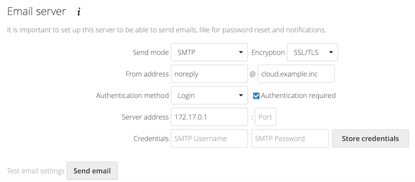

.. _email-config:

=====
Email
=====

Nextcloud is capable of sending password reset emails, notifying users of new
file shares, changes in files, and activity notifications. Your users configure
which notifications they want to receive on their Personal pages.

Nextcloud does not contain a full email server, but rather connects to your
existing mail server. You must have a functioning mail server for Nextcloud to be
able to send emails. You may have a mail server on the same machine as Nextcloud,
or it may be a remote server.

To access the setup page below log in with an admin account. Click on your avatar
in the top right, and then click Settings. On the left side under Administration and
click Basic settings.

With the wizard, connecting Nextcloud to your mail server is fast and easy.
The wizard fills in the values in ``config/config.php``, so you may use either
or both as you prefer.

The Nextcloud Email wizard supports three types of mail server connections:
SMTP, qmail, and Sendmail. Use the SMTP configurator for a remote server or
Sendmail when your mail server is on the same machine as Nextcloud.

.. note:: The Sendmail option refers to the Sendmail SMTP server and any
   drop-in Sendmail replacement such as Postfix, Exim, or Courier. All of
   these include a ``sendmail`` binary, and are freely-interchangeable.

.. _email-smtp-config:

Mail Providers
--------------

.. versionadded:: 30

A mail provider is an app that provides outbound mail service to Nextcloud and allows the sending of system emails
directly through a user's configured personal email account instead of the system email account.
At present, this functionality is limited to calendar invitations.
This feature automatically matches a users email address to a configured mail provider account, when a system message is sent.
The only app that supports this functionality at present is Nextcloud Mail 4.1 or higher, a configured email account is required.

Configuring an SMTP server
--------------------------

You need the following information from your mail server administrator to
connect Nextcloud to a remote SMTP server:

.. warning:: There were changes to the 3rd party mailer library in Nextcloud 26:
    
    * STARTTLS cannot be enforced. It will be used automatically if the mail server supports it. The encryption type should be set to 'None/STARTTLS' in this case. See :ref:`here<TLSPeerVerification>` for an example on how to configure self signed certificates.
    * NTLM authentication for Microsoft Exchange is not supported by the new mailer library. Try using `basic authentication <https://learn.microsoft.com/en-us/exchange/client-developer/exchange-web-services/authentication-and-ews-in-exchange#basic-authentication>`_ instead.
    * Outlook and Microsoft Exchange have discontinued support for Basic authentication. It is no longer possible to use their services as your default email handler.

* Encryption type: None/STARTTLS or SSL

* The From address you want your outgoing Nextcloud mails to use

* Whether authentication is required

* Authentication: when authentication is required, the underlying mailer will try the following authentication methods in the order they're listed:

    * CramMd5
    * Login
    * Plain
    * XOAuth2

* The server's IP address or fully-qualified domain name and the SMTP port

* Login credentials (if required)

.. note:: The ``overwrite.cli.url`` parameter from ``config.php`` will be used for the SMTP EHLO.

Your changes are saved immediately, and you can click the Send Email button to
test your configuration. This sends a test message to the email address you
configured on your Personal page. The test message says::

  If you received this email, the settings seem to be correct.

  --
  Nextcloud
  a safe home for all your data

Configuring Sendmail/qmail
--------------------------

Configuring Sendmail or qmail requires only that you select one of them
instead of SMTP, and then enter your desired return email address.

In most cases the ``SMTP`` option is best, since you will be able to control all
of your mail server options in one place, in your mail server configuration then.

Using email templates
---------------------

We designed a mechanism that generates emails which follow the theming
settings and look the same in all the different email clients out there.

.. note:: If, for some reason, you need text-only emails, consider simply configuring
   this on the client side or let the receiving (or even sending) mail server drop the
   HTML part. Note that there is no security impact from **sending** HTML emails, just
   from displaying them and thus any security risk can only be mitigated by disabling
   showing HTML on the client (or removing the HTML part in the mail server).

Modifying the look of emails beyond the theming app capabilities
""""""""""""""""""""""""""""""""""""""""""""""""""""""""""""""""

You can overwrite templates by writing a class that implements the template interface
(or extends it to not need to copy over everything). Easiest way is to then put this class into
an app and load it so you do not need to patch it on every update.

This is the interface of the class that needs to be implemented: https://github.com/nextcloud/server/blob/master/lib/public/Mail/IEMailTemplate.php

That is the implementation that could be extended and used to see how it works: https://github.com/nextcloud/server/blob/master/lib/private/Mail/EMailTemplate.php

An example from `a GitHub issue <https://portal.nextcloud.com/article/customized-email-templates-29.html>`_:

1. Look at the source code of extended class `OC\\Mail\\EMailTemplate::class <https://github.com/nextcloud/server/blob/master/lib/private/Mail/EMailTemplate.php>`_

2. Then override what you need in your own `OC\\Mail\\EMailTemplate::class` extension

**Example:**

Let's assume that we need to override the email header::

   <?php

   namespace \OCA\MyApp;

   use OC\Mail\EMailTemplate;

   class MyClass extends EMailTemplate
   {
      protected string $header = <<<EOF
         <table align="center" class="wrapper">
               // your theme email header modification
         </table>
      EOF;
   }

3. Then in ``config/config.php`` change ``mail_template_class`` to your class namespace::

   'mail_template_class' => 'OCA\\MyApp\\MyClass',

You will find a detailed step by step guide in our `support portal <https://portal.nextcloud.com/article/customized-email-templates-29.html>`_.

Setting mail server parameters in config.php
--------------------------------------------

If you prefer, you may set your mail server parameters in ``config/config.php``.
The following examples are for SMTP, Sendmail, and Qmail.

SMTP
""""

If you want to send email using a local or remote SMTP server it is necessary
to enter the name or IP address of the server, optionally followed by a colon
separated port number, e.g. **:425**. If this value is not given the default
port 25/tcp will be used unless you change that by modifying the
**mail_smtpport** parameter.

::

    "mail_smtpmode"     => "smtp",
    "mail_smtphost"     => "smtp.server.dom:425",

or

::

    "mail_smtpmode"     => "smtp",
    "mail_smtphost"     => "smtp.server.dom",
    "mail_smtpport"     => 425,

If a malware or SPAM scanner is running on the SMTP server it might be
necessary that you increase the SMTP timeout to e.g. 30s:

::

    "mail_smtptimeout"  => 30,

If the SMTP server accepts insecure connections, the default setting can be
used:

::

    "mail_smtpsecure"   => '',

The connection will be upgraded automatically via STARTTLS if the SMTP server
supports it.

If required by the SMTP server, a secure SSL/TLS connection can be enforced
via the SMTPS protocol which uses the port 465/tcp:

::

    "mail_smtphost"     => "smtp.server.dom:465",
    "mail_smtpsecure"   => 'ssl',

And finally it is necessary to configure if the SMTP server requires
authentication, if not, the default values can be taken as is.

::

    "mail_smtpauth"     => false,
    "mail_smtpname"     => "",
    "mail_smtppassword" => "",

If SMTP authentication is required you have to set the required username
and password.

::

    "mail_smtpauth"     => true,
    "mail_smtpname"     => "username",
    "mail_smtppassword" => "password",

Sendmail
""""""""

If you want to use the well known Sendmail program to send email, it is
necessary to have an installed and working email system on your \*nix server.
The sendmail binary (**/usr/sbin/sendmail**) is usually part of that system.
Nextcloud should be able to send email out of the box.

::

    "mail_smtpmode"     => "sendmail",
    "mail_smtphost"     => "127.0.0.1",
    "mail_smtpport"     => 25,
    "mail_smtptimeout"  => 10,
    "mail_smtpsecure"   => "",
    "mail_smtpauth"     => false,
    "mail_smtpauthtype" => "LOGIN",
    "mail_smtpname"     => "",
    "mail_smtppassword" => "",

qmail
"""""

If you want to use the qmail program to send email, it is necessary to have an
installed and working qmail email system on your server. The qmail binary
installed on your server will then be used to send email. Nextcloud should
be able to send email out of the box.

::

    "mail_smtpmode"     => "qmail",
    "mail_smtphost"     => "127.0.0.1",
    "mail_smtpport"     => 25,
    "mail_smtptimeout"  => 10,
    "mail_smtpsecure"   => "",
    "mail_smtpauth"     => false,
    "mail_smtpauthtype" => "LOGIN",
    "mail_smtpname"     => "",
    "mail_smtppassword" => "",

Send a test email
-----------------

To test your email configuration, save your email address in your personal
settings and then use the **Send email** button in the *Email Server* section
of the Admin settings page.

Troubleshooting
---------------

Enabling debug mode
"""""""""""""""""""

If you are unable to send email, it might be useful to activate further debug
messages by enabling the ``mail_smtpdebug`` parameter and temporarily setting your NC loglevel to DEBUG:

::

    "mail_smtpdebug" => true,
    "loglevel" => 0,

Be cautious setting your ``loglevel`` to DEBUG (``0``) since it'll apply to everything occurring on your NC instance, not just email. 
And don't forget to set it back to a more reasonable level when you're done troubleshooting:

::

    "mail_smtpdebug" => false,
    "loglevel" => 2,

.. note:: Immediately after pressing the **Send email** button, as described
   before, several **SMTP -> get_lines(): ...** messages appear on the screen.
   This is expected behavior and can be ignored.

Why is my web domain different from my mail domain?
"""""""""""""""""""""""""""""""""""""""""""""""""""

The default domain name used for the sender address is the hostname
where your Nextcloud installation is served. If you have a different mail domain
name you can override this behavior by setting the following configuration
parameter:

::

    "mail_domain" => "example.com",

This setting results in every email sent by Nextcloud (for example, the password
reset email) having the domain part of the sender address appear as follows::

  no-reply@example.com

How can I find out if an SMTP server is reachable?
""""""""""""""""""""""""""""""""""""""""""""""""""

Use the ping command to check the server availability::

  ping smtp.server.dom

::

  PING smtp.server.dom (ip-address) 56(84) bytes of data.
  64 bytes from your-server.local.lan (192.168.1.10): icmp_req=1 ttl=64
  time=3.64ms

How can I find out if the SMTP server is listening on a specific TCP port?
""""""""""""""""""""""""""""""""""""""""""""""""""""""""""""""""""""""""""

The best way to get mail server information is to ask your mail
server admin. If you are the mail server admin, or need information in a
hurry, you can use the ``netstat`` command. This example shows all active
servers on your system, and the ports they are listening on. The SMTP server is
listening on localhost port 25.

::

# netstat -pant

::

 Active Internet connections (servers and established)
 Proto Recv-Q Send-Q Local Address   Foreign Address  State  ID/Program name
 tcp    0      0    0.0.0.0:631     0.0.0.0:*        LISTEN   4418/cupsd
 tcp    0      0    127.0.0.1:25    0.0.0.0:*        LISTEN   2245/exim4
 tcp    0      0    127.0.0.1:3306  0.0.0.0:*        LISTEN   1524/mysqld

*  25/tcp is unencrypted smtp

* 110/tcp/udp is unencrypted pop3

* 143/tcp/udp is unencrypted imap4

* 465/tcp is encrypted submissions

* 587/tcp is opportunistically-encrypted submission

* 993/tcp/udp is encrypted imaps

* 995/tcp/udp is encrypted pop3s

How can I determine if the SMTP server supports the SMTPS protocol?
"""""""""""""""""""""""""""""""""""""""""""""""""""""""""""""""""""

A good indication that the SMTP server supports the SMTPS protocol
is that it is listening on the `submissions` port **465**.

How can I determine what authorization and encryption protocols the mail server supports?
"""""""""""""""""""""""""""""""""""""""""""""""""""""""""""""""""""""""""""""""""""""""""

SMTP servers usually announce the availability of STARTTLS
immediately after a connection has been established. You can easily check this
using the ``telnet`` command.

.. note:: You must enter the marked lines to obtain the information displayed.

::

  telnet smtp.domain.dom 25

::

  Trying 192.168.1.10...
  Connected to smtp.domain.dom.
  Escape character is '^]'.
  220 smtp.domain.dom ESMTP Exim 4.80.1 Tue, 22 Jan 2013 22:39:55 +0100
  EHLO your-server.local.lan                   # <<< enter this command
  250-smtp.domain.dom Hello your-server.local.lan [ip-address]
  250-SIZE 52428800
  250-8BITMIME
  250-PIPELINING
  250-AUTH PLAIN LOGIN CRAM-MD5                 # <<< Supported auth protocols
  250-STARTTLS                                  # <<< Encryption is supported
  250 HELP
  QUIT                                          # <<< enter this command
  221 smtp.domain.dom closing connection
  Connection closed by foreign host.

.. _TLSPeerVerification:

How can I send mail using self-signed certificates or use STARTTLS with self signed certificates?
"""""""""""""""""""""""""""""""""""""""""""""""""""""""""""""""""""""""""""""""""""""""""""""""""

To disable peer verification or to use self signed certificates, add the following
to your ``config/config.php``::

    "mail_smtpstreamoptions" => array(
        'ssl' => array(
            'allow_self_signed' => true,
            'verify_peer' => false,
            'verify_peer_name' => false
        )
    ),

All emails keep getting rejected even though only one email address is invalid.
"""""""""""""""""""""""""""""""""""""""""""""""""""""""""""""""""""""""""""""""

Partial sending, i. e. sending to all but the faulty email address is not possible.

.. note:: Immediately after pressing the **Send email** button, as described
   before, several **SMTP -> get_lines(): ...** messages appear on the screen.
   This is expected behavior and can be ignored.
